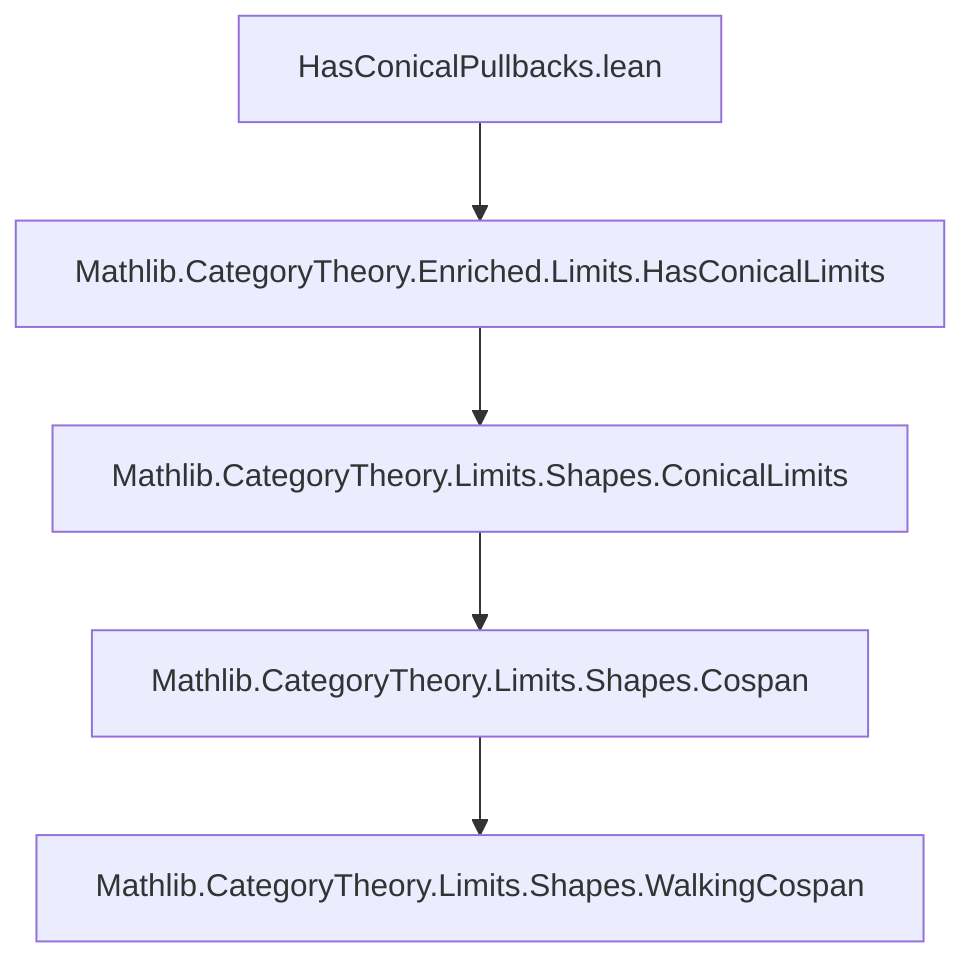

**Technical Brief: `HasConicalPullbacks.lean`**

---

### 1. **Key Definitions & Theorems**

| Name | Type / Signature | Purpose |
|------|------------------|---------|
| `HasConicalPullback` | `{X Y Z : C} → (f : X ⟶ Z) → (g : Y ⟶ Z) → Prop` | Represents *mere existence* of a conical limit cone over the cospan $f, g$ in an enriched category. Defined as `HasConicalLimit V (cospan f g)`. |
| `HasConicalPullbacks` | `Prop` | States that *every* pair of composable morphisms (i.e., every cospan) admits a conical pullback. Defined as `HasConicalLimitsOfShape WalkingCospan V C`. |
| `example [HasConicalPullback V f g] : HasPullback f g` | Proof term | Shows that existence of a *conical* pullback implies existence of a (usual) pullback in the underlying ordinary category. |
| `example [HasConicalPullbacks V C] : HasPullbacks C` | Proof term | Extends the above: global existence of conical pullbacks implies all pullbacks exist in `C`. |

> Note: `HasPullback` and `HasPullbacks` are standard in `Limits` and refer to ordinary pullbacks (i.e., 2-sided equalizers in the underlying category), while `HasConicalPullback`/`HasConicalPullbacks` refer to *enriched* conical limits.

---

### 2. **Naming Conventions**

- **Prefix `HasConical...`**: Indicates *mere existence* of a conical limit of a given shape (e.g., `HasConicalPullback`, `HasConicalPullbacks`, `HasConicalLimitsOfShape`).
- **Suffix `Pullback` / `Pullbacks`**: Refers to the shape `WalkingCospan` (two arrows into a common apex).
- **`V`-parametered**: Enrichment base is explicit (`V`), distinguishing enriched conical limits from ordinary ones.

---

### 3. **Tactic Stack**

- **`inferInstance`**: Used twice to discharge existence proofs by typeclass inference.
- **No explicit tactics** (e.g., `simp`, `rw`, `exact`) appear in the file — it is purely definitional and typeclass-based.

---

### 4. **Proof Logic**

- **No inductive or case-based reasoning** is performed in this file.
- Logic is *definitional* and *typeclass-driven*:
  - Definitions are abbreviations that reduce to existing `Limits` infrastructure (`HasConicalLimit`, `HasConicalLimitsOfShape`).
  - Proofs are immediate via `inferInstance`, leveraging typeclass resolution to connect enriched conical pullbacks → ordinary pullbacks.

---

### 5. **Imports**

| Import | Role |
|--------|------|
| `Mathlib.CategoryTheory.Enriched.Limits.HasConicalLimits` | Provides foundational infrastructure for conical limits in enriched categories (e.g., `HasConicalLimit`, `HasConicalLimitsOfShape`). |

> This file builds directly on the `HasConicalLimits` module — it does *not* import general category theory (e.g., `CategoryTheory.Category`), implying it assumes prior enrichment context.

---

### 6. **Mermaid Diagrams**

#### **Dependency Graph**


#### **Conceptual Overview**
```mermaid
flowchart LR
  subgraph Enriched World
    A[V-enriched category C] -->|cospan f,g| B[HasConicalPullback V f g]
    B -->|definition| C[HasConicalLimit V (cospan f g)]
    C -->|global| D[HasConicalPullbacks V C]
  end

  subgraph Ordinary World
    D -->|inferInstance| E[HasPullbacks C]
    B -->|inferInstance| F[HasPullback f g]
  end

  style A fill:#f9f,stroke:#333
  style D fill:#bbf,stroke:#333
  style E fill:#9f9,stroke:#333
```

---

### 7. **Theoretical Context**

- This module bridges **enriched category theory** and **ordinary limit theory**.
- It confirms that *conical pullbacks* in the enriched sense (i.e., limits weighted by the terminal weight) coincide with ordinary pullbacks when the enrichment is over a monoidal category `V`.
- The `WalkingCospan` shape encodes the diagram $X \xrightarrow{f} Z \xleftarrow{g} Y$; `HasConicalLimitsOfShape WalkingCospan V C` asserts all such diagrams have conical limits.

--- 

**End of Brief**
