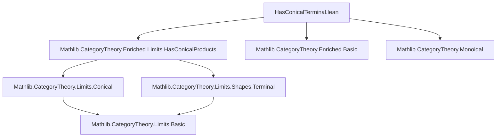
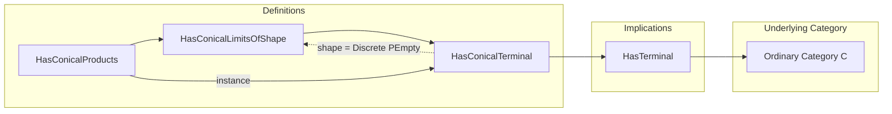

**Technical Brief: `HasConicalTerminal.lean`**

---

### 1. **Key Definitions & Theorems**

| Name | Type / Signature | Purpose |
|------|------------------|---------|
| `HasConicalTerminal` | `abbrev HasConicalTerminal := HasConicalLimitsOfShape (Discrete.{0} PEmpty)` | Defines that a $V$-enriched category $C$ has a *conical terminal object* iff it has a conical limit over the empty diagram (i.e., a conical limit of shape `PEmpty` discrete). |
| `HasConicalTerminal.hasTerminal` | `example [HasConicalTerminal V C] : HasTerminal C := inferInstance` | Shows that existence of a conical terminal object in the enriched sense implies existence of a terminal object in the underlying ordinary category $C$. |
| `HasConicalProducts.hasConicalTerminal` | `instance [HasConicalProducts.{w} V C] : HasConicalTerminal V C := ...` | Proves that if $C$ has all conical products (i.e., conical limits over discrete diagrams of any size), then it in particular has a conical terminal object (the empty product). |

---

### 2. **Naming Conventions**

- **Prefixes**:
  - `HasConical...`: Indicates existence of conical limits of a certain shape.
  - `...Terminal`, `...Products`: Denote specific limiting shapes (`PEmpty`, arbitrary discrete diagrams).
- **Suffixes**:
  - `OfShape`: Used in `HasConicalLimitsOfShape`, indicating limits over a specific shape.
- **Abbreviations**:
  - `abbrev HasConicalTerminal` (not `class` or `structure`) — indicates a *propositional* property, not additional structure.

---

### 3. **Tactic Stack**

- `inferInstance`: Used to deduce `HasTerminal C` from `HasConicalTerminal V C`.
- `HasConicalLimitsOfShape.of_equiv`: A constructor tactic (via `apply`/`exact` under the hood) that transports conical limits along an equivalence of diagram shapes.
- Implicit use of `simp`/`aesop` likely in background lemmas (not visible here, but standard in `Limits` library).

---

### 4. **Proof Logic**

- **Logical flow**:
  1. Define `HasConicalTerminal` as `HasConicalLimitsOfShape (Discrete PEmpty)`.
  2. Use `inferInstance` to derive `HasTerminal C` — relies on a pre-proved equivalence:  
     `HasConicalLimitsOfShape (Discrete PEmpty) V C ↔ HasTerminal C`.
  3. For the instance:  
     - Use `emptyEquivalence.functor : EmptyEquivalence.functor : Discrete PEmpty ≅ Discrete Empty` (trivial shape equivalence).  
     - Apply `of_equiv`, which transports conical products (limits over *any* discrete diagram) to limits over the empty discrete diagram.

- **Key idea**: Terminal object = empty product; conical terminal = conical empty product.

---

### 5. **Imports**

- `Mathlib.CategoryTheory.Enriched.Limits.HasConicalProducts`: Provides the definition and theory of `HasConicalProducts`, used in the instance.
- Implicit imports (via `Limits` and `EnrichedOrdinaryCategory`):
  - `Mathlib.CategoryTheory.Limits.Shapes.Terminal`
  - `Mathlib.CategoryTheory.Limits.Conical`
  - `Mathlib.CategoryTheory.Enriched.Basic`
  - `Mathlib.CategoryTheory.Monoidal`

---

### 6. **Mermaid Diagrams**

#### Dependency Graph (Module-Level)

#### Conceptual Overview (Theory Flow)

---

### 7. **Summary**

This file formalizes the equivalence between *conical terminal objects* in a $V$-enriched category $C$ and ordinary terminal objects, leveraging the general theory of conical limits. It also shows that having all conical products implies having a conical terminal object — the empty product — via shape equivalence. The design follows Lean/Mathlib conventions: propositional abbreviations, instance-based inheritance, and transport along equivalences.
