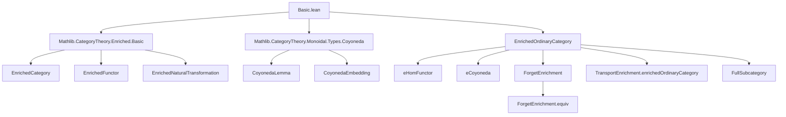
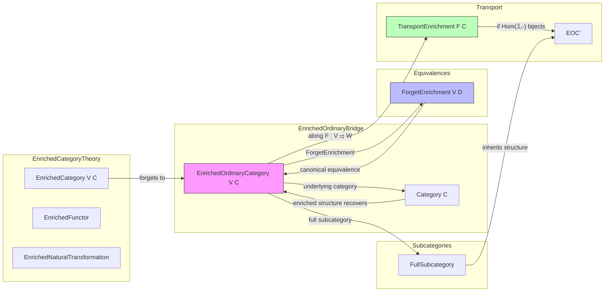

### Technical Brief: `Basic.lean` — Enriched Ordinary Categories in Lean 4

---

#### **1. Key Definitions & Theorems**

| Name | Type / Signature | Purpose |
|------|------------------|---------|
| `EnrichedOrdinaryCategory` | `class extends EnrichedCategory V C` | Packages a category `C` that is simultaneously enriched over `V` *and* ordinary, with morphism identification `(X ⟶ Y) ≃ (𝟙_ V ⟶ (X ⟶[V] Y))`. |
| `homEquiv` | `{X Y : C} → (X ⟶ Y) ≃ (𝟙_ V ⟶ (X ⟶[V] Y))` | Core equivalence witnessing the identification of ordinary and enriched homs. |
| `homEquiv_id` | `homEquiv (𝟙 X) = eId V X` | Ensures identities correspond under the equivalence. |
| `homEquiv_comp` | `homEquiv (f ≫ g) = (λ_ _).inv ≫ (homEquiv f ⊗ₘ homEquiv g) ≫ eComp V X Y Z` | Ensures composition is preserved up to the enriched structure. |
| `eHomEquiv` | `def (X ⟶ Y) ≃ (𝟙_ V ⟶ (X ⟶[V] Y))` | Public alias for `homEquiv`. |
| `eHomEquiv_id`, `eHomEquiv_comp` | `@[simp]`, `@[reassoc]` lemmas | Simplification and reassociation rules for `eHomEquiv`. |
| `eHomWhiskerRight` | `(X ⟶ X') → (X' ⟶[V] Y) ⟶ (X ⟶[V] Y)` | Right whiskering induced by ordinary morphism, via enrichment. |
| `eHomWhiskerLeft` | `(Y ⟶ Y') → (X ⟶[V] Y) ⟶ (X ⟶[V] Y')` | Left whiskering induced by ordinary morphism. |
| `eComp_eHomWhiskerRight`, `eComp_eHomWhiskerLeft` | `@[reassoc]` lemmas | Compatibility of enriched composition with whiskering. |
| `eHom_whisker_cancel`, `eHom_whisker_cancel_inv`, `eHom_whisker_exchange` | `@[reassoc]` lemmas | Technical coherence laws for whiskering with isomorphisms and exchange. |
| `eHomFunctor` | `Cᵒᵖ ⥤ C ⥤ V` | The enriched hom bifunctor: `(X, Y) ↦ X ⟶[V] Y`. |
| `eCoyoneda` | `abbrev (X : C) → C ⥤ V` | Enriched coyoneda: `(X ⟶[V] -)`. |
| `ForgetEnrichment.enrichedOrdinaryCategory` | `instance` | For any enriched category `D`, its underlying ordinary category `ForgetEnrichment V D` is enriched ordinary. |
| `ForgetEnrichment.equivInverse`, `ForgetEnrichment.equivFunctor`, `ForgetEnrichment.equiv` | Functors & equivalence | Canonical equivalence between `D` and `ForgetEnrichment V D` when `D` is enriched ordinary. |
| `TransportEnrichment.enrichedOrdinaryCategory` | `def` | Transports enriched ordinary structure along lax monoidal `F : V ⥤ W`, assuming bijectivity of `Hom(𝟙, -) → Hom(𝟙, F(-))`. |
| `TransportEnrichment.forgetEnrichmentEquiv` | `def` | Equivalence between `TransportEnrichment F (ForgetEnrichment V D)` and `ForgetEnrichment W (TransportEnrichment F D)`. |
| `ObjectProperty.FullSubcategory.enrichedOrdinaryCategory` | `instance` | Full subcategories of enriched ordinary categories inherit the structure. |

---

#### **2. Naming Conventions**

- **Prefixes**:
  - `e_`: Enriched structure (e.g., `eId`, `eComp`, `eHomEquiv`, `eHomWhiskerRight`).
  - `homEquiv_`: Properties of the hom-equivalence.
  - `ForgetEnrichment.`: Forgetting enrichment and related constructions.
  - `TransportEnrichment.`: Transporting enrichment along functors.

- **Suffixes**:
  - `_right`, `_left`: Direction of whiskering.
  - `_comp`, `_id`: Behavior w.r.t. composition / identity.
  - `_exchange`, `_cancel`: Coherence / cancellation lemmas.

- **General pattern**: `eHomWhiskerRight V f Y`, where `V` is the enrichment base, `f` is an ordinary morphism, and `Y` is the target object.

---

#### **3. Tactic Stack**

- **Core tactics**:
  - `by cat_disch`: Category-theoretic discharge tactic (likely custom).
  - `simp`: Heavily used, especially with `@[simp]` lemmas.
  - `rw`: Rewriting using lemmas like `eHomEquiv_comp`, `assoc`, `tensorHom_def`.
  - `dsimp`: Simplifying definitions before rewriting.
  - `change`: Renaming goals for clarity.
  - `slice_rhs`: Focused rewriting on subterms.
  - `congr`: Congruence for equality proofs.
  - `Equiv.injective`: Injectivity of equivalences.

- **Monoidal category-specific**:
  - `tensorHom_def`, `tensorHom_def_assoc`, `whisker_exchange_assoc`, `associator_inv_naturality_*`, `unitors_*`, `triangle_assoc_*`, `leftUnitor_*`, `rightUnitor_*`.

- **Iso-related**:
  - `Iso.inv_hom_id`, `Iso.hom_inv_id`, often with `_assoc` variants.

- **Functoriality**:
  - `F.map_comp`, `F.map_id`, `Functor.LaxMonoidal.*`.

---

#### **4. Proof Logic**

- **Structure of proofs**:
  - **Definitional unfolding** (`dsimp`) → **rewriting** (`rw`) using coherence laws and naturality.
  - **Induction not needed**: All proofs are algebraic manipulations in a monoidal category.
  - **Leverage simp lemmas**: Most lemmas are marked `@[simp]` or `@[reassoc]` for automatic simplification.
  - **Injectivity arguments**: For proving equality of morphisms, often apply `Equiv.injective` after applying `eHomEquiv`.
  - **Coherence**: Heavy use of monoidal coherence (associators, unitors, symmetry) via `assoc`, ` whisker_*_assoc`, `tensorHom_*`.

- **Typical proof pattern**:
  ```lean
  dsimp [eHomWhiskerRight]
  rw [assoc, eHomEquiv_comp, comp_whiskerRight_assoc, ← e_assoc', ...]
  simp [e_assoc']
  ```

- **Equivalence proofs**:
  - Construct functors explicitly (`@[simps]`).
  - Prove `map_id` and `map_comp` using `eHomEquiv_id`, `eHomEquiv_comp`.
  - Show unit/counit are natural isomorphisms via `Iso.refl`.

---

#### **5. Imports**

- `Mathlib.CategoryTheory.Enriched.Basic`: Core enriched category theory.
- `Mathlib.CategoryTheory.Monoidal.Types.Coyoneda`: For coyoneda embeddings.

> **Scope**: This module formalizes the bridge between *enriched* and *ordinary* categories, focusing on the case where both structures coexist and are compatible.

---

#### **8. Mermaid Diagrams**

##### **Dependency Graph (Top-Level)**



##### **Overview of Theory Flow**



> **Key Insight**: This file formalizes the *embedding* of enriched ordinary categories into the broader landscape of enriched category theory, showing how enrichment can be *forgotten*, *transported*, and *restricted* while preserving compatibility with the underlying ordinary structure.

--- 

Let me know if you'd like a formalized dependency graph (e.g., in `.lean` format) or a summary of how this fits into the larger `Mathlib` enriched category theory ecosystem.
