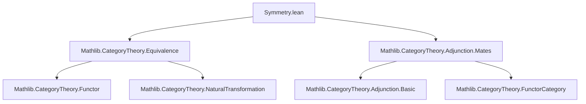
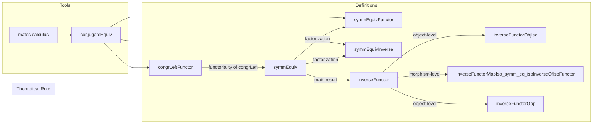

### Technical Brief: `Symmetry.lean`

---

#### **1. Key Definitions & Theorems**

| Name | Type | Purpose |
|------|------|---------|
| `symmEquivFunctor` | `(C ≌ D) ⥤ (D ≌ C)ᵒᵖ` | Forward functor of the symmetry equivalence: sends an equivalence $e : C ≌ D$ to its opposite symmetric $e^\mathrm{symm, op}$. |
| `symmEquivInverse` | `(D ≌ C)ᵒᵖ ⥤ (C ≌ D)` | Inverse functor of the symmetry equivalence: constructs the symmetric equivalence in the opposite direction. |
| `symmEquiv` | `(C ≌ D) ≌ (D ≌ C)ᵒᵖ` | The main theorem: symmetry of equivalences defines an equivalence of categories. |
| `inverseFunctor` | `(C ≌ D) ⥤ (D ⥤ C)ᵒᵖ` | Functorial version of taking inverses: sends equivalence $e$ to the functor $e^\mathrm{inverse}$, viewed in the opposite functor category. |
| `inverseFunctorObjIso` | `(inverseFunctor C D).obj e ≅ Opposite.op e.inverse` | Shows that `inverseFunctor` indeed sends $e$ to the opposite of its inverse functor. |
| `inverseFunctorMapIso_symm_eq_isoInverseOfIsoFunctor` | `lemma` | Equates two ways of obtaining a natural isomorphism $e^\mathrm{inverse} \cong f^\mathrm{inverse}$ from $e \cong f$: via `inverseFunctor` and via `Iso.isoInverseOfIsoFunctor`. |
| `inverseFunctorObj'` | `Opposite.unop ((inverseFunctor C D).obj e) ≅ e.inverse` | Unopped version of `inverseFunctorObjIso`, more convenient for concrete reasoning. |
| `congrLeftFunctor` | `(C ≌ D) ⥤ ((C ⥤ E) ≌ (D ⥤ E))ᵒᵖ` | Functorial version of `Equivalence.congrLeft`: sends equivalence $f : C ≌ D$ to the equivalence of hom-categories $(C ⥤ E) ≌ (D ⥤ E)$ induced by precomposition with $f$. |

---

#### **2. Naming Conventions**

- **Prefixes**:
  - `symmEquiv*`: symmetry-related constructions (e.g., `symmEquivFunctor`, `symmEquivInverse`).
  - `inverseFunctor*`: constructions involving inversion of equivalences.
  - `congrLeft*`: constructions related to left congruence (precomposition).
- **Suffixes**:
  - `Functor`: indicates a functor (e.g., `symmEquivFunctor`).
  - `Inverse`: indicates the inverse functor in an equivalence (e.g., `symmEquivInverse`).
  - `ObjIso` / `Obj'`: object-level isomorphisms (often unopped variants).
  - `MapIso*`: lemmas about behavior on isomorphisms (e.g., `inverseFunctorMapIso_symm_eq_isoInverseOfIsoFunctor`).

---

#### **3. Tactic Stack**

- **Core tactics**:
  - `cat_disch`: used repeatedly to discharge category-theoretic equalities (likely a custom tactic for hom-sets and naturality).
  - `simp`: heavily used with custom simp lemmas (`symm`, `symmEquivInverse`, etc.).
  - `ext`: extensionality for natural transformations and functors.
  - `rw`, `apply`, `exact`: standard proof scripting.
- **Category-theoretic automation**:
  - `by cat_disch`: appears in `map_comp` proofs, indicating automated verification of functoriality.
  - `by simp [symm, symmEquivInverse]`: used in unit/counit isomorphism proofs.

---

#### **4. Proof Logic**

- **Structure**:
  - **Functor definition**: Constructed component-wise (`obj`, `map`), with `map_comp` verified using `cat_disch`.
  - **Equivalence proof** (`symmEquiv`):
    - Define unit and counit as natural isomorphisms via `NatIso.ofComponents`.
    - Use `simp` with definitions (`symm`, `symmEquivInverse`) to verify triangle identities.
  - **Lemmas**:
    - Prove coherence between different constructions (e.g., `inverseFunctorMapIso_symm_eq_isoInverseOfIsoFunctor`) via `cat_disch`.
    - Use `ext` + `simp` for component-wise equality.

- **Inductive/structural pattern**:
  - No induction on natural numbers or syntax.
  - All proofs rely on **component-wise reasoning** (object and morphism level), naturality, and properties of mates (via `conjugateEquiv`).

---

#### **5. Imports**

- `Mathlib.CategoryTheory.Equivalence`: core definitions of equivalences of categories.
- `Mathlib.CategoryTheory.Adjunction.Mates`: calculus of mates, used to define `conjugateEquiv`, which is central to functoriality of symmetry and congruence.

---

#### **6. Mermaid Diagrams**

##### **Dependency Graph (Module Level)**



##### **Overview of File Structure**



##### **Categorical Relationships**

```mermaid
graph LR
  C["Category C"] -->|e : C ≌ D| D["Category D"]
  D -->|e.symm| C
  C -->|e.inverse| D
  D -->|e.inverse.op| C

  subgraph Equivalence of categories
    (C ≌ D) <-->|symmEquiv| (D ≌ C)ᵒᵖ
  end

  subgraph Functor categories
    (C ⥤ E) <-->|congrLeft e| (D ⥤ E)
  end
```

---

#### **7. Summary**

This file formalizes the **functoriality of symmetry** for equivalences of categories using the calculus of mates. It constructs:
- An equivalence $(C ≌ D) ≌ (D ≌ C)ᵒᵖ$,
- A functor $(C ≌ D) ⥤ (D ⥤ C)ᵒᵖ$ sending $e \mapsto e^\mathrm{inverse}$,
- A functor $(C ≌ D) ⥤ ((C ⥤ E) ≌ (D ⥤ E))ᵒᵖ$ lifting `congrLeft`.

The proofs rely on:
- Explicit component-wise definitions,
- `conjugateEquiv` for handling natural isomorphisms via mates,
- `cat_disch` for automated verification of functoriality and naturality.

This is foundational for higher-categorical reasoning in Mathlib, especially for symmetry and coherence laws in monoidal or cartesian contexts.
