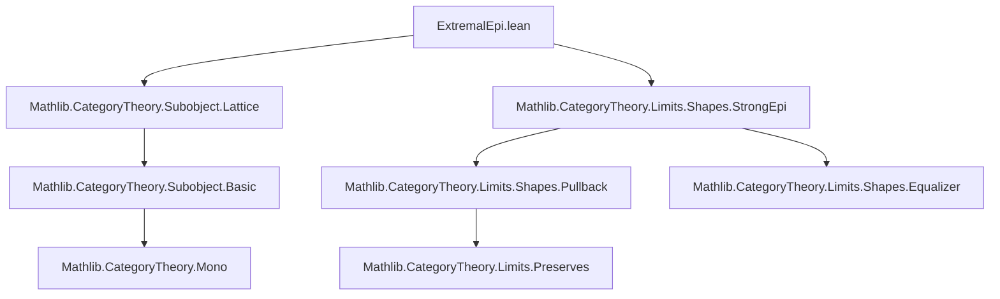
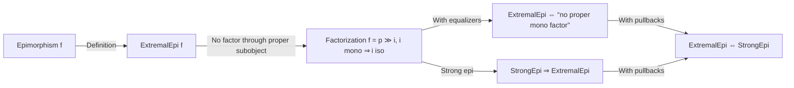

### Technical Brief: `ExtremalEpi.lean`

---

#### **1. Key Definitions & Theorems**

| Name | Type / Signature | Purpose |
|------|------------------|---------|
| `ExtremalEpi` | `class ExtremalEpi (f : X ⟶ Y) : Prop extends Epi f` | Defines an extremal epimorphism: an epimorphism that does **not** factor through any *proper* subobject (i.e., any mono `i : Z ⟶ Y` that is not an iso). Formally: any factorization `f = p ≫ i` with `i` mono implies `i` is iso. |
| `ExtremalEpi.subobject_eq_top` | `lemma` | If `f` is extremal epi and `f` factors through a subobject `A`, then `A = ⊤` (the top subobject). |
| `ExtremalEpi.mk_of_hasEqualizers` | `lemma` | In a category with equalizers, if every factorization `f = p ≫ i` with `i` mono forces `i` iso, then `f` is extremal epi. (Proves equivalence of the categorical definition and the “no proper subobject factorization” condition under equalizers.) |
| `StrongEpi.extremalEpi` | `instance [StrongEpi f] : ExtremalEpi f` | Every strong epimorphism is extremal. |
| `extremalEpi_iff_strongEpi_of_hasPullbacks` | `lemma` | In a category with pullbacks, extremal epis ↔ strong epis. |

---

#### **2. Naming Conventions**

- **Prefixes / Suffixes**:
  - `ExtremalEpi.`: class and lemmas about extremal epis.
  - `isIso`: used in the class to assert that any mono factor through `f` must be iso.
  - `subobject_eq_top`: reflects the idea that only the top subobject can factor through `f`.
  - `mk_of_hasEqualizers`: constructor lemma requiring existence of equalizers.
  - `extremalEpi_iff_strongEpi_of_hasPullbacks`: biconditional under pullback assumption.

- **General pattern**: `ExtremalEpi.{property}` for class, `ExtremalEpi.{lemma}` for properties.

---

#### **3. Tactic Stack**

Frequently used tactics in proofs:

| Tactic | Usage |
|--------|-------|
| `rw` | Rewriting definitions (e.g., `← Subobject.isIso_arrow_iff_eq_top`, `← cancel_epi`, etc.) |
| `simp` | Simplifying using category axioms, equalizer/pullback properties, and `CategoryTheory` lemmas |
| `tauto` | In `mk_of_hasEqualizers.isIso`, to discharge the `Epi f` part automatically |
| `exact` / `⟨...⟩` | Constructing isomorphisms and morphisms in pullback/pullback-lift arguments |
| `congr 1` | To split equality of composites into equalities of components |
| `have`, `set`, `refine` | Structuring proof goals, especially in `extremalEpi_iff_strongEpi_of_hasPullbacks` |

---

#### **4. Proof Logic**

- **Structure of proofs**:
  - **Class definition**: `ExtremalEpi` extends `Epi`, and adds a universal property: any mono factorization is iso.
  - **`subobject_eq_top`**: Uses the class property `isIso` on the factorization given by `Subobject.Factors`, then applies `Subobject.isIso_arrow_iff_eq_top`.
  - **`mk_of_hasEqualizers`**:
    - To prove `Epi f`: uses equalizer universal property and the hypothesis to show left-cancellation.
    - To prove `isIso`: directly applies the hypothesis.
  - **`StrongEpi.extremalEpi`**:
    - Uses the definition of strong epi (via lifting against monos), constructs a commutative square, and applies the strong epi lifting property to get a lift → shows the mono is split epi + mono ⇒ iso.
  - **`extremalEpi_iff_strongEpi_of_hasPullbacks`**:
    - `→`: Given extremal epi, show it’s strong: use pullback of `f` along a mono `i`, then extremality forces the pullback projection to be iso ⇒ lifting exists.
    - `←`: Already covered by `StrongEpi.extremalEpi`.

---

#### **5. Imports & Dependencies**

| Import | Purpose |
|--------|---------|
| `Mathlib.CategoryTheory.Subobject.Lattice` | Provides `Subobject`, `Subobject.Factors`, `⊤`, `isIso_arrow_iff_eq_top`, etc. |
| `Mathlib.CategoryTheory.Limits.Shapes.StrongEpi` | Defines `StrongEpi`, used in the instance and equivalence. |

Other implicit dependencies:
- `CategoryTheory.Category`
- `CategoryTheory.Limits` (for equalizers, pullbacks, etc.)
- `CategoryTheory.Mono` (implicitly via `[Mono i]`)

---

#### **6. Mermaid Diagrams**

##### **Dependency Graph (Module-Level)**

##### **Conceptual Overview (Theory Flow)**

---

#### **7. Summary**

This module formalizes the theory of **extremal epimorphisms** in category theory, establishing:
- A clean categorical definition (`ExtremalEpi` class),
- Equivalence with “no proper subobject factorization” under equalizers,
- Inclusion `StrongEpi ⊆ ExtremalEpi`,
- Equality of the two notions under pullbacks.

It leverages standard tools from `Mathlib`’s category theory library: subobject lattices, limits (equalizers, pullbacks), and strong epimorphisms.

--- 

Let me know if you'd like a formalized summary in Lean docstring format or a visualization of the proof graph.
