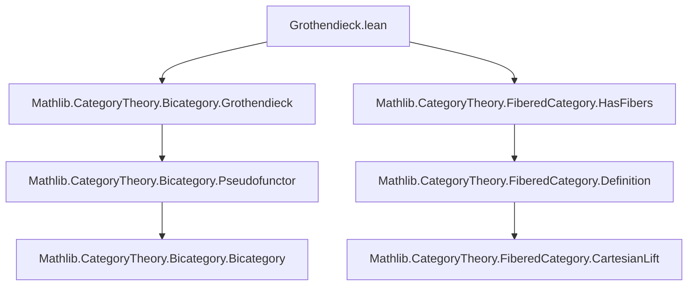
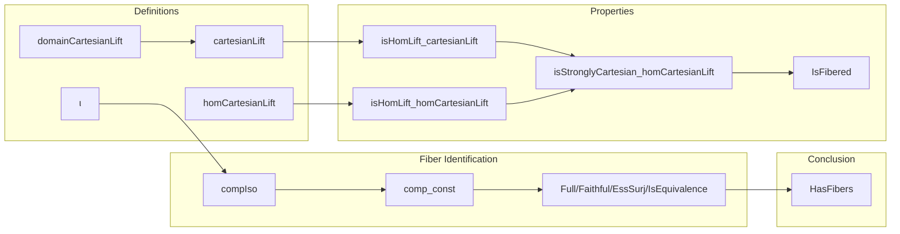

**Technical Brief: Grothendieck Construction in Lean 4**

---

### 1. Key Definitions & Theorems

| Name | Type / Signature | Purpose |
|------|------------------|---------|
| `domainCartesianLift` | `abbrev domainCartesianLift : ∫ᶜ F` | Constructs the total space object (object in the Grothendieck construction) lying over the domain of `f`. |
| `cartesianLift` | `abbrev cartesianLift : domainCartesianLift a f ⟶ ⟨S, a⟩` | The Cartesian lift of a morphism `f : R ⟶ S` in the base category. |
| `isHomLift_cartesianLift` | `instance isHomLift (forget F) f (cartesianLift a f)` | Shows `cartesianLift` satisfies the universal property of a *hom lift* for `forget F`. |
| `homCartesianLift` | `abbrev homCartesianLift {a'} g φ' [IsHomLift ...] : a' ⟶ domainCartesianLift a f` | The unique mediating arrow factoring any other lift through the Cartesian lift. |
| `isStronglyCartesian_homCartesianLift` | `lemma isStronglyCartesian (forget F) f (cartesianLift a f)` | Proves that `cartesianLift` is *strongly Cartesian*, i.e., satisfies the full universal property. |
| `instance IsFibered` | `instance : IsFibered (forget F)` | Main theorem: the projection `forget F : ∫ᶜ F → 𝒮` is a fibered category. |
| `ι` | `def ι : F.obj ⟨op S⟩ ⥤ ∫ᶜ F` | Inclusion of the fiber category `F(S)` into the total category `∫ᶜ F`. |
| `compIso`, `comp_const` | `def compIso`, `lemma comp_const` | Encodes that composing the inclusion `ι` with `forget F` yields the constant functor at `S`. |
| `Fiber.inducedFunctor ... .Full`, `.Faithful`, `.EssSurj`, `.IsEquivalence` | `instance`s | Show that the induced functor from `F(S)` to the fiber over `S` is an equivalence of categories. |
| `HasFibers (forget F)` | `instance : HasFibers (forget F)` | Concludes that `∫ᶜ F` has fibers, with fiber over `S` being `F.obj ⟨op S⟩`. |

---

### 2. Naming Conventions

- **Prefixes**:
  - `domainCartesianLift`, `cartesianLift`, `homCartesianLift`: all relate to constructing Cartesian lifts.
  - `isHomLift_`, `isStronglyCartesian_`: predicate-style naming for properties.
  - `ι` (Greek iota): standard notation for inclusion of fiber into total category.
- **Suffixes**:
  - `_app`, `_inv`, `_hom`: used for components of natural transformations / isomorphisms.
  - `_assoc`, `_naturality_assoc`: for associativity/naturality lemmas.
- **Pattern**:
  - `forget F` is used consistently as the projection functor.
  - `⟨S, a⟩` denotes objects in the Grothendieck construction (base + fiber).
  - `F.map f.op.toLoc` appears repeatedly to pull back along `f` in the pseudofunctor.

---

### 3. Tactic Stack

Frequently used tactics in proofs:

| Tactic | Usage |
|--------|-------|
| `simp` / `simp_rw` | Simplifying hom-components, naturality, unit laws. |
| `ext` | Extensionality for natural transformations / functors. |
| `simpa` | Simplifying using assumptions (e.g., `IsHomLift.fac'`). |
| `exact`, `refine`, `intro` | Standard proof construction. |
| `rw`, `apply`, `convert` | Rewriting and unification for equality goals. |
| `cases` / `obtain` | Extracting structure from hypotheses (e.g., `⟨rfl⟩ : g = χ'.1`). |
| `aesop` | Not present — this file avoids automation in favor of explicit reasoning. |
| `ring` | Not used — no arithmetic simplifications needed. |

---

### 4. Proof Logic

The logical flow follows a standard categorical construction pattern:

1. **Construct candidate Cartesian lifts**:
   - Define `domainCartesianLift` and `cartesianLift`.
2. **Verify universal property**:
   - Define `homCartesianLift` as the mediating arrow.
   - Prove it is a hom lift (`isHomLift_homCartesianLift`).
   - Prove it satisfies the *strong* universal property (`isStronglyCartesian_homCartesianLift`).
3. **Conclude fibered structure**:
   - Use `IsFibered.of_exists_isStronglyCartesian` to get `IsFibered (forget F)`.
4. **Identify fibers**:
   - Define inclusion `ι : F(S) → ∫ᶜ F`.
   - Show `ι ⋙ forget F ≅ const S`, i.e., the fiber over `S` is equivalent to `F(S)`.
   - Prove the induced functor is full, faithful, and essentially surjective ⇒ equivalence.
5. **Instantiate `HasFibers`**:
   - Use the above to define the fibered category structure with explicit fiber categories.

Induction is not used — the arguments are *constructive* and *component-wise*, leveraging pseudofunctoriality (e.g., `F.mapId`, `F.mapComp`) and bicategorical coherence laws.

---

### 5. Imports & Dependencies

| Import | Role |
|--------|------|
| `Mathlib.CategoryTheory.Bicategory.Grothendieck` | Core definitions of the Grothendieck construction `∫ᶜ F`. |
| `Mathlib.CategoryTheory.FiberedCategory.HasFibers` | Definitions of fibered categories, fibers, and `HasFibers`. |
| `Mathlib.CategoryTheory.Functor.Opposite`, `Bicategory`, `Fiber` | Supporting infrastructure for pseudofunctors, opposite categories, and fibered categories. |

---

### 6. Mermaid Diagrams

#### Dependency Graph (Module-Level)

#### Overview of File Structure

---

### 7. Summary

This file formalizes the classical result that the **Grothendieck construction** `∫ᶜ F` of a pseudofunctor `F : 𝒮ᵒᵖ → Cat` yields a **fibered category** over `𝒮`, with fibers canonically equivalent to the values of `F`. It constructs explicit Cartesian lifts, verifies their universal property, and identifies the fiber over each object `S` with `F(S)`. The Lean formalization is highly explicit, leveraging bicategorical coherence and naturality, and avoids heavy automation in favor of transparent, human-readable proofs.
