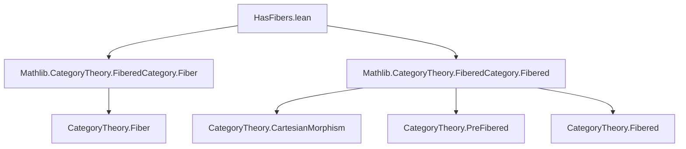
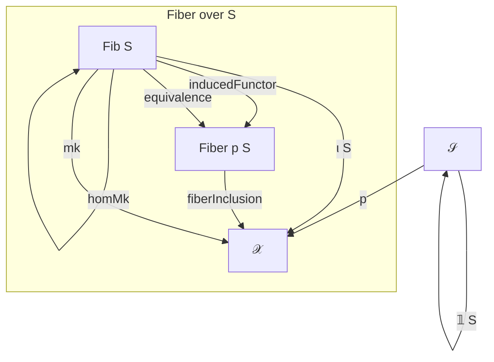

### Technical Brief: `HasFibers.lean`

---

#### **1. Key Definitions & Theorems**

| Name | Type / Signature | Purpose |
|------|------------------|---------|
| `HasFibers p` | `class (p : 𝒳 ⥤ 𝒮)` | Typeclass encoding extrinsic fiber structure over a functor `p`. |
| `Fib S` | `Fib : 𝒮 → Type u₃` | Fiber category over object `S : 𝒮`. |
| `ι S` | `ι S : Fib S ⥤ 𝒳` | Inclusion functor of the fiber into total category `𝒳`. |
| `comp_const S` | `ι S ⋙ p = const (Fib S) S` | Ensures `ι S` maps everything over `S`. |
| `equiv S` | `Functor.IsEquivalence (inducedFunctor (comp_const S))` | Equivalence between `Fib S` and standard fiber `Fiber p S`. |
| `canonical p` | `HasFibers p` | Canonical instance using standard fibers `Fiber p S`. |
| `inducedFunctor p S` | `Fiber p S ⥤ Fiber p S` | Identity equivalence (up to iso) used to transfer structure. |
| `Fib.homMk φ` | `a ⟶ b` | Lift of a morphism `φ : (ι S).obj a ⟶ (ι S).obj b` lying over `𝟙 S`. |
| `Fib.mk ha` | `Fib p S` | Object in fiber corresponding to `a : 𝒳` with `p(a) = S`. |
| `Fib.mkIsoSelf ha` | `(ι S).obj (Fib.mk ha) ≅ a` | Isomorphism between inclusion of fiber object and original object. |
| `mkPullback f ha` | `Fib p R` | Pullback object in fiber over `R`, for `f : R ⟶ S`. |
| `pullbackMap f ha` | `(ι R).obj (mkPullback f ha) ⟶ a` | Cartesian morphism lifting `f`. |
| `inducedMap f ψ φ` | `b ⟶ b'` | Morphism in fiber induced by universal property of Cartesian morphism. |
| `fiber_factorization` | `∃ …` | Factorization of any morphism as fiber map followed by Cartesian lift. |

---

#### **2. Naming Conventions**

- **Prefixes:**
  - `Fib.`: Functions operating on the fiber category (e.g., `Fib.homMk`, `Fib.mk`).
  - `ι`: Inclusion of fiber into total category (`ι S`, `ι.map`, etc.).
  - `proj`: Projection to base (e.g., `proj_eq`, `projMap`).
  - `mk`: Construction of fiber objects/morphisms from data in `𝒳` (e.g., `mk`, `mkPullback`).
  - `induced`: Morphisms/functors induced via universal properties (e.g., `inducedFunctor`, `inducedMap`).

- **Suffixes:**
  - `Iso`: Isomorphisms (e.g., `mkIsoSelf`, `isoMk`).
  - `Map`: Morphisms (e.g., `pullbackMap`, `projMap`).
  - `Lift`: Refers to lifting over base morphisms (e.g., `IsHomLift`, `IsCartesian`).

---

#### **3. Tactic Stack**

Frequently used tactics in proofs:
- `simp` / `simp only`: Simplifying using `comp_const`, `proj_eq`, `Fib.map_homMk`, etc.
- `rw`: Rewriting using equalities like `comp_const`, `proj_eq`, `inducedFunctor_comp`.
- `conv`: For precise rewriting in subterms (e.g., `conv in f => rw [← id_comp f]`).
- `infer_instance`: Automatically inferring class instances (e.g., `Category`, `IsHomLift`, `IsCartesian`).
- `ext`: Proving morphism equality via `hom_ext`.
- `apply of_fac`: Used in `homLift` to construct lifts via factorization.
- `congr_hom`: Used to equate morphisms after applying functors.

---

#### **4. Proof Logic**

- **Inductive/structural reasoning** is minimal; most proofs are *constructive* and rely on:
  - Equivalence `Fib S ≃ Fiber p S` to transfer constructions.
  - Universal properties of Cartesian morphisms (`IsCartesian`) and pullbacks.
  - Faithfulness/fullness of `ι S` (via equivalence).
- **Typical flow**:
  1. Use `equiv S` to reduce to standard fiber.
  2. Construct object/morphism in standard fiber (e.g., `Fiber.mk`, `Fiber.homMk`).
  3. Pull back via `inducedFunctor` to fiber category.
  4. Use `Fib.map_homMk`, `Fib.mkIsoSelf`, etc., to relate back to `𝒳`.
- **Factorization proofs** (e.g., `fiber_factorization`) use:
  - `pullbackMap` to get Cartesian lift.
  - `inducedMap` to get the fiber part.
  - `inducedMap_comp` to verify factorization.

---

#### **5. Imports**

- `Mathlib.CategoryTheory.FiberedCategory.Fiber`: Provides standard fiber construction (`Fiber p S`, `fiberInclusion`, etc.).
- `Mathlib.CategoryTheory.FiberedCategory.Fibered`: Provides definitions like `IsCartesian`, `IsPreFibered`, `IsFibered`, and related lemmas.

---

#### **6. Mermaid Diagrams**

##### **Dependency Graph (Module-Level)**



##### **Conceptual Overview of `HasFibers` Structure**



##### **Factorization via `fiber_factorization`**

```mermaid
graph TD
  b[Fib p R] -->|τ| b'[Fib p R] -->|ψ| a[𝒳]
  R -->|f| S
  b -.ι R.-> b -.ι R.-> a
  b' -.ι R.-> a
  ψ is Cartesian over f
  τ is in fiber over R
```

---

#### **7. Summary**

`HasFibers` provides an *extrinsic* abstraction of fibered categories, allowing users to work directly with chosen fiber categories `Fib S` instead of standard fibers `Fiber p S`. This is especially useful when `Fib S` has a more concrete or computationally friendly description (e.g., discrete categories for presheaves). The API supports:
- Lifting morphisms and objects from `𝒳` into fibers.
- Constructing Cartesian lifts and induced maps.
- Factoring arbitrary morphisms into fiber + Cartesian parts.

The canonical instance ensures compatibility with standard fiber constructions, enabling reuse of general results in concrete settings.
