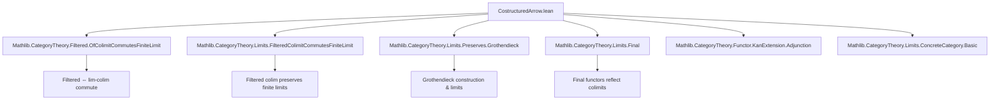

### Technical Brief: `CostructuredArrow.lean`

---

#### **1. Key Definitions & Theorems**

| Name | Type / Signature | Purpose |
|------|------------------|---------|
| `CostructuredArrow L t` | `CategoryTheory.CostructuredArrow L t` | The *costructured arrow category* from a functor `L : A ⥤ T` to an object `t : T`. Objects are pairs `(a, f : L a ⟶ t)`. |
| `CostructuredArrow.functor L` | `L ⋙ CostructuredArrow.functor L : A ⥤ T ⥤ Type u₁` | The Grothendieck construction of the family `b ↦ CostructuredArrow L (R b)` when `R : B ⥤ T`. |
| `CostructuredArrow.grothendieckProj L` | `CostructuredArrow.grothendieckProj L : (Grothendieck (CostructuredArrow.functor L)) ⥤ T` | Projection from the Grothendieck construction to the base category `T`. |
| `isFiltered_of_isFiltered_costructuredArrow_small` | `IsFiltered B → Final R → (∀ b, IsFiltered (CostructuredArrow L (R.obj b))) → IsFiltered A` | Main lemma for small categories: deduces filteredness of `A` from filteredness of `B`, finality of `R`, and filteredness of each costructured arrow category. |
| `isFiltered_of_isFiltered_costructuredArrow` | Same as above, but for general (possibly large) categories | Generalization of the above using `AsSmall` equivalence to reduce to the small case. |

---

#### **2. Naming Conventions**

- **Prefixes**:
  - `isFiltered_`: predicates asserting filteredness of a category.
  - `CostructuredArrow._`: all definitions/lemmas related to costructured arrow categories.
  - `colimit._`, `limit._`: standard limit/colimit constructions.
  - `Grothendieck._`: constructions involving the Grothendieck construction.

- **Suffixes**:
  - `_small`: for lemmas restricted to small categories.
  - `_of_equivalence`: for deducing properties via categorical equivalence.
  - `_pre`, `_post`: for pre- or post-composition functors (e.g., `CostructuredArrow.pre`, `CostructuredArrow.post`).

---

#### **3. Tactic Stack**

- `refine`: used to construct morphisms in limit/colimit diagrams.
- `simp only [...]`: simplification with specific lemmas (e.g., `comp_obj`, `Cat.of_α`).
- `exact`: for closing goals directly.
- `asEquivalence`, `symm`, `trans`: for manipulating equivalences.
- `IsFiltered.of_equivalence`: to transfer filteredness along equivalences.
- `filtered_colim_preservesFiniteLimits`: used to justify preservation of finite limits by filtered colimits.

---

#### **4. Proof Logic**

The proof proceeds in two stages:

1. **Small case (`isFiltered_of_isFiltered_costructuredArrow_small`)**:
   - Goal: Show `A` is filtered.
   - Strategy: Use the characterization of filtered categories via commutation of finite limits with filtered colimits.
   - Construct a canonical morphism:
     $$
     \lim_{j \in J} \operatorname{colim}_{a \in A} F(j,a) \to \operatorname{colim}_{a \in A} \lim_{j \in J} F(j,a)
     $$
     using:
     - `colimitIsoColimitGrothendieck`: relates colimits over `A` to colimits over the Grothendieck construction.
     - `colimitLimitIso`: swaps limit and colimit when the indexing diagram satisfies certain conditions (here, via filtered colim preserving finite limits).
     - `limitCompWhiskeringLeftIsoCompLimit`: to handle the composition with the projection from the Grothendieck construction.

2. **General case (`isFiltered_of_isFiltered_costructuredArrow`)**:
   - Reduce to the small case via `AsSmall` equivalence:
     - Replace `A`, `B`, `T` with their small equivalents `AsSmall A`, etc.
     - Use equivalences to transport the costructured arrow categories and their filteredness.
     - Apply the small case lemma.
     - Pull back filteredness along the equivalence `A ≌ AsSmall A`.

---

#### **5. Imports & Dependencies**

- **Core category theory**:
  - `Mathlib.CategoryTheory.Filtered.OfColimitCommutesFiniteLimit`: characterizes filtered categories via limit-colimit commutation.
  - `Mathlib.CategoryTheory.Functor.KanExtension.Adjunction`: for adjunctions and Kan extensions (used implicitly via Grothendieck).
  - `Mathlib.CategoryTheory.Limits.ConcreteCategory.Basic`: basic limit theory in concrete categories.
  - `Mathlib.CategoryTheory.Limits.FilteredColimitCommutesFiniteLimit`: key preservation result.
  - `Mathlib.CategoryTheory.Limits.Preserves.Grothendieck`: Grothendieck construction and limit preservation.
  - `Mathlib.CategoryTheory.Limits.Final`: final functors and their properties.

---

#### **6. Mermaid Diagrams**

##### **Dependency Graph (High-Level)**



##### **Overview of Proof Structure**

```mermaid
flowchart LR
  A[Given: L : A ⥤ T, R : B ⥤ T] --> B{Is B filtered?}
  B -->|Yes| C[Is R final?]
  C -->|Yes| D[∀ b, Is CostructuredArrow L (R b) filtered?]
  D -->|Yes| E[Apply small case lemma]
  E --> F[Use AsSmall equivalence]
  F --> G[Conclude: A is filtered]
```

---

#### **7. Mathematical Content Summary**

This file formalizes a categorical result from *Categories and Sheaves* (Kashiwara–Schapira, Prop. 3.1.8):

> If $R : B \to T$ is a final functor, $B$ is filtered, and for all $b \in B$, the costructured arrow category $\mathcal{A}_{L,R(b)}$ is filtered, then the domain category $\mathcal{A}$ is filtered.

The proof leverages:
- The Grothendieck construction to encode the family of costructured arrow categories.
- Preservation of finite limits by filtered colimits.
- Equivalence-based reduction from large to small categories.

---

Let me know if you'd like a formalized statement in natural language or a diagrammatic explanation of the costructured arrow category.
