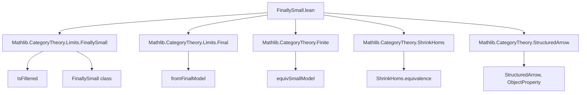
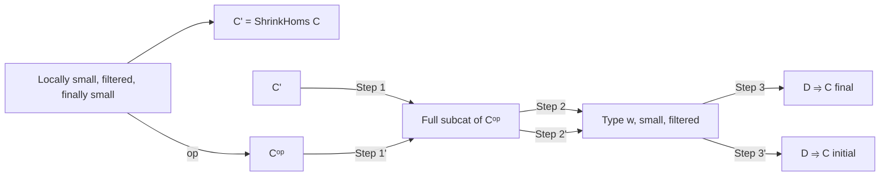
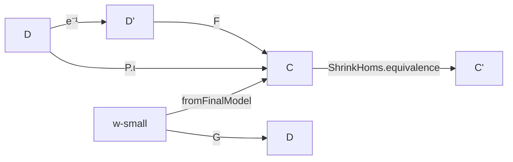

**Technical Brief: `FinallySmall.lean`**

---

### 1. **Key Definitions & Theorems**

| Name | Type / Signature | Purpose |
|------|------------------|---------|
| `FinallySmall.IsFiltered` | `class IsFiltered (C : Type u) [Category C]` | Encodes filteredness of a category (nonempty, connected diagrams, cocones for parallel pairs). |
| `FinallySmall.FinallySmall` | `class FinallySmall.{w} (C : Type u) [Category C]` | Says that for every object $X$, the category of arrows $Y \to X$ with $Y$ in some fixed small full subcategory is filtered and essentially small. |
| `FinallySmall.exists_of_isFiltered` | `∃ (D : Type w) (_ : SmallCategory D) (_ : IsFiltered D) (F : D ⥤ C), F.Final` | Main theorem: existence of a *final* functor from a *small filtered* category into a locally small, filtered, finally small category. |
| `FinallySmall.FilteredFinalModel` | `Type w` | The domain category $D$ in the above existential statement; constructed via choice. |
| `FinallySmall.fromFilteredFinalModel` | `FilteredFinalModel.{w} C ⥤ C` | The final functor $D \to C$. |
| `InitiallySmall.exists_of_isCofiltered` | `∃ (D : Type w) (_ : SmallCategory D) (_ : IsCofiltered D) (F : D ⥤ C), F.Initial` | Dual result: existence of an *initial* functor from a *small cofiltered* category into a locally small, cofiltered, initially small category. |
| `InitiallySmall.CofilteredInitialModel` | `Type w` | Dual of `FilteredFinalModel`. |
| `InitiallySmall.fromCofilteredInitialModel` | `CofilteredInitialModel.{w} C ⥤ C` | Dual of `fromFilteredFinalModel`. |

---

### 2. **Naming Conventions**

- **Prefixes**:
  - `finallySmall_`, `initiallySmall_`: module-level namespace.
  - `fromFilteredFinalModel`, `fromCofilteredInitialModel`: “from” prefix for functors *from* a model category.
  - `FilteredFinalModel`, `CofilteredInitialModel`: “Model” suffix for canonical constructions.
- **Suffixes**:
  - `_of_`: e.g., `finallySmall_of_final_of_finallySmall`, `of_equivalence`.
  - `*_op`: dual constructions (e.g., `Cᵒᵖ`, `Dᵒᵖ`, `leftOp`).
- **Property predicates**:
  - `IsFiltered`, `IsCofiltered`, `FinallySmall`, `InitiallySmall`, `SmallCategory`, `LocallySmall`.

---

### 3. **Tactic Stack**

| Tactic | Usage |
|--------|-------|
| `obtain` / `rintro` | Extracting witnesses from existential hypotheses. |
| `let` / `have` | Constructing intermediate objects (e.g., `P`, `G`, `e`). |
| `tauto` | Solving trivial logical goals (especially for property proofs like `P Y`). |
| `inferInstance` | Inferring class instances (e.g., `SmallCategory`, `IsFiltered`, `Final`). |
| `rw`, `rfl` | Rewriting using definitional equalities. |
| `apply`, `exact`, `intro` | Basic proof scripting. |
| `equivSmallModel`, `small_of_surjective`, ` Functor.final_of_comp_full_faithful'` | Advanced category-theoretic lemmas used in key steps. |
| `coeq_condition_assoc`, `ObjectProperty.hom_ext` | Specific lemmas for structured arrow categories and full subcategories. |

---

### 4. **Proof Logic**

The proof proceeds in three main stages:

1. **Reduction to `Category.{w}` instead of `LocallySmall.{w}`**  
   - First, assuming only `Category.{w}` (not necessarily locally small), construct a final functor from a *$w$-small* filtered category $D$ into $C$.
   - Construction uses the *strict image* of the final model `fromFinalModel.{w} C : FinalModel.{w} C ⥤ C`.
   - The domain $D$ is taken as the full subcategory of $C$ spanned by objects in the strict image of `fromFinalModel`.
   - Verification that this subcategory is filtered uses properties of `IsFiltered` and the universal property of `fromFinalModel`.

2. **Upgrade to `Type w` via `equivSmallModel`**  
   - Given a $w$-small category $D$, use `equivSmallModel.{w} D` to get an equivalence $D ≃ D'$ with $D'$ of type `Type w`.
   - Transport structure (category, filteredness, finality) along this equivalence.

3. **Handle locally small case via `ShrinkHoms`**  
   - For a locally small category $C$, use the equivalence `ShrinkHoms.equivalence.{w} C : C ≃ ShrinkHoms C` to reduce to the previous case.
   - `ShrinkHoms C` is a category with hom-sets of type `w`, satisfying the assumptions of step 1.
   - Pull back the final functor along the equivalence.

The dual result for cofiltered/initially small categories is obtained by applying the filtered/final result to the opposite category $C^{op}$.

---

### 5. **Imports**

- `Mathlib.CategoryTheory.Limits.FinallySmall` — main source module.
- `Mathlib.CategoryTheory` — core category theory library.
- `Mathlib.CategoryTheory.Limits.Final` — for `Final` functors and `fromFinalModel`.
- `Mathlib.CategoryTheory.Finite` — for `SmallCategory`, `Small.{w}`, `equivSmallModel`.
- `Mathlib.CategoryTheory.ShrinkHoms` — for `ShrinkHoms` and its equivalence.
- `Mathlib.CategoryTheory.StructuredArrow` — for `StructuredArrow`, `ObjectProperty`, `FullSubcategory`.

---

### 6. **Mermaid Diagrams**

#### **Dependency Graph (High-Level)**

#### **Overview of Construction Flow**

#### **Key Functors & Equivalences**

---

### 7. **Summary**

This file establishes a *small model* for filtered (resp. cofiltered) categories under the *finally small* (resp. *initially small*) hypothesis. It shows that any locally small filtered finally small category admits a final functor from a *small* filtered category — a crucial tool for constructing limits/colimits, descent, and homotopy theory in category theory. The dual statement for cofiltered initially small categories follows formally via opposites.

The construction is highly structured, leveraging:
- `fromFinalModel` as a starting point,
- strict image and full subcategories to cut down to a small domain,
- `ShrinkHoms` to reduce locally small categories to ones with hom-sets of bounded universe,
- `equivSmallModel` to ensure the resulting category lives in the desired universe.

This is foundational for further developments in *homotopy limits*, *sheaf theory*, and *descent* in higher category theory.
