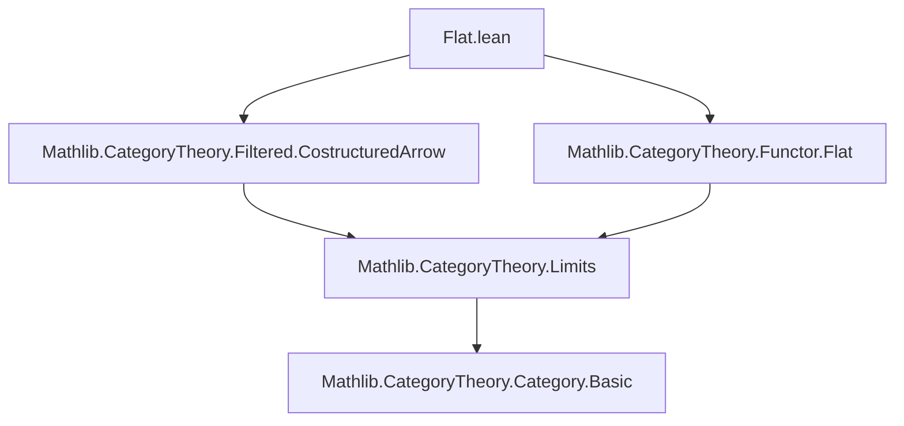
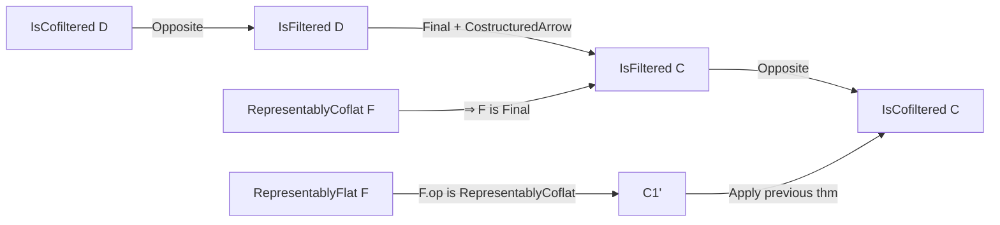

**Technical Brief: `Flat.lean` Module**

---

### 1. **Key Definitions & Theorems**

| Name | Type / Signature | Purpose |
|------|------------------|---------|
| `IsFiltered` | `Category → Prop` | Predicate stating a category is filtered (nonempty, connected, every pair of objects has a cocone, every pair of parallel arrows has a coequalizer). |
| `IsCofiltered` | `Category → Prop` | Dual of `IsFiltered`; category is cofiltered iff its opposite is filtered. |
| `RepresentablyCoflat` | `(F : C ⥤ D) → Prop` | `F` is *representably coflat* if for all $d \in D$, the comma category $(d \downarrow F)$ is filtered. |
| `RepresentablyFlat` | `(F : C ⥤ D) → Prop` | Dual: for all $d \in D$, the comma category $(F \downarrow d)$ is filtered (i.e., $F^\mathrm{op}$ is representably coflat). |
| `IsFiltered.of_final` | *(implicit in proof)* | If $F : C \to D$ is final and $D$ is filtered, then $C$ is filtered. |
| `isFiltered_of_representablyCoflat` | `[IsFiltered D] → [RepresentablyCoflat F] → IsFiltered C` | Main theorem: filteredness descends along representably coflat functors. |
| `isCofiltered_of_representablyFlat` | `[IsCofiltered D] → [RepresentablyFlat F] → IsCofiltered C` | Dual: cofilteredness descends along representably flat functors. |

---

### 2. **Naming Conventions**

- **Prefixes**:
  - `isFiltered_`, `isCofiltered_`: indicate properties of categories.
  - `representablyCoflat`, `representablyFlat`: denote properties of functors.
- **Suffixes**:
  - `_of_`: indicates derivation *from* a hypothesis (e.g., `of_representablyCoflat`).
  - `_op`: used for dual constructions (e.g., `F.op`, `isCofiltered_of_isFiltered_op`).
- **`𝟭 _`**: identity functor on a category (used as a terminal object in comma categories).

---

### 3. **Tactic Stack**

- `exact`: used to conclude with a direct application of a lemma.
- `have`: intermediate lemma introduction (here, to apply the filtered version to the opposite functor).
- Implicit use of:
  - `apply` / `exact` via `lemma` application.
  - `rw` / `simp` likely used internally in `IsFiltered.of_final` or related lemmas (not visible here, but standard in such proofs).
  - `CategoryTheory`-specific tactics (e.g., `ext`, `funext`, `apply_fun`) are not explicit in this snippet but are assumed in the imported modules.

---

### 4. **Proof Logic**

- **Main proof pattern**:
  1. Use the fact that *representably coflat functors are final* (resp. *representably flat ⇒ op is representably coflat ⇒ op is final*).
  2. Apply `isFiltered_of_isFiltered_costructuredArrow F (𝟭 _)`, which is a version of `IsFiltered.of_final` specialized to costructured arrows.
  3. For the cofiltered case:
     - Pass to opposites: `F.op : Cᵒᵖ ⥤ Dᵒᵖ`.
     - Apply the filtered version to `F.op`.
     - Conclude via `isCofiltered_of_isFiltered_op`, which states that $C$ is cofiltered iff $Cᵒᵖ$ is filtered.

- **Logical flow**:
  > *Assume $D$ filtered and $F$ representably coflat ⇒ $(d \downarrow F)$ filtered for all $d$ ⇒ $F$ final ⇒ $C$ filtered.*

---

### 5. **Imports**

- `Mathlib.CategoryTheory.Filtered.CostructuredArrow`: provides `isFiltered_of_isFiltered_costructuredArrow`, linking filteredness of costructured arrow categories to filteredness of domain.
- `Mathlib.CategoryTheory.Functor.Flat`: defines `RepresentablyFlat` and `RepresentablyCoflat`, and likely proves key lemmas like:
  - `RepresentablyCoflat → Final`
  - `RepresentablyFlat F ↔ RepresentablyCoflat F.op`

---

### 8. **Mermaid Diagrams**

#### Dependency Graph (Module-Level)



#### Theoretical Overview (Flow of Reasoning)



#### Key Implication Chain

```
RepresentablyCoflat F
        ⇒ F is Final
        ⇒ (d ↓ F) filtered for all d
        ⇒ IsFiltered (costructuredArrow F (𝟭 _))
        ⇒ IsFiltered C      [via isFiltered_of_isFiltered_costructuredArrow]

RepresentablyFlat F
        ⇔ RepresentablyCoflat F.op
        ⇒ IsFiltered Cᵒᵖ   [apply above to F.op]
        ⇒ IsCofiltered C   [by definition]
```

--- 

This module formalizes a foundational transfer principle for (co)filteredness along representably (co)flat functors — a key step in categorical homotopy theory and shape theory.
