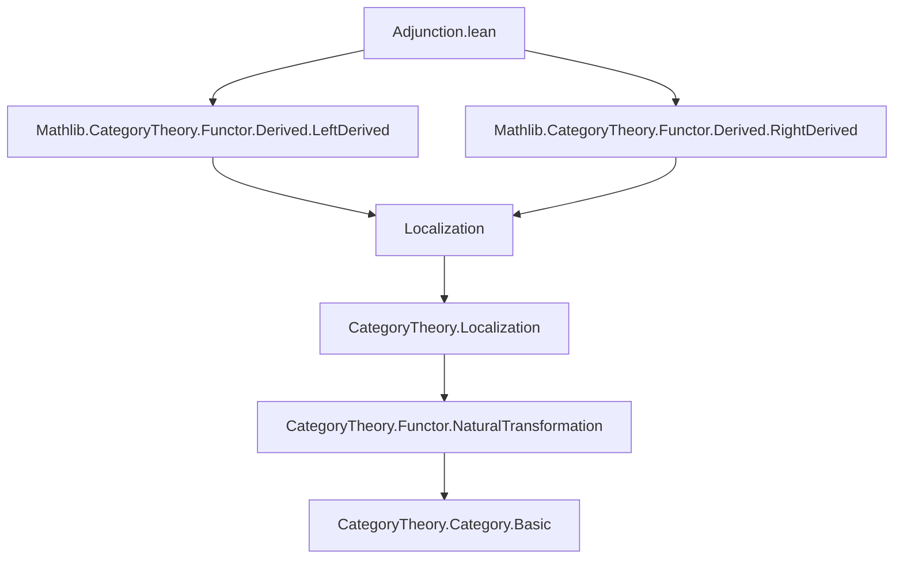

### Technical Brief: `Adjunction.lean` — Derived Adjunction in Category Theory

---

#### **1. Key Definitions & Theorems**

| Name | Type / Signature | Purpose |
|------|------------------|---------|
| `derived'` | `[G'.IsLeftDerivedFunctor α W₁] → [F'.IsRightDerivedFunctor β W₂] → (η : 𝟭 D₁ ⟶ G' ⋙ F') → (ε : F' ⋙ G' ⟶ 𝟭 D₂) → (hη : ...) → (hε : ...) → G' ⊣ F'` | Constructs an adjunction `G' ⊣ F'` from natural transformations `η`, `ε` satisfying compatibility with the derived structures (`α`, `β`). |
| `derivedη` | `[(G' ⋙ F').IsLeftDerivedFunctor ...] → 𝟭 D₁ ⟶ G' ⋙ F'` | Defines the unit of the derived adjunction via universal property of left derived functors. |
| `derivedε` | `[(F' ⋙ G').IsRightDerivedFunctor ...] → F' ⋙ G' ⟶ 𝟭 D₂` | Defines the counit of the derived adjunction via universal property of right derived functors. |
| `derived` | `[G'.IsLeftDerivedFunctor α W₁] → [F'.IsRightDerivedFunctor β W₂] → [...] → G' ⊣ F'` | Main theorem: under absolute derived functor assumptions, an adjunction `G ⊣ F` induces `G' ⊣ F'`. |
| `derivedη_fac_app` | `∀ X₁, (derivedη.app (L₁.obj X₁)) ≫ F'.map (α.app X₁) = L₁.map (adj.unit.app X₁) ≫ β.app (G.obj X₁)` | Factorization property of `derivedη` over the localization `L₁`. |
| `derivedε_fac_app` | `∀ X₂, G'.map (β.app X₂) ≫ (derivedε.app (L₂.obj X₂)) = α.app (F.obj X₂) ≫ L₂.map (adj.counit.app X₂)` | Factorization property of `derivedε` over the localization `L₂`. |

---

#### **2. Naming Conventions**

- **Prefixes**:
  - `derived*`: Indicates constructions related to derived functors (`derivedη`, `derivedε`, `derived'`, `derived`).
  - `is_*`: Used in typeclass instances like `IsLeftDerivedFunctor`, `IsRightDerivedFunctor`, `IsLocalization`.
- **Suffixes**:
  - `*_fac_app`: Factorization lemmas for components at objects (e.g., `derivedη_fac_app`).
  - `*_app`: Component of a natural transformation at an object (standard in Lean’s `Functor`/`NatTrans`).
- **Variables**:
  - `α : L₁ ⋙ G' ⟶ G ⋙ L₂`, `β : F ⋙ L₁ ⟶ L₂ ⋙ F'`: Structure maps witnessing that `G'`, `F'` are derived from `G`, `F`.
  - `W₁`, `W₂`: Classes of morphisms being localized.

---

#### **3. Tactic Stack**

- **Core tactics**:
  - `cat_disch`: Discharges categorical diagrammatic goals.
  - `simp only [Functor.map_comp]`: Simplifies functoriality.
  - `rw [...]`: Rewriting using naturality, associativity, unit/counit laws.
  - `reassoc_of%`: Handles reassociation of compositions using `reassoc` lemmas.
  - `congr_app`: Converts equality of natural transformations to pointwise equality.
  - `simpa using ...`: Simplifies using a lemma and discharges remaining goals.
- **Category-theoretic automation**:
  - `ext`: Extensionality for natural transformations/functors.
  - `apply ...Derived_ext`: Applies derived functor extensionality (e.g., `G'.leftDerived_ext`).
  - `dsimp at ...`: Simplifies definitional equalities in context.

---

#### **4. Proof Logic**

The proof proceeds in two phases:

1. **Construction of unit and counit**:
   - `derivedη` is defined using the universal property of *left* derived functors: it lifts a natural transformation from `L₁` to `G' ⋙ F'`.
   - `derivedε` is defined dually using *right* derived functors.

2. **Verification of triangle identities**:
   - For the **left triangle**, `derived'` reduces the goal to showing an equality of morphisms in `D₂`, then applies `G'.leftDerived_ext α W₁`, followed by diagram chasing:
     - Uses naturality of `ε`, `α`, and `η`.
     - Applies `hη`, `hε`, and the original triangle identities of `adj : G ⊣ F`.
     - Simplifies using functoriality and localization properties.
   - For the **right triangle**, symmetric argument using `F'.rightDerived_ext β W₂`.

The key insight is that *absolute* derived functors ensure the composite functors `G' ⋙ F'` and `F' ⋙ G'` are themselves derived, enabling the use of universal properties.

---

#### **5. Imports**

- `Mathlib.CategoryTheory.Functor.Derived.LeftDerived`
- `Mathlib.CategoryTheory.Functor.Derived.RightDerived`

These imports provide:
- Definitions of left/right derived functors (`IsLeftDerivedFunctor`, `IsRightDerivedFunctor`).
- Universal properties (`leftDerivedLift`, `rightDerivedDesc`, `leftDerived_fac_app`, etc.).
- Tools for working with localization and derived functors in homological algebra.

---

#### **6. Mermaid Diagrams**

##### **Dependency Graph**



##### **Overview of Theory Flow**

```mermaid
flowchart LR
  subgraph Setup
    G[G : C₁ ⥤ C₂] & F[F : C₂ ⥤ C₁]
    L₁[L₁ : C₁ ⥤ D₁] & L₂[L₂ : C₂ ⥤ D₂]
    W₁[W₁ ⊆ Mor C₁] & W₂[W₂ ⊆ Mor C₂]
    adj[adj : G ⊣ F]
  end

  subgraph Derived Functors
    G'[G' : D₁ ⥤ D₂] & F'[F' : D₂ ⥤ D₁]
    α[α : L₁ ⋙ G' ⇒ G ⋙ L₂] & β[β : F ⋙ L₁ ⇒ L₂ ⋙ F']
    isG'[G'.IsLeftDerivedFunctor α W₁] & isF'[F'.IsRightDerivedFunctor β W₂]
  end

  subgraph Absolute Assumptions
    absG'[ (G' ⋙ F').IsLeftDerivedFunctor ... W₁ ]
    absF'[ (F' ⋙ G').IsRightDerivedFunctor ... W₂ ]
  end

  subgraph Result
    derived[derived : G' ⊣ F']
  end

  adj --> isG'
  adj --> isF'
  isG' --> absG'
  isF' --> absF'
  absG' --> derived
  absF' --> derived
```

---

#### **7. Summary**

This file formalizes a foundational result in homological algebra: **derived adjunctions**. It shows that under mild absoluteness conditions, an adjunction between ordinary functors descends to an adjunction between their derived functors. The proof leverages:
- The universal properties of derived functors (`leftDerivedLift`, `rightDerivedDesc`),
- Naturality and coherence laws of monoidal categories (associators, unitors),
- Diagrammatic reasoning in enriched categorical settings.

It is closely tied to Maltsiniotis’ revisitation of Quillen’s adjunction theorem for derived functors.

--- 

Let me know if you'd like a formalized summary in Lean syntax or a proof sketch in natural deduction style.
