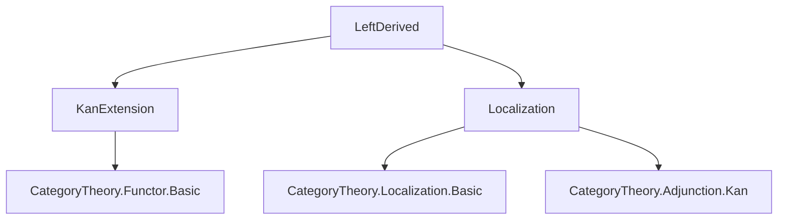
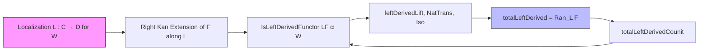
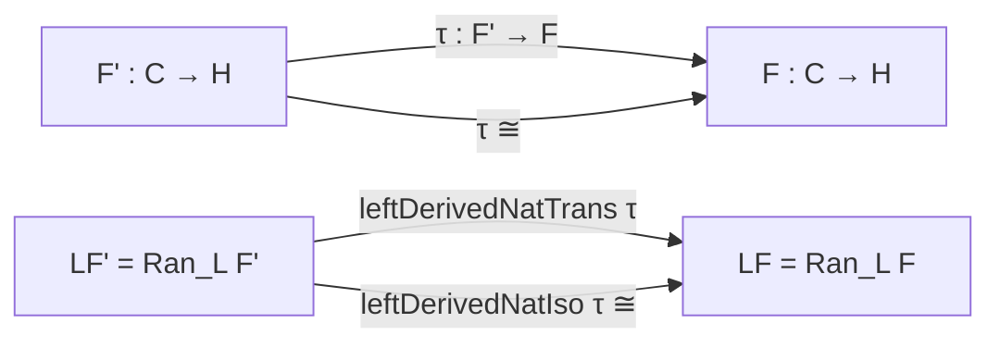

### Technical Brief: `LeftDerived.lean`

---

#### **1. Key Definitions & Theorems**

| Name | Type / Signature | Purpose |
|------|------------------|---------|
| `IsLeftDerivedFunctor` | `class (LF : D ⥤ H) → (α : L ⋙ LF ⟶ F) → W → Prop` | Asserts that `LF` equipped with `α` is a *right Kan extension* of `F` along localization `L`, i.e., a *left derived functor*. |
| `isLeftDerivedFunctor_iff_isRightKanExtension` | `↔` | Equivalence between `IsLeftDerivedFunctor` and `IsRightKanExtension`, under localization assumption. |
| `leftDerivedLift` | `G : D ⥤ H → β : L ⋙ G ⟶ F → G ⟶ LF` | Universal property: lifts natural transformations through the derived functor. |
| `leftDerived_fac`, `leftDerived_fac_app` | `whiskerLeft L γ ≫ α = β` | Factorization property of `leftDerivedLift`. |
| `leftDerived_ext` | `γ₁, γ₂ : G ⟶ LF → whiskerLeft L γ₁ ≫ α = whiskerLeft L γ₂ ≫ α → γ₁ = γ₂` | Uniqueness of lifts (monomorphism-like behavior). |
| `leftDerivedNatTrans` | `τ : F' ⟶ F → LF' ⟶ LF` | Induced morphism between derived functors from a morphism of base functors. |
| `leftDerivedNatTrans_id`, `leftDerivedNatTrans_comp` | `Id`, `Comp` laws | Functoriality of `leftDerivedNatTrans`. |
| `leftDerivedNatIso` | `τ : F' ≅ F → LF' ≅ LF` | Induced isomorphism between derived functors from an isomorphism of base functors. |
| `leftDerivedUnique` | `LF ≅ LF'` | Uniqueness up to unique iso of left derived functors. |
| `isLeftDerivedFunctor_iff_isIso_leftDerivedLift` | `G.IsLeftDerivedFunctor β W ↔ IsIso (LF.leftDerivedLift …)` | Characterization of when a candidate is *the* left derived functor: lift is iso. |
| `HasLeftDerivedFunctor` | `class F → W → Prop` | `F` has a left derived functor w.r.t. `W` iff it has a right Kan extension along *any* localization `L` for `W`. |
| `hasLeftDerivedFunctor_iff` | `↔ HasRightKanExtension L F` | Equivalence with existence of right Kan extension along a specific localization. |
| `totalLeftDerived` | `D ⥤ H` | The *total* left derived functor: the right Kan extension of `F` along `L`. |
| `totalLeftDerivedCounit` | `L ⋙ totalLeftDerived ⟶ F` | The counit of the Kan extension, serving as the structure map `α`. |
| `instance IsLeftDerivedFunctor` | `totalLeftDerived` is a left derived functor | Canonical instance showing `totalLeftDerived` satisfies the definition. |

---

#### **2. Naming Conventions**

- **Prefixes**:
  - `leftDerived…`: for constructions tied to left derived functors (`leftDerivedLift`, `leftDerivedNatTrans`, `leftDerivedNatIso`, `leftDerivedUnique`).
  - `totalLeftDerived…`: for the *canonical* construction (`totalLeftDerived`, `totalLeftDerivedCounit`).
  - `hasLeftDerivedFunctor`: for existence predicates (`HasLeftDerivedFunctor`, `hasLeftDerivedFunctor_iff`).
- **Suffixes**:
  - `…_iff_…`: logical equivalences.
  - `…_ext`, `…_fac`, `…_app`: extensionality, factorization, and application lemmas.
  - `…_iff_of_iso`, `…_of_iso`: lemmas using isomorphism-based transport.
- **Variables**:
  - `α`, `α'`, `α''`: structure maps `L ⋙ LF ⟶ F`.
  - `e`, `τ`, `τ'`: natural transformations/isomorphisms between functors.
  - `W`: the class of morphisms to localize at.

---

#### **3. Tactic Stack**

Frequent tactics used in proofs:

| Tactic | Role |
|--------|------|
| `simp` / `simp only` | Simplify using `reassoc`, `simps`, and definitional equalities. |
| `rw` / `apply` | Rewrite using equivalences (`hasLeftDerivedFunctor_iff`, `isLeftDerivedFunctor_iff_…`). |
| `dsimp` | Simplify definitions (e.g., unfolding `leftDerivedNatTrans`). |
| `exact` / `infer_instance` | Provide witnesses or instances (e.g., `IsRightKanExtension`). |
| `leftDerived_ext` | Prove equality of natural transformations via universal property. |
| `by simp` / `by dsimp` | Short proofs relying on definitional equality. |

No heavy automation like `aesop` or `ring`; proofs are mostly structural, leveraging Kan extension properties.

---

#### **4. Proof Logic**

- **Core Strategy**: *Dualize* results from `RightDerived.lean`.
- **Typical Proof Flow**:
  1. Reduce to known results about *right* Kan extensions via `isLeftDerivedFunctor_iff_isRightKanExtension`.
  2. Use universal properties (`liftOfIsRightKanExtension_*`) to construct maps and prove commutativity/uniqueness.
  3. Transport structure along isomorphisms (`isRightKanExtension_iff_of_iso`, `leftDerivedNatIso`).
  4. For existence (`HasLeftDerivedFunctor.mk'`), extract the Kan extension data from the instance.
- **Induction**: Not used — all arguments are categorical/universal.

---

#### **5. Imports**

| Module | Purpose |
|--------|---------|
| `Mathlib.CategoryTheory.Functor.KanExtension.Basic` | Core Kan extension theory (right extensions, lifts, factorization). |
| `Mathlib.CategoryTheory.Localization.Predicate` | Localization functors, `IsLocalization`, `W.Q`, universal property. |

These imports define the categorical machinery for Kan extensions and localizations, which are dualized to define *left* derived functors.

---

#### **6. Mermaid Diagrams**

##### **Dependency Graph (Module-Level)**

##### **Conceptual Overview of Theory Flow**

##### **Uniqueness & Functoriality**

---

#### **7. Summary**

This file formalizes *left derived functors* in a general categorical setting, using *right Kan extensions* along localization functors. It defines:

- A type class `IsLeftDerivedFunctor` capturing the universal property.
- A canonical construction `totalLeftDerived` when it exists (`HasLeftDerivedFunctor`).
- Functoriality and uniqueness up to unique isomorphism.

The development is *dual* to `RightDerived.lean`, and relies heavily on the theory of Kan extensions and localization from Mathlib. All results are structured around the universal property of right Kan extensions, with proofs streamlined by `reassoc` and `simps` attributes for simplification.
