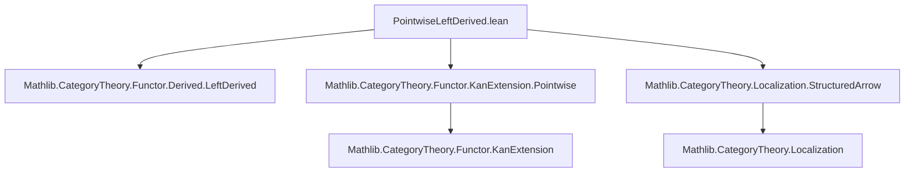
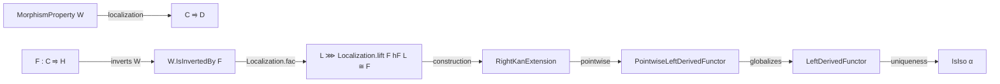

Here is the structured technical brief extracted from `PointwiseLeftDerived.lean`:

---

### **1. Key Definitions & Theorems**

| Name | Type | Purpose |
|------|------|---------|
| `HasPointwiseLeftDerivedFunctorAt (X : C)` | `Prop` | States that `F : C ⥤ H` has a pointwise right Kan extension at `W.Q.obj X`, i.e., a pointwise left derived functor at `X`. |
| `HasPointwiseLeftDerivedFunctor` | `∀ X, F.HasPointwiseLeftDerivedFunctorAt W X` | Global version: `F` has a pointwise left derived functor at every object. |
| `hasPointwiseLeftDerivedFunctorAt_iff` | `F.HasPointwiseLeftDerivedFunctorAt W X ↔ HasPointwiseRightKanExtensionAt L F (L.obj X)` | Equivalence between the definition using `W.Q` and any localization `L`. |
| `hasPointwiseLeftDerivedFunctorAt_iff_of_mem` | `F.HasPointwiseLeftDerivedFunctorAt W X ↔ F.HasPointwiseLeftDerivedFunctorAt W Y` for `W (X ⟶ Y)` | Invariance under `W`-morphisms. |
| `hasPointwiseRightKanExtension_of_hasPointwiseLeftDerivedFunctor` | `HasPointwiseRightKanExtension L F` | From pointwise to global pointwise right Kan extension. |
| `hasLeftDerivedFunctor_of_hasPointwiseLeftDerivedFunctor` | `F.HasLeftDerivedFunctor W` | Derives existence of a (non-pointwise) left derived functor. |
| `isPointwiseRightKanExtensionOfHasPointwiseLeftDerivedFunctor` | `(RightExtension.mk _ α).IsPointwiseRightKanExtension` | Shows a left derived functor is pointwise when pointwise exists. |
| `isPointwiseRightKanExtensionAtOfIsoOfIsLocalization` | `(RightExtension.mk _ e.inv).IsPointwiseRightKanExtensionAt` | Constructs pointwise right Kan extension from an isomorphism `F ≅ L ⋙ G`. |
| `isPointwiseRightKanExtensionOfIsoOfIsLocalization` | `(RightExtension.mk _ e.inv).IsPointwiseRightKanExtension` | Global version of the above. |
| `RightExtension.isPointwiseRightKanExtensionOfIsIsoOfIsLocalization` | `E.IsPointwiseRightKanExtension` | When the extension map `E.hom` is an iso. |
| `hasPointwiseLeftDerivedFunctor_of_inverts` | `W.IsInvertedBy F → F.HasPointwiseLeftDerivedFunctor W` | Main existence theorem: if `F` inverts `W`, then it has a pointwise left derived functor. |
| `isLeftDerivedFunctor_of_inverts` | `F'.IsLeftDerivedFunctor e.hom W` | Constructs a left derived functor from an isomorphism `L ⋙ F' ≅ F`. |
| `isIso_of_isLeftDerivedFunctor_of_inverts` | `IsIso α` | Uniqueness up to iso: any left derived transformation is iso when `F` inverts `W`. |
| `isLeftDerivedFunctor_iff_of_inverts` | `LF.IsLeftDerivedFunctor α W ↔ IsIso α` | Characterization: left derived functor iff the unit is iso. |

---

### **2. Naming Conventions**

- **Prefixes**:
  - `hasPointwiseLeftDerivedFunctorAt_`: properties of pointwise existence at an object.
  - `hasPointwiseLeftDerivedFunctor`: global existence.
  - `isPointwiseRightKanExtensionAt_` / `isPointwiseRightKanExtension`: constructions of pointwise right Kan extensions (dualized).
  - `isLeftDerivedFunctor_`: constructions of left derived functors.
- **Suffixes**:
  - `_of_iso`, `_of_inverts`, `_of_mem`: indicate hypotheses (e.g., existence of iso, `W`-inversion, or `W`-morphism).
  - `_iff`: equivalence lemmas.
- **Notable pattern**: `LeftDerived` ↔ `RightKanExtension` via duality.

---

### **3. Tactic Stack**

Frequent tactics used:
- `rw` / `simp only` / `simp`: for rewriting and simplifying using definitions and equivalences.
- `infer_instance`: to discharge typeclass goals (e.g., `HasPointwiseRightKanExtensionAt`).
- `exact`, `refine`, `have`, `set`: for structured proof construction.
- `Localization.induction_structuredArrow`: induction principle for structured arrows over localization.
- `dsimp`, `assumption`, `intro`, `cases`: standard Lean tactics.
- `cancel_mono`, `comp_id`, `assoc`, `reassoc_of%`: category-theoretic simplifications.

---

### **4. Proof Logic**

- **Core strategy**:  
  - Use the equivalence between pointwise left derived functors and pointwise right Kan extensions along localizations.
  - Leverage the universal property of localization and structured arrows.
  - Prove existence via isomorphism `F ≅ L ⋙ G` (e.g., from `W.IsInvertedBy F` ⇒ `Localization.fac F hF L`).
  - Uniqueness: show any two left derived functors are naturally isomorphic; any left derived transformation is iso.

- **Typical proof flow**:
  1. Reduce to a specific localization (usually `W.Q`) using `hasPointwiseLeftDerivedFunctorAt_iff`.
  2. Construct a pointwise right Kan extension using `isPointwiseRightKanExtensionAtOfIsoOfIsLocalization`.
  3. Use `Localization.essSurj` and `isPointwiseRightKanExtensionAtEquivOfIso'` to extend globally.
  4. For uniqueness: apply `leftDerivedUnique` and invertibility lemmas.

---

### **5. Imports**

| Import | Role |
|--------|------|
| `Mathlib.CategoryTheory.Functor.Derived.LeftDerived` | Base theory of left derived functors. |
| `Mathlib.CategoryTheory.Functor.KanExtension.Pointwise` | Pointwise Kan extensions (right Kan extensions used here). |
| `Mathlib.CategoryTheory.Localization.StructuredArrow` | Structured arrows over localization, key for pointwise constructions. |

---

### **6. Mermaid Diagrams**

#### **Dependency Graph (Module-Level)**



#### **Conceptual Overview (Theory Flow)**



#### **Key Equivalence Chains**

```mermaid
graph LR
  A[F.HasPointwiseLeftDerivedFunctorAt W X] 
  <->|hasPointwiseLeftDerivedFunctorAt_iff| B[HasPointwiseRightKanExtensionAt L F (L.obj X)]
  B <->|isPointwiseRightKanExtensionAtOfIsoOfIsLocalization| C[∃ e : F ≅ L ⋙ G, (RightExtension.mk e.inv).IsPointwiseRightKanExtensionAt]
  C -->|globalizes| D[HasPointwiseRightKanExtension L F]
  D -->|definition| E[F.HasLeftDerivedFunctor W]
```

---

This file formalizes a *dual* perspective on derived functors: instead of constructing left derived functors via colimits, it uses *pointwise right Kan extensions* to define and prove existence/uniqueness of pointwise left derived functors — a clean, categorical approach leveraging localization theory.
