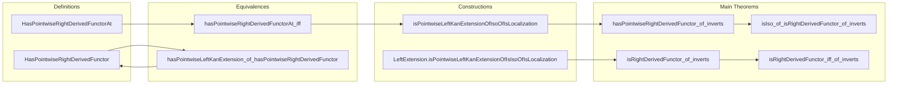

### Technical Brief: `PointwiseRightDerived.lean`

---

#### **1. Key Definitions & Theorems**

| Name | Type / Signature | Purpose |
|------|------------------|---------|
| `HasPointwiseRightDerivedFunctorAt` | `class (X : C) → Prop` | Defines that `F : C ⥤ H` has a pointwise right derived functor at `X`: i.e., `F` has a *pointwise left Kan extension* along the localization `W.Q : C ⥤ D` at `W.Q.obj X`. |
| `HasPointwiseRightDerivedFunctor` | `abbrev (F : C ⥤ H) → Prop` | `∀ X, F.HasPointwiseRightDerivedFunctorAt W X`: `F` has a pointwise right derived functor everywhere. |
| `hasPointwiseRightDerivedFunctorAt_iff` | `lemma` | Equivalence: `F.HasPointwiseRightDerivedFunctorAt W X ↔ HasPointwiseLeftKanExtensionAt L F (L.obj X)` for any localization `L` of `W`. |
| `hasPointwiseLeftKanExtension_of_hasPointwiseRightDerivedFunctor` | `lemma` | If `F` has a pointwise right derived functor, then it has a *global* pointwise left Kan extension along any localization `L`. |
| `hasRightDerivedFunctor_of_hasPointwiseRightDerivedFunctor` | `instance` | Derives the existence of a (global) right derived functor from pointwise existence. |
| `isPointwiseLeftKanExtensionOfHasPointwiseRightDerivedFunctor` | `noncomputable def` | Shows that a right derived functor (assumed to exist) is automatically a *pointwise* left Kan extension when pointwise right derived functors exist. |
| `isPointwiseLeftKanExtensionAtOfIsoOfIsLocalization` | `def` | If `F ≅ L ⋙ G` and `L` is a localization, then the component `e.hom` exhibits `G` as a pointwise left Kan extension of `F` at `L.obj Y`. |
| `isPointwiseLeftKanExtensionOfIsoOfIsLocalization` | `noncomputable def` | Global version: `e.hom` makes `G` a pointwise left Kan extension everywhere. |
| `LeftExtension.isPointwiseLeftKanExtensionOfIsIsoOfIsLocalization` | `noncomputable def` | If `E : LeftExtension L F` has invertible `E.hom`, then `E` is pointwise left Kan. |
| `hasPointwiseRightDerivedFunctor_of_inverts` | `lemma` | **Main theorem**: If `F` inverts `W`, then `F` has a pointwise right derived functor. |
| `isRightDerivedFunctor_of_inverts` | `lemma` | If `F ≅ L ⋙ F'`, then `F'` is the right derived functor of `F` along `L`. |
| `isIso_of_isRightDerivedFunctor_of_inverts` | `lemma` | If `F` inverts `W` and `F'` is a right derived functor of `F`, then the unit `α : F ⟶ L ⋙ F'` is an isomorphism. |
| `isRightDerivedFunctor_iff_of_inverts` | `lemma` | Equivalence: `F'` is the right derived functor of `F` ⇔ the unit `α` is an isomorphism, assuming `F` inverts `W`. |

---

#### **2. Naming Conventions**

- **Prefixes**:
  - `hasPointwiseRightDerivedFunctorAt`: for properties at an object.
  - `hasPointwiseRightDerivedFunctor`: global property.
  - `isPointwiseLeftKanExtension…`: for exhibiting (pointwise) left Kan extensions.
  - `isRightDerivedFunctor`: for right derived functors.
- **Suffixes**:
  - `At`: for pointwise (at an object).
  - `OfIso`: when constructed from an isomorphism.
  - `OfInverts`: when derived from the assumption that `F` inverts `W`.
  - `OfHasPointwiseRightDerivedFunctor`: when assuming global pointwise existence.
- **Abbreviations**:
  - `RF` for `RightDerivedFunctor`, `L` for localization functor.

---

#### **3. Tactic Stack**

Frequent tactics used in proofs:

| Tactic | Role |
|--------|------|
| `rw` | Rewriting using equivalences, naturality, and isomorphism laws. |
| `simp` / `simp only` | Simplifying using `Localization` and `Iso` properties. |
| `infer_instance` | Automatically applying instance lemmas (e.g., `IsIso`, `HasPointwiseLeftKanExtensionAt`). |
| `exact` / `refine` | Constructing proofs term-by-term. |
| `induction` (via `Localization.induction_costructuredArrow`) | Structural induction on costructured arrows. |
| `cancel_epi` | Cancellation of epimorphisms (used after showing invertibility). |
| `dsimp`, `assoc`, `map_comp`, `NatTrans.naturality_assoc` | Category-theoretic simplifications and naturality manipulations. |
| `rw [comp_id]`, `rw [map_id]` | Simplifying identities. |

---

#### **4. Proof Logic**

The logical flow follows a **two-phase strategy**:

1. **Reduction to pointwise left Kan extensions**:
   - Define *pointwise right derived functors* via *pointwise left Kan extensions* along localizations.
   - Prove equivalence between pointwise existence at `X` and existence of a left Kan extension at `L.obj X` for *any* localization `L` (`hasPointwiseRightDerivedFunctorAt_iff`).
   - Use localization properties (`essSurj`, `uniq`, `inverts`) to lift pointwise to global.

2. **Main existence result**:
   - If `F` inverts `W`, then `F ≅ W.Q ⋙ (Localization.lift F hF W.Q)`.
   - Apply `isPointwiseLeftKanExtensionOfIsoOfIsLocalization` to get a pointwise left Kan extension.
   - Conclude `F` has a pointwise right derived functor (`hasPointwiseRightDerivedFunctor_of_inverts`).
   - Derive global right derived functor and uniqueness up to iso.

Key lemmas use:
- **Localization universal property** (`induction_costructuredArrow`, `isoOfHom`).
- **Naturality and iso calculus** (`NatTrans.naturality`, ` whiskerLeft`, `asIso`).
- **Cancellation** (epi/mono) after establishing invertibility.

---

#### **5. Imports**

| Module | Purpose |
|--------|---------|
| `Mathlib.CategoryTheory.Functor.Derived.RightDerived` | General theory of right derived functors. |
| `Mathlib.CategoryTheory.Functor.KanExtension.Pointwise` | Pointwise Kan extensions (core technical machinery). |
| `Mathlib.CategoryTheory.Localization.StructuredArrow` | Costructured arrows for localization (used in induction proofs). |

---

#### **8. Mermaid Diagrams**

##### **Dependency Graph (High-Level)**

```mermaid
graph TD
  A[Localization Theory] --> B[StructuredArrow]
  B --> C[Pointwise Kan Extensions]
  C --> D[PointwiseRightDerived.lean]
  A --> D
  D --> E[PointwiseLeftDerived.lean] %% dual file
  D --> F[RightDerived.lean]
```

##### **Overview of File Structure**



##### **Proof Strategy Flow (for main theorem)**

```mermaid
flowchart LR
  A[F inverts W] --> B[F ≅ W.Q ⋙ RF]
  B --> C[LeftExtension.mk e.hom]
  C --> D[isPointwiseLeftKanExtension]
  D --> E[HasPointwiseLeftKanExtensionAt W.Q F (W.Q.obj X)]
  E --> F[F.HasPointwiseRightDerivedFunctorAt W X]
  F --> G[F.HasPointwiseRightDerivedFunctor W]
```

---

This file formalizes a foundational result in derived functor theory: **inverting a class of morphisms suffices to construct pointwise right derived functors**, using Kan extensions as the core categorical tool. It is dual to `PointwiseLeftDerived.lean`, and both files rely heavily on localization theory and structured arrow calculus.
