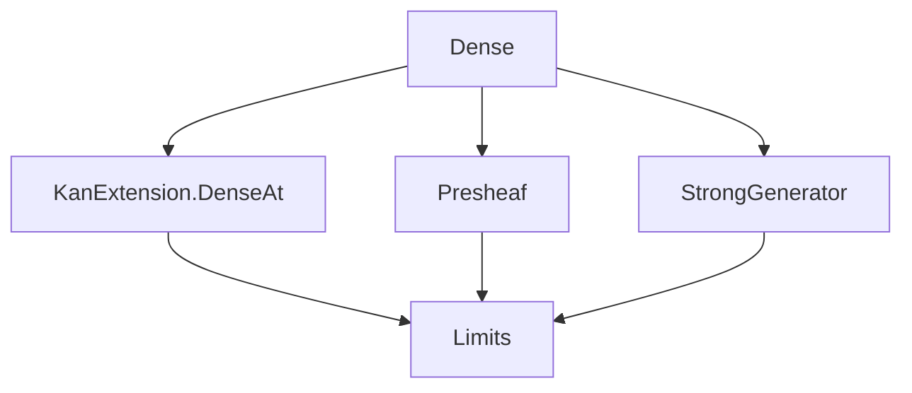

Here is the structured technical brief extracted from `Dense.lean`:

---

### **1. Key Definitions & Theorems**

| Name | Type / Signature | Purpose |
|------|------------------|---------|
| `IsDense` | `class IsDense (F : C ⥤ D) : Prop` | Defines a functor $F : C \to D$ as *dense* if every object $Y : D$ admits a canonical colimit cocone over the diagram of morphisms $F X \to Y$. |
| `denseAt` | `denseAt F [F.IsDense] (Y : D) : F.DenseAt Y` | A choice of structure witnessing density at $Y$. |
| `isDense_iff_nonempty_isPointwiseLeftKanExtension` | `F.IsDense ↔ Nonempty ((LeftExtension.mk _ (rightUnitor F).inv).IsPointwiseLeftKanExtension)` | Equivalence between density and existence of a pointwise left Kan extension structure on $\mathrm{Id}_D$ along $F$. |
| `IsDense.of_iso` / `IsDense.iff_of_iso` | `F ≅ G → F.IsDense → G.IsDense` | Density is invariant under natural isomorphism of functors. |
| `IsDense.comp_left_iff_of_isEquivalence` / `IsDense.comp_right_iff_of_isEquivalence` | `(G ⋙ F).IsDense ↔ F.IsDense` (for $G$ an equivalence) | Density is preserved and reflected under pre- or post-composition with equivalences. |
| `IsDense.of_fullyFaithful_restrictedULiftYoneda` | `[F.Full] → (restrictedULiftYoneda F).FullyFaithful → F.IsDense` | If the restricted ULift Yoneda embedding along $F$ is fully faithful, then $F$ is dense. |
| `isDense_iff_fullyFaithful_restrictedULiftYoneda` | `[F.Full] → F.IsDense ↔ Nonempty ((restrictedULiftYoneda F).FullyFaithful)` | For full $F$, density is equivalent to full faithfulness of the restricted Yoneda embedding. |
| `isStrongGenerator_of_isDense` | `[F.IsDense] → IsStrongGenerator (.ofObj F.obj)` | The image of a dense functor forms a strong generator. |

---

### **2. Naming Conventions**

- **Prefixes**:
  - `isDense_`: properties/characterizations of density (`isDense_iff_...`, `isDense_of_...`)
  - `denseAt`: canonical colimit cocone at an object
  - `isStrongGenerator_of_`: implication from density to strong generation
- **Suffixes**:
  - `_iff_`: equivalence statements
  - `_of_`: forward implication or construction
  - `_iff_of_`: equivalence under additional assumptions (e.g., equivalence, fullness)
- **Module-level**:
  - `Functor.IsDense`, `Functor.denseAt`, `Functor.isStrongGenerator_of_isDense`

---

### **3. Tactic Stack**

Frequently used tactics in proofs:
- `ext`: extensionality for natural transformations / morphisms
- `simpa`: simplification with assumptions
- `dsimp`: definitional simplification
- `rw`: rewriting using equalities/isomorphisms
- `exact`, `refine`, `intro`: basic proof construction
- `have`, `let`: local definitions and intermediate lemmas
- `inferInstance`: typeclass inference
- `congr_fun`, `congr_arg`: functional extensionality tools
- `ULift.up_injective`, `ULift.down_injective`: properties of `ULift`

---

### **4. Proof Logic**

- **Structure**: Most proofs follow a pattern of:
  1. **Unfolding definitions** (e.g., `isDenseAt`, `DenseAt`, `Cocone`, `CostructuredArrow`)
  2. **Constructing candidates** (e.g., cocones, natural transformations)
  3. **Verifying universal properties** (factorization, uniqueness) using:
     - `hom_ext'` for morphism extensionality in presheaf categories
     - `ULift`-based lifting arguments to handle size issues
     - Yoneda lemmas (`uliftYoneda`, `restrictedULiftYoneda`)
  4. **Using isomorphisms** (e.g., `associator`, `unitIso`, `counitIso`) to transport structures along equivalences.

- **Inductive/constructive style**: Density is defined via a *class* with a *choice* (`denseAt`), and proofs often construct the required colimit cocone explicitly.

---

### **5. Imports**

- `Mathlib.CategoryTheory.Functor.KanExtension.DenseAt`: foundational definitions of density and Kan extensions
- `Mathlib.CategoryTheory.Limits.Presheaf`: presheaf category structure, colimits, Yoneda
- `Mathlib.CategoryTheory.Generator.StrongGenerator`: strong generators and their characterization

---

### **6. Mermaid Diagrams**

#### **Dependency Graph (Module-Level)**



#### **Overview of Theory Flow**

```mermaid
flowchart LR
  A[Functor F : C → D] --> B{Is F dense?}
  B -->|Definition| C[Every Y ∈ D is colimit of F/X → Y]
  B -->|Characterization| D[Id_D = Lan_F F pointwise]
  B -->|Full case| E[restrictedULiftYoneda F fully faithful]
  B -->|Consequence| F[range(F) is strong generator]
  D --> G[Invariance under iso / equivalence]
  E --> H[Equivalence: density ↔ fully faithful]
```

---

Let me know if you'd like a formalization of the theory in a specific style (e.g., for documentation, teaching, or integration into a larger project).
