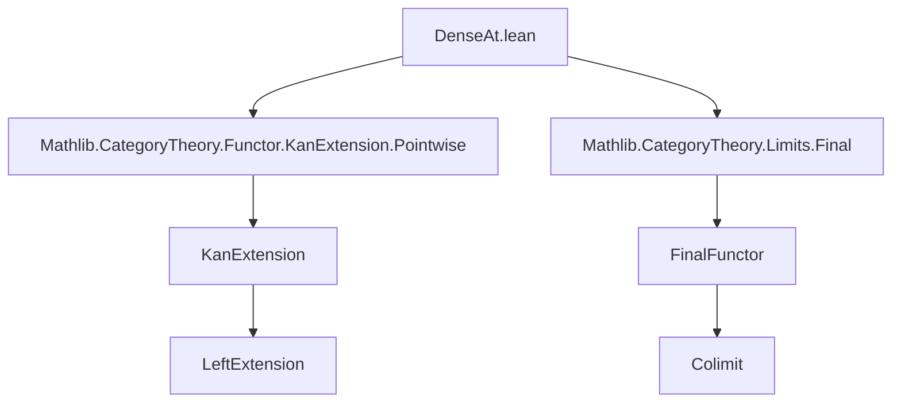
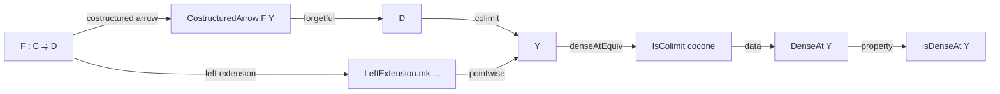

Here is the structured technical brief extracted from `DenseAt.lean`:

---

### **1. Key Definitions & Theorems**

| Name | Type / Signature | Purpose |
|------|------------------|---------|
| `DenseAt (Y : D)` | `Type max u₁ u₂ v₂` | Data-carrying notion: `F` is dense at `Y` iff the canonical cocone at `Y` (via left extension along `F`) is a colimit. |
| `denseAtEquiv (Y : D)` | `F.DenseAt Y ≃ IsColimit (...)` | Equivalence between the data of `F.DenseAt Y` and the property of being a colimit of the associated cocone. |
| `DenseAt.ofIso` | `Y ≅ Y' → F.DenseAt Y'` | Density at an object is invariant under isomorphism. |
| `DenseAt.ofNatIso` | `F ≅ G → G.DenseAt Y` | Density is invariant under natural isomorphism of functors. |
| `DenseAt.precompEquivOfFinal` | `[(CostructuredArrow.pre G F Y).Final] → (G ⋙ F).DenseAt Y ≃ F.DenseAt Y` | Precomposition with a final functor preserves/reflects density. |
| `DenseAt.precompOfFinal` | `[(CostructuredArrow.pre G F Y).Final] → F.DenseAt Y → (G ⋙ F).DenseAt Y` | If `G` is final, density descends along precomposition. |
| `DenseAt.postcompEquivalence` | `[G.IsEquivalence] → F.DenseAt Y → (F ⋙ G).DenseAt (G.obj Y)` | Density is preserved under postcomposition with an equivalence. |
| `isDenseAt` | `ObjectProperty D` | Property version: `Y` satisfies `F.isDenseAt Y` iff `Nonempty (F.DenseAt Y)`. |
| `isDenseAt_eq_isPointwiseLeftKanExtensionAt` | `rfl` | Identifies `isDenseAt` with the pointwise left Kan extension predicate. |
| `isDenseAt_iff` | `F.isDenseAt X ↔ Nonempty (IsColimit (...))` | Reformulation of the property in terms of existence of a colimit. |
| `IsDenseAt.IsClosedUnderIsomorphisms` | `instance` | `isDenseAt` is closed under isomorphisms. |
| `congr_isDenseAt` | `F ≅ G → F.isDenseAt = G.isDenseAt` | Natural isomorphism of functors yields equality of density properties. |
| `IsDenseAt.iff_of_final`, `IsDenseAt.of_final` | `[(CostructuredArrow.pre G F Y).Final] → ...` | Finality of the precomposition functor yields equivalence/implication for `isDenseAt`. |

---

### **2. Naming Conventions**

- **Prefixes**:
  - `DenseAt.`: for data-level definitions and constructions (e.g., `DenseAt.ofIso`, `DenseAt.precompOfFinal`).
  - `isDenseAt`: for the property-level predicate (no data).
  - `CostructuredArrow.`: for constructions involving the comma category / costructured arrow category.
  - `LeftExtension.`: for left Kan extension-related constructions (e.g., `LeftExtension.mk`, `coconeAt`).

- **Suffixes**:
  - `Equiv`: for equivalences (e.g., `denseAtEquiv`, `precompEquivOfFinal`).
  - `OfIso`, `OfNatIso`, `OfFinal`: for constructions depending on additional structure (iso, natural iso, finality).
  - `Postcomp`, `Precomp`: for functors composed on the right/left.

- **Other patterns**:
  - `Whisker`, `Iso`, `Final`: used in tactic names or lemmas involving categorical operations.

---

### **3. Tactic Stack**

- `rfl`: used in definitional equalities (`isDenseAt_eq_isPointwiseLeftKanExtensionAt`, `isDenseAt_iff`).
- `ext`: used to extend cocones (e.g., `Cocones.ext (Iso.refl _)`).
- `infer_instance`: used to discharge typeclass instances (e.g., `IsClosedUnderIsomorphisms`).
- `exact`: used to supply proofs directly (e.g., in `DenseAt.ofNatIso`).
- `rw`: used implicitly in `congr_isDenseAt` and `iff_of_final`.
- `exact` + `Iso.refl`: common pattern for trivial isomorphisms in cocone extensions.

No heavy automation (e.g., `aesop`, `ring`, `simp`) appears—proofs are largely structural and rely on categorical lemmas.

---

### **4. Proof Logic**

- **Core logical flow**:
  1. **Reduction to colimits**: Density is defined via pointwise left Kan extensions, which are equivalent to colimit conditions on the costructured arrow category.
  2. **Invariance principles**: Density is shown to be stable under:
     - Isomorphisms of objects (`ofIso`)
     - Natural isomorphisms of functors (`ofNatIso`)
     - Postcomposition with equivalences (`postcompEquivalence`)
     - Precomposition with final functors (`precompEquivOfFinal`, `precompOfFinal`)
  3. **Property vs data separation**: Data (`DenseAt`) ↔ property (`isDenseAt`) via `denseAtEquiv` and `isDenseAt_iff`.
  4. **Finality-based equivalences**: When a functor between comma categories is final, density transfers back and forth.

- **Typical proof pattern**:
  - Use `IsColimit.equivOfNatIsoOfIso` or `ofWhiskerEquivalence` to transport colimit structures along equivalences or natural isomorphisms.
  - Apply `Final.isColimitWhiskerEquiv` when precomposition with a final functor is involved.

---

### **5. Imports**

- `Mathlib.CategoryTheory.Functor.KanExtension.Pointwise`: Provides `LeftExtension.mk`, `IsPointwiseLeftKanExtensionAt`, `coconeAt`.
- `Mathlib.CategoryTheory.Limits.Final`: Provides `Final`, `isColimitWhiskerEquiv`, and related lemmas.

These imports define the foundational categorical machinery for Kan extensions and final functors.

---

### **6. Mermaid Diagrams**

#### **Dependency Graph (Module-Level)**



#### **Conceptual Overview of `DenseAt`**



#### **Invariance Under Structure**

```mermaid
graph LR
  DenseAtY[DenseAt Y] -->|ofIso| DenseAtY'[DenseAt Y']
  DenseAtY -->|ofNatIso| DenseAtG[DenseAt G Y]
  DenseAtY -->|postcompEquivalence| DenseAtFG[DenseAt (F ⋙ G) (G Y)]
  DenseAtY -->|precompOfFinal| DenseAtGF[DenseAt (G ⋙ F) Y]
```

---

### **7. Theory Context**

- **Goal**: Formalize *canonical colimits*—objects expressible as colimits of diagrams induced by a functor `F`.
- **Motivation**: Dense functors generalize the idea of a full subcategory generating the whole category via colimits (e.g., Yoneda embedding).
- **Future work** (from TODO):
  - Formalize *dense subcategories* (full subcategories where inclusion is dense).
  - Show *presheaves* are canonical colimits w.r.t. Yoneda embedding.

---

Let me know if you'd like a formalization roadmap for the TODO items or a comparison with the nLab definition.
