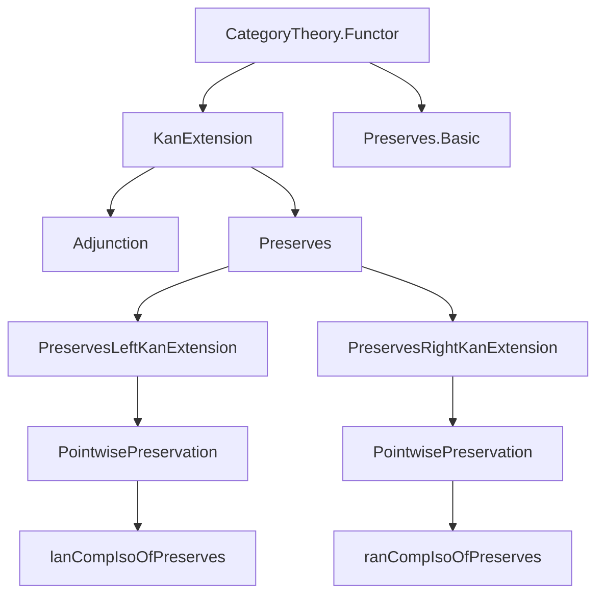
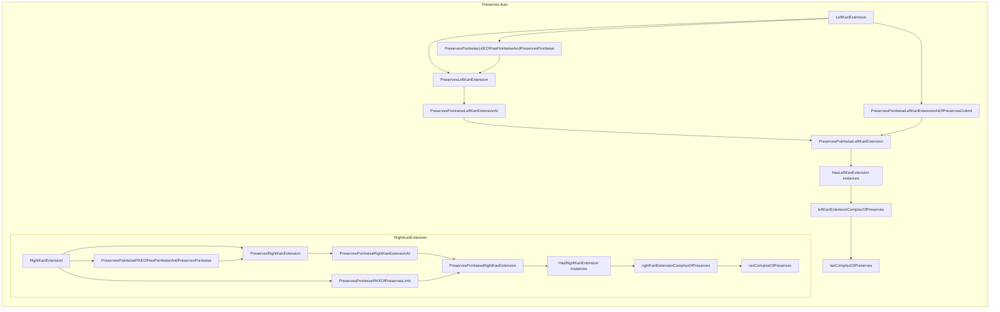

### Technical Brief: Preservation of Kan Extensions in Lean 4 (Preserves.lean)

---

#### **1. Key Definitions & Theorems**

| Name | Type | Purpose |
|------|------|---------|
| `PreservesLeftKanExtension` | `class` | Encodes that `G : B ⥤ D` preserves *all* left Kan extensions of `F : A ⥤ B` along `L : A ⥤ C`. Formally: maps every left Kan extension `α : F ⟶ L ⋙ F'` to a left Kan extension `G ∘ α`. |
| `PreservesPointwiseLeftKanExtensionAt (c : C)` | `class` | Encodes preservation of *pointwise* left Kan extensions at a specific object `c : C`. |
| `PreservesPointwiseLeftKanExtension` | `abbrev` | Universal preservation of pointwise left Kan extensions: `∀ c, PreservesPointwiseLeftKanExtensionAt G F L c`. |
| `PreservesLeftKanExtensions` | `abbrev` | Preservation of *all* left Kan extensions of *any* `F : A ⥤ B` along `L`. |
| `PreservesPointwiseLeftKanExtensions` | `abbrev` | Preservation of *all* pointwise left Kan extensions of *any* `F`. |
| `PreservesRightKanExtension`, `PreservesPointwiseRightKanExtensionAt`, etc. | `class` / `abbrev` | Dual notions for *right* Kan extensions. |
| `leftKanExtensionCompIsoOfPreserves` | `def` | Constructs natural isomorphism `(lan L F) ⋙ G ≅ lan L (F ⋙ G)` when `G` preserves left Kan extensions and `lan L F` exists. |
| `pointwiseLeftKanExtensionCompIsoOfPreserves` | `def` | Same as above, but for *pointwise* left Kan extensions. |
| `lanCompIsoOfPreserves` | `def` | Natural isomorphism between functors `lan ⋙ G` and `G ⋙ lan`, when `G` preserves all left Kan extensions. |
| `rightKanExtensionCompIsoOfPreserves`, `ranCompIsoOfPreserves` | `def` | Duals for right Kan extensions. |
| `preservesPointwiseLeftKanExtensionAtOfPreservesColimit` | `instance` | If `G` preserves the colimit of the diagram `CostructuredArrow.proj L c ⋙ F`, then it preserves pointwise left Kan extensions at `c`. |
| `preservesPointwiseLKEOfHasPointwiseAndPreservesPointwise` | `instance` | If pointwise left Kan extensions exist and `G` preserves *some*, then it preserves *all*. |
| `mk_of_preserves_isLeftKanExtension`, `mk_of_preserves_isUniversal` | `lemma` | Constructors for `PreservesLeftKanExtension` using a *single* left Kan extension (or its universal property). |

---

#### **2. Naming Conventions**

- **Prefixes**:
  - `preserves...`: Typeclasses/instances asserting preservation.
  - `...CompIsoOfPreserves`: Isomorphisms expressing commutation of `G` with Kan extensions.
  - `...Fac[_app]`: Lemmas about factorization through Kan extensions (often `hom_fac`, `inv_fac`, `fac_app`).
- **Suffixes**:
  - `At c`: Pointwise preservation at object `c`.
  - `Extension`: Refers to full Kan extension (not just pointwise).
  - `postcompose`: Action of post-composing with `G`.
- **Abbreviations**:
  - `LKE` = Left Kan Extension
  - `RKE` = Right Kan Extension
  - `lan` = left Kan extension functor (`L.lan`)
  - `ran` = right Kan extension functor (`L.ran`)

---

#### **3. Tactic Stack**

Frequently used tactics in proofs:
- `simp` / `simp only [...]` — Simplification using `simps!`, `reassoc`, and custom lemmas.
- `ext` — Extensionality for natural transformations.
- `rw`, `apply`, `exact` — Basic rewriting and application.
- `infer_instance`, `apply_instance` — Instance resolution.
- `dsimp`, `change`, `convert` — For fine-grained definitional equality manipulation.
- `hom_ext_of_isLeftKanExtension`, `isLeftKanExtension_of_iso` — Specialized extensionality lemmas for Kan extensions.
- `simpa [...] using` — Simplify using a target lemma.
- `cases`, `obtain`, `have` — For destructuring existential hypotheses.

---

#### **4. Proof Logic**

The logical flow in most proofs follows this pattern:

1. **Induction/Case Analysis**:
   - Often on existence/uniqueness of Kan extensions (e.g., `leftKanExtensionUnique`, `rightKanExtensionUnique`).
2. **Universal Property Use**:
   - Leveraging `IsLeftKanExtension`/`IsRightKanExtension` to construct unique mediating morphisms.
3. **Iso-based Transport**:
   - Transporting universal properties along isomorphisms (e.g., `Limits.IsColimit.ofIsoColimit`, `Limits.IsLimit.ofIsoLimit`).
4. **Whiskering & Associator Manipulation**:
   - Reordering compositions using `whiskerRight`, `whiskerLeft`, and `Functor.associator`.
5. **Pointwise → Global**:
   - Proving global preservation from pointwise preservation (e.g., `preservesPointwiseLKEOfHasPointwiseAndPreservesPointwise`).
6. **Factorization Lemmas**:
   - Showing that diagrams commute by appealing to the universal property (e.g., `leftKanExtensionCompIsoOfPreserves_hom_fac`).

---

#### **5. Imports**

- `Mathlib.CategoryTheory.Functor.KanExtension.Adjunction`
- `Mathlib.CategoryTheory.Limits.Preserves.Basic`

These indicate the module builds on:
- General theory of Kan extensions and their adjunctions.
- Preservation of (co)limits by functors.

---

#### **6. Mermaid Diagrams**

##### **Dependency Graph (High-Level)**

##### **Overview of File Structure**

---

#### **7. Summary**

This module formalizes the categorical notion of *preservation of Kan extensions* in Lean 4, with a focus on:
- Typeclasses encoding preservation of left/right Kan extensions (global and pointwise).
- Constructors and lemmas for verifying preservation via universal properties or (co)limit preservation.
- Natural isomorphisms expressing commutation of functors with Kan extension functors (`lan`, `ran`).
- A dual treatment of left and right cases, mirroring standard category theory.

The formalization is highly structured, leveraging Lean’s typeclass inference and `simps!` conventions for automatic simplifier lemmas. It serves as a foundational layer for higher categorical constructions involving Kan extensions (e.g., derived functors, Grothendieck constructions, etc.).
