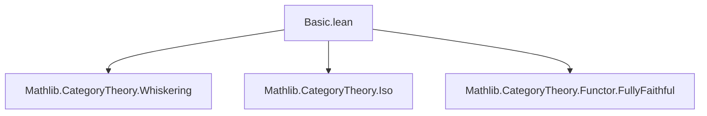

### Technical Brief: `Basic.lean` — Functors Reflecting Isomorphisms

---

#### **1. Key Definitions & Theorems**

| Name | Type / Signature | Purpose |
|------|------------------|---------|
| `Functor.ReflectsIsomorphisms` | `class Functor.ReflectsIsomorphisms (F : C ⥤ D) : Prop` | Typeclass expressing that a functor `F` reflects isomorphisms: if `F.map f` is an iso, then `f` is an iso. |
| `reflects` | `∀ {A B : C} (f : A ⟶ B), IsIso (F.map f) → IsIso f` | Core witness of the typeclass: the reflection property. |
| `isIso_of_reflects_iso` | `theorem` | Given `F` reflects isos and `F.map f` is an iso, conclude `f` is an iso. |
| `isIso_iff_of_reflects_iso` | `lemma` | Equivalence: `IsIso (F.map f) ↔ IsIso f` under `F.ReflectsIsomorphisms`. |
| `Functor.FullyFaithful.reflectsIsomorphisms` | `lemma` | Fully faithful functors reflect isos. |
| `reflectsIsomorphisms_of_full_and_faithful` | `instance` | Automatically derives `F.ReflectsIsomorphisms` from `F.Full` and `F.Faithful`. |
| `reflectsIsomorphisms_comp` | `instance` | Composition of functors reflecting isos also reflects isos. |
| `reflectsIsomorphisms_of_comp` | `lemma` | If `G ∘ F` reflects isos, then `F` does too. |
| `reflectsIsomorphisms_of_whiskeringRight` | `instance` | Right whiskering by a functor reflecting isos also reflects isos. |

---

#### **2. Naming Conventions**

- **Prefixes**:
  - `reflectsIsomorphisms_`: for instances/lemmas about the typeclass.
  - `isIso_of_` / `isIso_iff_of_`: for results linking `IsIso` of `f` and `F.map f`.
- **Suffixes**:
  - `_of_`: e.g., `of_full_and_faithful`, `of_comp`: indicates derivation from a condition.
  - `_comp`: for composition-related properties.
  - `_of_whiskeringRight`: for whiskering constructions.

---

#### **3. Tactic Stack**

Frequent tactics used in proofs:
- `infer_instance`: to apply typeclass instances.
- `rw [← isIso_iff_of_reflects_iso _ F]`: rewriting using equivalences.
- `dsimp`: simplification of definitions (e.g., unfolding `map` of composition).
- `change`: to adjust goal to match a known instance.
- `intro`, `exact`, `apply`: basic intro/elimination.
- `haveI := ...`: introducing an instance for later use.

No heavy automation (e.g., `aesop`, `ring`, `simp`) — proofs are mostly direct typeclass reasoning.

---

#### **4. Proof Logic**

- **Structure**: Most proofs follow a *typeclass-driven* pattern:
  1. Assume `F.map f` is an iso.
  2. Use `reflects` (or derived lemmas) to lift back to `f`.
- **Common flows**:
  - *Forward direction*: Use `reflects` directly.
  - *Equivalence proofs*: Split into two implications; one direction uses `reflects`, the other is trivial (`inferInstance`).
  - *Composition*: Use `reflects` twice — first on `G`, then on `F`.
  - *Whiskering*: Use `NatTrans.isIso_iff_isIso_app` to reduce to pointwise isos, then apply `reflects` for `F`.

Induction or case analysis is *not* used — this is purely categorical reasoning.

---

#### **5. Imports**

| Module | Purpose |
|--------|---------|
| `Mathlib.CategoryTheory.Whiskering` | For `whiskeringRight`, used in last instance. |
| `Mathlib.CategoryTheory.Iso` | Core definitions: `IsIso`, `Iso`, etc. |
| `Mathlib.CategoryTheory.Functor.FullyFaithful` | For `FullyFaithful`, `Full`, `Faithful`, and their relation to isos. |

---

#### **6. Mermaid Diagrams**

##### **Dependency Graph (Module-Level)**



##### **Conceptual Theory Flow**

```mermaid
graph LR
  A[Functor F : C ⥤ D] --> B[IsIso(F.map f)?]
  B -->|Yes| C[Does F reflect?]
  C -->|Yes| D[f is Iso]
  
  E[FullyFaithful F] -->|Implies| C
  F[F.ReflectsIso & G.ReflectsIso] -->|Implies| G[(F ⋙ G).ReflectsIso]
  G -->|Implies| H[F.ReflectsIso]
  I[WhiskeringRight E D F] -->|If F reflects| J[Whiskered functor reflects]
```

##### **Typeclass Hierarchy Overview**

```mermaid
graph TD
  FullyFaithful[FullyFaithful F] -->|instance| ReflectsIso[F.ReflectsIsomorphisms]
  FullFaithful[F.Full & F.Faithful] -->|instance| ReflectsIso
  ReflectsIsoComp[(F ⋙ G).ReflectsIso] -->|lemma| ReflectsIsoF[F.ReflectsIso]
  ReflectsIsoWhisker[(whiskeringRight ...).obj F] -->|instance| ReflectsIso
```

---

#### **7. Summary**

This file formalizes the categorical notion of *functors reflecting isomorphisms* in Lean 4. It introduces a `Prop`-valued typeclass, proves key properties (e.g., closure under composition, inheritance from fully faithful functors), and connects it to standard categorical constructions like whiskering. The formalization is minimal, clean, and leverages Lean’s typeclass inference for automatic derivation. It serves as foundational infrastructure for higher-level categorical reasoning (e.g., in sheaf theory, descent, or monadicity).
