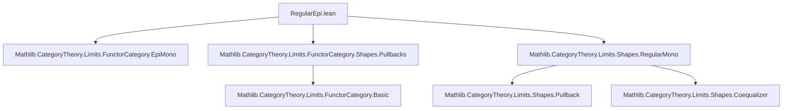

**Technical Brief: `RegularEpi.lean`**

---

### 1. **Key Definitions & Theorems**

| Name | Type / Signature | Purpose |
|------|------------------|---------|
| `IsRegularEpiCategory` | `Class (C : Type u → Type v) [Category C]` | States that every epimorphism in `C` is *regular*, i.e., a coequalizer of some pair of morphisms. |
| `regularEpiOfEpi` | `{F G : C} → (f : F ⟶ G) → [Epi f] → IsRegularEpi f` | The core witness: given an epi `f`, produce a coequalizer diagram showing it's regular. |
| `PullbackCone.combine` | `PullbackCone.combine f g h` | Constructs a cone over the span `f, g` using a common codomain and a witness `h : f ≫ k = g ≫ k`. |
| `evaluationJointlyReflectsColimits` | `EvaluationJointlyReflectsColimits (I : Type u) (F : I ⥤ C ⥤ D)` | A property used to lift colimits in functor categories: colimits in `C ⥤ D` are detected pointwise via evaluation functors. |
| `isColimitCoforkOfEffectiveEpi` | `IsRegularEpiCategory.regularEpiOfEpi (f.app k)` → `IsColimit (coforkOfEffectiveEpi ...)` | Converts a regular epi in `D` into a colimit cocone (specifically, a coequalizer). |
| `Iso.refl _` | `Iso.refl X : X ≅ X` | Identity isomorphism, used for natural isomorphisms and equality of cones. |

**Main Theorem (Instance)**  
```lean
instance [∀ {F G : D} (f : F ⟶ G) [Epi f], HasPullback f f] 
         [HasPushouts D] 
         [IsRegularEpiCategory D] :
         IsRegularEpiCategory (C ⥤ D)
```
> *If `D` is a regular epi category with pullbacks of epimorphisms and all pushouts, then the functor category `C ⥤ D` is also a regular epi category.*

---

### 2. **Naming Conventions**

- **Prefixes**:
  - `regularEpiOfEpi`: witness that an epi is regular.
  - `isColimit...`: constructs colimits from pointwise data.
  - `evaluation...`: relates properties in functor categories to pointwise properties.
- **Suffixes**:
  - `_of_`: e.g., `isColimitCoforkOfEffectiveEpi` — constructs something *from* a hypothesis.
  - `combine`: builds structured cones from pointwise data.
- **Variable naming**:
  - `f`, `g`, `k`: morphisms.
  - `F`, `G`, `W`: objects.
  - `pt`, `fst`, `snd`, `condition`: components of a pullback cone.

---

### 3. **Tactic Stack**

| Tactic | Usage |
|--------|-------|
| `refine` | To construct the main witness with holes to fill. |
| `exacts [...]` | To discharge multiple goals in sequence. |
| `intro` / `rintro` | To introduce variables and destruct sums/products. |
| `all_goals` | Apply same tactic to all goals. |
| `cat_disch` | Custom tactic (likely from `CategoryTheory` library) to discharge category-theoretic goals (e.g., commutativity, naturality). |
| `equivOfNatIsoOfIso` | To prove equivalence of colimits via natural isomorphism of diagrams and vertex isomorphism. |
| `Cocones.ext` | Extensionality for cocones: equality of cocones via equality of apex and legs. |

---

### 4. **Proof Logic**

The proof proceeds as follows:

1. **Goal**: Show any epi `f : F ⟶ G` in `C ⥤ D` is regular — i.e., coequalizes its kernel pair.
2. **Pointwise reduction**: For each `k : C`, `f.app k` is an epi in `D`, hence regular by assumption.
3. **Construct kernel pair pointwise**: Use `PullbackCone.combine` to define the kernel pair diagram in `D` at each `k`, using the assumption `HasPullback (f.app k) (f.app k)`.
4. **Lift to functor category**: Assemble these pointwise pullbacks into a diagram in `C ⥤ D` using `PullbackCone.combine`.
5. **Show it coequalizes `f`**: Use naturality and the universal property of pullbacks.
6. **Verify colimit property**:
   - Use `evaluationJointlyReflectsColimits` to reduce to checking colimit property pointwise.
   - At each `k`, apply `isColimitCoforkOfEffectiveEpi`, which uses the regularity of `f.app k` in `D`.
   - Show the resulting cocones are naturally isomorphic via `equivOfNatIsoOfIso`, using `Iso.refl` and `Cocones.ext`.
7. **Conclusion**: `f` is a regular epi in `C ⥤ D`.

---

### 5. **Imports**

| Import | Role |
|--------|------|
| `Mathlib.CategoryTheory.Limits.FunctorCategory.EpiMono` | Provides basic facts about epis/monos in functor categories. |
| `Mathlib.CategoryTheory.Limits.FunctorCategory.Shapes.Pullbacks` | Provides pullback constructions in functor categories (e.g., pointwise pullbacks). |
| `Mathlib.CategoryTheory.Limits.Shapes.RegularMono` | Defines regular monos and related properties (dual to regular epis). |

> Note: Though `RegularMono` is imported, the file focuses on *regular epis* — consistent with the title.

---

### 6. **Mermaid Diagrams**

#### **Dependency Graph (Module Level)**



#### **Conceptual Overview of the Proof**

```mermaid
flowchart LR
  A[_epi f : F ⟶ G in C ⥤ D] --> B[pointwise f.app k is epi in D]
  B --> C[regular epi in D ⇒ coequalizes its kernel pair]
  C --> D[construct kernel pair in D pointwise]
  D --> E[assemble into kernel pair in C ⥤ D]
  E --> F[show it coequalizes f]
  F --> G[show universal property: colimit]
  G --> H[use evaluationJointlyReflectsColimits]
  H --> I[reduce to pointwise colimit]
  I --> J[apply isColimitCoforkOfEffectiveEpi]
  J --> K[f is regular epi in C ⥤ D]
```



---

### 7. **Domain-Specific AI Agent Notes**

- **Key abstractions**: Regular epis, pullbacks, colimits in functor categories.
- **Critical assumptions**: `D` must have:
  - Pullbacks of epimorphisms (used to build kernel pairs),
  - Pushouts (likely for other lemmas, though not directly used here),
  - Be a regular epi category (so every epi is regular).
- **Pattern**: *Pointwise construction + reflection of colimits* is a recurring theme in functor category arguments.
- **Automation potential**: High — many steps are mechanical (e.g., naturality, extensionality), so tactics like `cat_disch`, `simp`, `aesop` can be enhanced.

--- 

Let me know if you'd like a formalized summary in Lean or a visualization of the coequalizer diagram.
