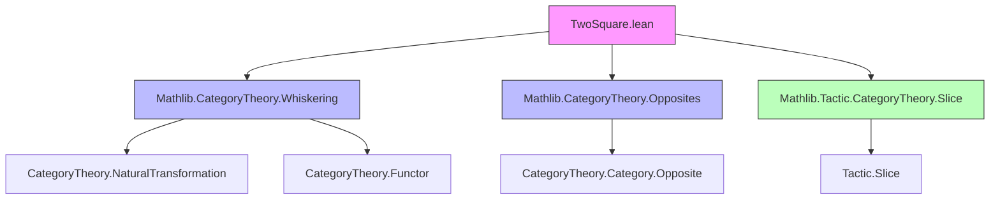
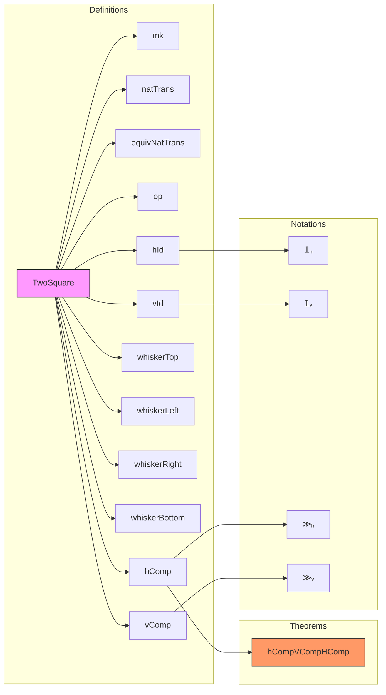

### Technical Brief: `TwoSquare.lean`

---

#### **1. Key Definitions & Theorems**

| Name | Type / Signature | Purpose |
|------|------------------|---------|
| `TwoSquare` | `def TwoSquare := T ⋙ R ⟶ L ⋙ B` | Represents a 2-cell (natural transformation) in a square of functors. |
| `mk` | `abbrev mk (α : T ⋙ R ⟶ L ⋙ B)` | Constructor for a 2-square from a natural transformation. |
| `natTrans` | `abbrev natTrans (w : TwoSquare …) : T ⋙ R ⟶ L ⋙ B` | Projection of the underlying natural transformation. |
| `equivNatTrans` | `def equivNatTrans : TwoSquare … ≃ (T ⋙ R ⟶ L ⋙ B)` | Equivalence between 2-squares and natural transformations. |
| `op` | `def op (α : TwoSquare …) : TwoSquare L.op T.op B.op R.op` | Opposite 2-square (dual under category opposite). |
| `hId` | `def hId (L : C₁ ⥤ C₃) : TwoSquare (𝟭 _) L L (𝟭 _)` | Horizontal identity 2-square (top/bottom identities). |
| `vId` | `def vId (T : C₁ ⥤ C₂) : TwoSquare T (𝟭 _) (𝟭 _) T` | Vertical identity 2-square (left/right identities). |
| `whiskerTop`, `whiskerLeft`, `whiskerRight`, `whiskerBottom` | `protected def whisker*` | Whiskering a 2-square with a natural transformation on any side. |
| `hComp` | `def hComp (w : TwoSquare …) (w' : TwoSquare …) : TwoSquare (T ⋙ T') L R' (B ⋙ B')` | Horizontal composition of 2-squares (grid-wise horizontal pasting). |
| `vComp` | `def vComp (w : TwoSquare …) (w' : TwoSquare …) : TwoSquare T (L ⋙ L') (R ⋙ R'') B''` | Vertical composition of 2-squares (grid-wise vertical pasting). |
| `hCompVCompHComp` | `lemma hCompVCompHComp (w₁ w₂ w₃ w₄ : …) : (w₁ ≫ₕ w₂) ≫ᵥ (w₃ ≫ₕ w₄) = (w₁ ≫ᵥ w₃) ≫ₕ (w₂ ≫ᵥ w₄)` | **Interchange law**: horizontal and vertical compositions commute up to equality. |

---

#### **2. Naming Conventions**

- **Prefixes**:
  - `whisker*`: for whiskering operations (`whiskerTop`, `whiskerLeft`, etc.)
  - `h*`: for horizontal operations (`hId`, `hComp`)
  - `v*`: for vertical operations (`vId`, `vComp`)
- **Suffixes**:
  - `op`: for opposite/dual constructions (`op`)
- **Notations**:
  - `𝟙ₕ` for `hId`
  - `𝟙ᵥ` for `vId`
  - `≫ₕ` for `hComp`
  - `≫ᵥ` for `vComp`

---

#### **3. Tactic Stack**

- **Core tactics**:
  - `ext`: extensionality for natural transformations (`NatTrans.ext`)
  - `simp only [...]`: heavy use of `simp` with explicit lemmas for naturality, associators, whiskering, etc.
  - `rw [...]`: rewriting using naturality squares and associator properties
  - `slice_rhs 2 3 => rw [...]`: advanced `slice` tactic usage to rewrite subterms in right-hand side
  - `unfold [...]`: unfolding definitions of `hComp`, `vComp`, `whisker*`
  - `funext`, `apply funext`, `apply ext`: for proving equality of natural transformations

---

#### **4. Proof Logic**

- **Structure of proofs**:
  - Proofs of equality between 2-squares proceed by:
    1. Unfolding definitions (`unfold hComp vComp whiskerLeft whiskerRight`)
    2. Extending to objects (`ext c`)
    3. Simplifying component-wise using `simp only [...]`
    4. Applying naturality and associator identities (e.g., `w₄.naturality`, `← Functor.comp_map`)
    5. Rewriting subterms using `slice_rhs` when needed.

- **Interchange law proof**:
  - Uses **component-wise extensionality** (`ext c`) to reduce to equality of components at each object `c : C₁`.
  - Relies on **pentagon identity** (via `associator_hom_app`, `associator_inv_app`) and **naturality** of involved transformations.
  - No higher coherence axioms needed — equality holds strictly.

---

#### **5. Imports**

- `Mathlib.CategoryTheory.Whiskering`: for `whiskerLeft`, `whiskerRight`, and whiskering lemmas.
- `Mathlib.CategoryTheory.Opposites`: for `op`, `NatTrans.op`, and opposite categories.
- `Mathlib.Tactic.CategoryTheory.Slice`: for `slice_rhs` tactic.

---

#### **6. Dependency Diagram**

---

#### **7. Overview Diagram**

---

#### **8. Theory Context**

- This file formalizes the **2-category of categories, functors, and natural transformations** as a **strict 2-category**, where:
  - Objects: categories
  - 1-morphisms: functors
  - 2-morphisms: natural transformations
- The `TwoSquare` type models **commutative squares of functors** equipped with a 2-cell (natural transformation) filling the square.
- The operations `hComp`, `vComp`, `whisker*`, and identities `hId`, `vId` satisfy the axioms of a **strict double category** (in fact, a strict 2-category).
- The **interchange law** (`hCompVCompHComp`) is a key coherence condition ensuring that horizontal and vertical compositions are compatible.

---

#### **9. Future Work (from TODO)**

- Generalize to **double categories** (not just strict 2-categories).
- Possibly formalize **bicategories** or **virtual double categories**, where associators and unitors are non-trivial isomorphisms.

--- 

Let me know if you'd like a formalized summary in Lean or a diagram of the interchange law.
