**Technical Brief: `TypeValuedFlat.lean`**

---

### 1. **Key Definitions & Theorems**

| Name | Type | Purpose |
|------|------|---------|
| `Functor.isCofiltered_elements` | `(F : C ⥤ Type w) → [HasFiniteLimits C] → [PreservesFiniteLimits F] → IsCofiltered F.Elements` | Main theorem: If `F` preserves finite limits and `C` has finite limits, then the category of elements `F.Elements` is cofiltered. |
| `F.Elements` | Category | Category of elements of a type-valued functor `F`, with objects pairs `(X, x)` where `X : C`, `x : F X`, and morphisms `f : X ⟶ Y` such that `F.map f x = y`. |
| `IsCofiltered` | Class | A category is *cofiltered* if: (i) it is nonempty, (ii) for any pair of objects, there exists a cone over them, and (iii) for any pair of parallel arrows, there exists a equalizing morphism. |
| `HasFiniteLimits`, `PreservesFiniteLimits` | Typeclasses | Assert existence/preservation of finite limits (terminal objects, binary products, equalizers). |

---

### 2. **Naming Conventions**

- **Prefixes**:
  - `isCofiltered_`: asserts a categorical property (e.g., `isCofiltered_elements`)
  - `prod_`, `equalizer_`, `terminal_`: standard limit-related notation (e.g., `prodIsProd`, `equalizerIsEqualizer`)
  - `mapIsLimitOfPreservesOfIsLimit`: composite naming reflecting preservation of limits under `F`
- **Suffixes**:
  - `_IsLimit`, `_IsTerminal`: denote limit/terminal cone properties
  - `_conePointUniqueUpToIso`: refers to uniqueness of cone point up to iso in limit diagrams

---

### 3. **Tactic Stack**

| Tactic | Usage |
|--------|-------|
| `intro` / `rintro` | Introduce hypotheses and destruct tuples |
| `let` + `have` | Construct intermediate objects/morphisms (e.g., `h`, `h'`) |
| `subst` | Eliminate definitional equalities (e.g., after `hg`) |
| `ext` | Extensionality for morphisms in `Type` |
| `tauto` | Solve propositional tautologies in cone maps verification |
| `congr_fun` + `hom_comp` | Extract component equations from naturality/cone diagrams |
| `.mk .left`, `.mk .right`, `.zero` | Construct morphisms in product/equalizer cones |
| `tactic aesop` (implied via `tauto`) | For simple logical reasoning |

---

### 4. **Proof Logic**

The proof proceeds by verifying the three clauses of `IsCofiltered`:

1. **Nonempty**: Use terminal object `⊤_ C` and its unique map to `F ⊤_`, yielding an object in `F.Elements`.
2. **Cone over objects**: Given `(X, x)` and `(Y, y)`, construct their product `X ⨯ Y` in `C`. Since `F` preserves binary products, `F(X ⨯ Y)` is a product of `F X` and `F Y`. Use the universal property to get a point `(x, y)` lifted to `X ⨯ Y`, and projectors give the cone legs.
3. **Cone over parallel arrows**: Given `f, g : (X, x) → (Y, y)` with `F.map f x = F.map g x`, equalize `f` and `g` in `C` via `equalizer f g`. Since `F` preserves equalizers, the equalizer in `C` maps via `F` to the equalizer in `Type`, and the element `x` (subject to `hf`) lifts to the equalizer object.

The proof crucially uses:
- Preservation of finite limits by `F`
- Explicit descriptions of finite limits in `Type` (binary products, equalizers, terminal object)
- Uniqueness up to iso of cone points in limit diagrams (`conePointUniqueUpToIso`)

---

### 5. **Imports**

| Module | Role |
|--------|------|
| `Mathlib.CategoryTheory.Elements` | Defines `F.Elements` category |
| `Mathlib.CategoryTheory.Filtered.Basic` | Defines `IsCofiltered` and filtered/cofiltered categories |
| `Mathlib.CategoryTheory.Limits.Preserves.Finite` | `PreservesFiniteLimits` typeclass |
| `Mathlib.CategoryTheory.Limits.Preserves.Shapes.*` | Specific shape preservation lemmas (products, equalizers, terminal) |
| `Mathlib.CategoryTheory.Limits.Types.*` | Concrete constructions of limits in `Type` (e.g., `Types.binaryProductLimit`) |

---

### 6. **Mermaid Diagrams**

#### Dependency Graph (Module-Level)

```mermaid
graph TD
  A[TypeValuedFlat.lean] --> B[Mathlib.CategoryTheory.Elements]
  A --> C[Mathlib.CategoryTheory.Filtered.Basic]
  A --> D[Mathlib.CategoryTheory.Limits.Preserves.Finite]
  A --> E[Mathlib.CategoryTheory.Limits.Preserves.Shapes.BinaryProducts]
  A --> F[Mathlib.CategoryTheory.Limits.Preserves.Shapes.Equalizers]
  A --> G[Mathlib.CategoryTheory.Limits.Preserves.Shapes.Terminal]
  A --> H[Mathlib.CategoryTheory.Limits.Types.Products]
  A --> I[Mathlib.CategoryTheory.Limits.Types.Equalizers]
```



#### Overview of Proof Structure

```mermaid
flowchart LR
  subgraph Setup
    F[F : C ⥤ Type w]
    HFL[HasFiniteLimits C]
    HPFL[PreservesFiniteLimits F]
  end

  subgraph Goal
    ICF[IsCofiltered F.Elements]
  end

  subgraph Proof Steps
    NC[Nonempty]
    CO[Cone over objects]
    CM[Cone over maps]
  end

  F & HFL & HPFL --> ICF
  ICF --> NC
  ICF --> CO
  ICF --> CM

  NC --> T[⊤_ C, terminal map]
  CO --> P[Product X ⨯ Y, lift ⟨x,y⟩]
  CM --> E[Equalizer eq(f,g), lift x s.t. F f x = F g x]
```

---

### 7. **Theoretical Context**

- This result connects *type-valued flatness* (via cofilteredness of elements) with *finite limit preservation*.
- It contrasts with `RepresentablyFlat`, which is defined via representable functors preserving finite colimits — a dual notion.
- The proof is constructive and uses explicit limit constructions in `Type`, making it suitable for formalization in Lean.

--- 

Let me know if you'd like a formalization checklist or a comparison with `RepresentablyFlat`.
