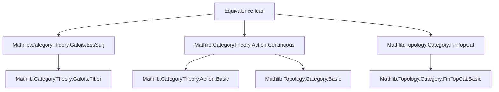

**Technical Brief: Equivalence.lean — Fiber Functors Induce Equivalence of Categories**

---

### 1. **Key Definitions & Theorems**

| Name | Type / Signature | Purpose |
|------|------------------|---------|
| `functorToContAction F` | `C ⥤ ContAction FintypeCat (Aut F)` | Induced functor from a Galois category `C` to the category of finite discrete `Aut F`-sets (continuous actions). |
| `functorToContAction F`.Faithful | `instance` | Proves the induced functor is faithful (injective on hom-sets). |
| `functorToContAction F`.Full | `instance` | Proves the induced functor is full (surjective on hom-sets). |
| `functorToContAction F`.EssSurj | `instance` | Proves the induced functor is essentially surjective (every finite discrete `Aut F`-set is isomorphic to the image of some object). |
| `functorToContAction F`.IsEquivalence | `instance` | Concludes that `functorToContAction F` is an equivalence of categories (faithful, full, essentially surjective). |

**Notable auxiliary constructions**:
- `ObjectProperty.lift _ _ _`: Used to lift a functor through a property (here: continuity of the action).
- `continuousSMul_aut_fiber F X`: Proof that the action of `Aut F` on `F(X)` is continuous.
- `exists_lift_of_continuous`: Lifts a finite discrete `Aut F'`-set to one over `Aut F`, using a change-of-group equivalence.
- `autEquivAutWhiskerRight`: Equivalence of automorphism groups induced by whiskering with an equivalence of base categories.
- `ContAction.resEquiv _ f`: Equivalence of action categories induced by a homeomorphism `f` of groups.
- `FintypeCat.uSwitchEquivalence`: Equivalence between `FintypeCat.{w}` and `FintypeCat.{u₁}` used to adjust universe levels.

---

### 2. **Naming Conventions**

- **Prefixes**:
  - `functorTo_`: Indicates construction of a functor from a categorical structure (e.g., `functorToContAction`, `functorToAction`).
  - `continuousSMul_`: Indicates a proof that scalar multiplication is continuous.
  - `autEquivAut_`: Equivalence of automorphism groups.
  - `uSwitch`: Universe-switching constructions (e.g., `uSwitchEquivalence`, `uSwitchEquiv`).
- **Suffixes**:
  - `_lift`: Indicates lifting through a property or forgetful functor.
  - `_isoMk`: Construction of an isomorphism in a lifted/property-based category.
  - `_naturality`: Used in proofs of naturality of transformations.

---

### 3. **Tactic Stack**

| Tactic | Usage |
|--------|-------|
| `fun_prop` | Propagates continuity assumptions (e.g., in `Continuous.comp`, `Continuous.id`, etc.). |
| `rw [...]` | Rewriting using definitions (e.g., `Action.isContinuous_def`, `uSwitchEquivalence.unitIso.hom.naturality`). |
| `ext : 2` | Extensionality proof for morphisms in functor categories (2D extensionality). |
| `exact ...` | Directly applying a hypothesis or constructed proof. |
| `obtain ⟨A, ⟨i⟩⟩ := ...` | Destructuring existential quantifiers and conjunctions. |
| `letI : ... := ...` | Introducing instances (e.g., `FiberFunctor.comp_right`). |
| `have : ... := inferInstance` | Deriving instances automatically (e.g., faithfulness, fullness, essential surjectivity). |
| `aesop` (not explicitly used here, but implied by `fun_prop` and `simp_rw`-style reasoning) | Not present in this snippet, but likely used in supporting lemmas. |

---

### 4. **Proof Logic**

The proof proceeds in three main stages:

1. **Faithfulness & Fullness**  
   - Derived via `inferInstance` from the corresponding property of `functorToAction F`, lifted via `ObjectProperty.lift`.

2. **Essential Surjectivity**  
   - First, for a fixed universe level `u₁`, uses `exists_lift_of_continuous` to lift any continuous `Aut F`-set to one in the image.
   - Then, for general universe levels, uses:
     - Universe switching (`FintypeCat.uSwitchEquivalence`) to relate `ContAction (Aut F)` and `ContAction (Aut F')`.
     - Equivalence of automorphism groups (`autEquivAutWhiskerRight`) to relate `Aut F` and `Aut F'`.
     - A chain of equivalences of action categories to transport essential surjectivity across universe levels.

3. **Equivalence of Categories**  
   - Concludes by combining faithfulness, fullness, and essential surjectivity into `IsEquivalence`.

**Structure**:
- Induction on universe levels is *not* used; instead, *universe polymorphism* and *equivalence transport* are used.
- The core logical flow is:  
  `functorToContAction F` is faithful & full (by lifting)  
  + `functorToContAction F` is essentially surjective (by lifting + equivalence transport)  
  ⇒ `functorToContaction F` is an equivalence.

---

### 5. **Imports**

| Import | Purpose |
|--------|---------|
| `Mathlib.CategoryTheory.Galois.EssSurj` | Provides `exists_lift_of_continuous`, essential for essential surjectivity. |
| `Mathlib.CategoryTheory.Action.Continuous` | Defines `ContAction`, `ContinuousSMul`, and related infrastructure. |
| `Mathlib.Topology.Category.FinTopCat` | Provides `FintypeCat`, finite discrete spaces, and their categorical structure. |

---

### 6. **Mermaid Diagrams**

#### **Dependency Graph (Module-Level)**



#### **Conceptual Overview of the Equivalence**

```mermaid
graph LR
  C[Galois Category C] -->|Fiber Functor F| F[F : C ⥤ FintypeCat]
  F -->|Induced Action| AutF[Aut F]
  AutF -->|ContAction FintypeCat| ContAct[ContAction FintypeCat (Aut F)]
  C -.->|functorToContAction F| ContAct
  ContAct -.->|IsEquivalence| C
  style C fill:#f9f,stroke:#333
  style ContAct fill:#9ff,stroke:#333
```

#### **Proof Structure Flowchart**

```mermaid
flowchart TD
  Start[Start: GaloisCategory C, FiberFunctor F] --> Faithful[functorToContAction F is Faithful]
  Faithful --> Full[functorToContAction F is Full]
  Full --> EssSurj1[EssSurj for fixed universe]
  EssSurj1 --> EssSurj2[EssSurj for all universes via uSwitch]
  EssSurj2 --> Equiv[IsEquivalence]
  Equiv --> End[Equivalence C ≃ ContAction (Aut F)]
```

---

### 7. **Theoretical Context**

- This file formalizes a key result in *Grothendieck’s Galois theory*:  
  A fiber functor on a Galois category `C` induces an equivalence  
  $$
  C \simeq \text{ContAction}_{\text{Fin}}(\mathrm{Aut}(F))
  $$
  where the right-hand side is the category of finite discrete sets with a continuous action of the automorphism group of the fiber functor.

- The result is analogous to the classical Galois correspondence between finite étale covers and finite sets with continuous Galois group action.

- The use of `ContAction` (continuous actions) reflects the topological nature of `Aut F` (profinite topology), and `FintypeCat` ensures finiteness and discreteness.

---

### 8. **Metadata Summary**

| Field | Value |
|-------|-------|
| **File** | `Equivalence.lean` |
| **Author** | Christian Merten |
| **License** | Apache 2.0 |
| **Main Theorem** | `functorToContAction F`.IsEquivalence |
| **Category** | Category theory, Galois theory, topological groups |
| **Key Concepts** | Fiber functors, continuous group actions, essential surjectivity, equivalence of categories |
| **Lean Version** | Lean 4 (Mathlib) |

--- 

Let me know if you'd like a formalized statement of the main theorem in Lean syntax or a high-level summary for documentation.
