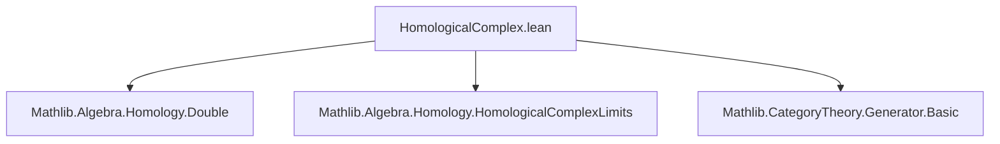
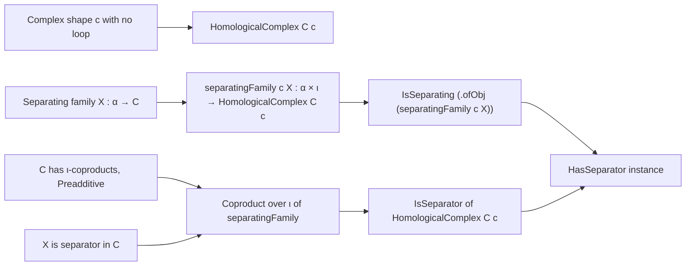
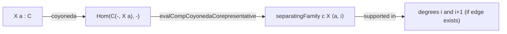

**Technical Brief: `HomologicalComplex.lean` — Generators of the Category of Homological Complexes**

---

### 1. **Key Definitions & Theorems**

| Name | Type / Signature | Purpose |
|------|------------------|---------|
| `separatingFamily` | `separatingFamily (j : α × ι) : HomologicalComplex C c` | Constructs a family of homological complexes indexed by `α × ι`, each supported in at most two consecutive degrees, from a separating family `X : α → C`. |
| `isSeparating_separatingFamily` | `ObjectProperty.IsSeparating (.ofObj (separatingFamily c X))` | Proves that the constructed family is separating, assuming `X` is separating and `c` has no loops. |
| `isSeparator_coproduct_separatingFamily` | `IsSeparator (∐ (fun i ↦ separatingFamily c (fun (_ : Unit) ↦ X) ⟨⟨⟩, i⟩))` | Shows that the coproduct over `ι` of the separating family (indexed by `Unit × ι`) is a *separator*, assuming `X` is a separator and suitable coproducts exist. |
| `instance [HasSeparator C] : HasSeparator (HomologicalComplex C c)` | `HasSeparator (HomologicalComplex C c)` | Concludes that if `C` has a separator, then so does `HomologicalComplex C c`, under the no-loop and coproduct assumptions. |

---

### 2. **Naming Conventions**

- **Prefixes**:
  - `separatingFamily_`: for constructions yielding separating families.
  - `isSeparating_`, `isSeparator_`: for properties (separating / separator).
- **Suffixes**:
  - `_family`: for families (indexed collections).
  - `_corepresentative`, `_corepresentable`: from `evalCompCoyonedaCorepresentable`, indicating use of co-Yoneda embedding / corepresentability.
- **Variable naming**:
  - `X`, `hX`: separating family and its witness.
  - `c`, `ι`: complex shape and its index type.
  - `j : α × ι`: index in the new family.

---

### 3. **Tactic Stack**

- `intro`, `ext`, `apply`, `simpa`, `exact`, `refine`, `have`, `rintro`, `cases` — standard Lean proof scripting.
- `simp only [...] using` — for targeted simplification using a specific lemma.
- `exact IsColimit.ofWhiskerEquivalence` — category-theoretic reasoning about colimits.
- `Equiv.punitProd`, `Discrete.equivalence`, `coproductIsCoproduct` — high-level category theory automation.

No heavy automation like `aesop`, `ring`, or `linarith` — proof is mostly structural and relies on universal properties.

---

### 4. **Proof Logic**

The proof proceeds in two stages:

1. **Separating family construction**:
   - Given a separating family `X : α → C`, define a new family over `α × ι` via `evalCompCoyonedaCorepresentative`.
   - To prove separating: take morphisms `f, g` between complexes `K, L`; assume they agree after precomposition with all elements of the new family.
   - Reduce to the original separating property of `X` using the hom-equivalence from `evalCompCoyonedaCorepresentable`.

2. **Separator via coproduct**:
   - Assume `C` has coproducts indexed by `ι` and is preadditive.
   - Form the coproduct of the separating family over `ι` (using `Unit` to index a single object `X`).
   - Show this coproduct is a separator by:
     - Using `isSeparator_of_isColimit_cofan` (a criterion for separators via colimits).
     - Showing the cofan is a colimit via `IsColimit.ofWhiskerEquivalence`, using an equivalence `Unit × ι ≃ ι`.

---

### 5. **Imports & Dependencies**

| Import | Role |
|--------|------|
| `Mathlib.Algebra.Homology.Double` | Background on double complexes and related constructions. |
| `Mathlib.Algebra.Homology.HomologicalComplexLimits` | Limits and colimits in `HomologicalComplex`, including coproducts. |
| `Mathlib.CategoryTheory.Generator.Basic` | Definitions of *separating family* and *separator* (i.e., generators). |

**Core dependencies**:
- `ComplexShape`, `HomologicalComplex`
- `HasZeroMorphisms`, `HasZeroObject`, `Preadditive`
- `HasCoproductsOfShape`
- `IsSeparator`, `ObjectProperty.IsSeparating`

---

### 6. **Mermaid Diagrams**

#### **Dependency Graph (Module Level)**

#### **Theoretical Overview (This File)**

#### **Key Construction Diagram (separatingFamily)**

---

### 7. **Summary**

This file establishes that the category of homological complexes `HomologicalComplex C c` inherits generator-theoretic properties from `C`, provided:
- `c` has no loops (to avoid infinite chains),
- `C` has zero morphisms, zero object, and (for separators) ι-indexed coproducts and is preadditive.

It constructs an explicit separating family with small support and shows that a separator in `C` yields one in `HomologicalComplex C c`. This is foundational for derived category constructions and Grothendieck abelian category criteria.
