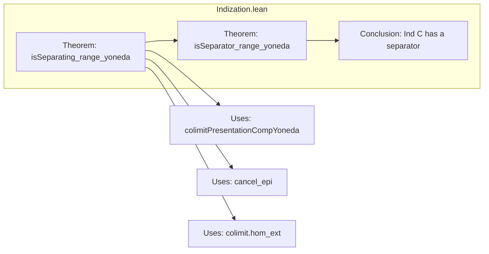

**Technical Brief: `Indization.lean`**

---

### 1. KEY DEFINITIONS & THEOREMS

| Name | Type / Signature | Purpose |
|------|------------------|---------|
| `Ind.isSeparating_range_yoneda` | `ObjectProperty.IsSeparating (.ofObj (Ind.yoneda : C ⥤ _).obj)` | Shows that the *range* of the Yoneda embedding into `Ind C` (viewed as a single object via `.ofObj`) forms a *separating class* — i.e., it detects distinct morphisms in `Ind C`. |
| `Ind.isSeparator_range_yoneda` | `IsSeparator (∐ (Ind.yoneda : C ⥤ _).obj)` | Under additional assumptions (`SmallCategory`, `Preadditive`, `HasFiniteColimits`), the *coproduct* over the Yoneda image is a *separator* (a single object that separates morphisms). |

**Notes**:
- `Ind.yoneda : C ⥤ Ind C` is the canonical embedding of `C` into its indization.
- `.ofObj` embeds a functor `C ⥤ Ind C` as a single object in `Ind C` (via the colimit of its image).
- `IsSeparating` means: for any parallel pair $f, g : X \rightrightarrows Y$, if $\forall s : S \to X$ with $S$ in the class, $f \circ s = g \circ s$, then $f = g$.
- `IsSeparator` is the stronger condition that a *single* object $S$ suffices: if $f \circ s = g \circ s$ for all $s : S \to X$, then $f = g$.

---

### 2. NAMING CONVENTIONS

- **Prefix `is_`**: Used for properties (e.g., `isSeparating`, `isSeparator`).
- **Suffix `_range_`**: Indicates construction from the *range* (image) of a functor (e.g., `range_yoneda`).
- **`_ofObj`**: Embeds a diagram/functor into a single object via colimit (here, the colimit of the Yoneda embedding).
- **`_hom` / `_comp`**: Standard category-theoretic notation for morphism components (e.g., `colimitPresentationCompYoneda X).hom`).

---

### 3. TACTIC STACK

- `refine`: Used to construct proofs by partial instantiation.
- `cancel_epi`: A tactic from `Mathlib.CategoryTheory.Preadditive.Basic` to cancel epimorphisms on the right.
- `colimit.hom_ext`: Extensionality for colimit morphisms — used to prove equality of colimit cocones.
- `simp [← Category.assoc, h]`: Simplification using associativity and the hypothesis `h`.

No heavy automation (e.g., `aesop`, `ring`, `linarith`) is used — the proof is mostly structural and categorical.

---

### 4. PROOF LOGIC

**For `Ind.isSeparating_range_yoneda`**:
1. Assume $f, g : X \to Y$ with $f \ne g$.
2. Use the *colimit presentation* of $X$ (via `Ind.colimitPresentationCompYoneda X`), which is a morphism $P \to X$ that is an epimorphism in `Ind C`.
3. Reduce the separation condition to testing against morphisms *into* this presentation.
4. Apply `colimit.hom_ext` to reduce to checking equality on each component of the colimit diagram.
5. Use `simp` and associativity to show that if $f \circ s = g \circ s$ for all $s$ from the Yoneda range, then $f = g$.

**For `Ind.isSeparator_range_yoneda`**:
- Follows immediately from the previous theorem and the fact that a separating *family* whose index category is small (here, the Yoneda embedding of a small category) yields a separator via coproduct.

---

### 5. IMPORTS

| Import | Role |
|--------|------|
| `Mathlib.CategoryTheory.Generator.Basic` | Definitions of separating families, separators, generators. |
| `Mathlib.CategoryTheory.Limits.Indization.Category` | Construction of `Ind C`, its colimits, and universal properties. |
| `Mathlib.CategoryTheory.Preadditive.Indization` | Properties of `Ind C` when `C` is preadditive (e.g., additive structure, coproducts). |

---

### 6. DEPENDENCY & THEORY OVERVIEW

#### Mermaid Diagram: Theoretical Dependencies

```mermaid
graph TD
  A[Small Category C] --> B[Ind C = Ind(C)]
  B --> C[Has Colimits]
  B --> D[Preadditive Structure]
  C --> E[Indization.lean: Separating Set]
  D --> E
  E --> F[Separator in Ind C]
  G[Mathlib.CategoryTheory.Generator.Basic] --> E
  H[Mathlib.CategoryTheory.Limits.Indization.Category] --> E
  I[Mathlib.CategoryTheory.Preadditive.Indization] --> E
```

#### Mermaid Diagram: File Structure Overview



---

### 7. CONTEXTUAL SUMMARY

This file establishes a foundational result in the theory of ind-objects: if $C$ is small, additive, and has finite colimits, then its indization `Ind C` admits a *separator*. This is crucial for applying Grothendieck’s axioms for abelian categories (e.g., AB3–AB5), and for constructing injective hulls or derived categories in this setting.

The proof leverages the Yoneda embedding and the fact that every object in `Ind C` is a filtered colimit of representables — a key structural property of ind-objects.

--- 

Let me know if you'd like a formalization-level dependency graph (e.g., `leanproject graph`) or a comparison with related files (e.g., `IndizationLimit.lean`, `IndizationAdditive.lean`).
