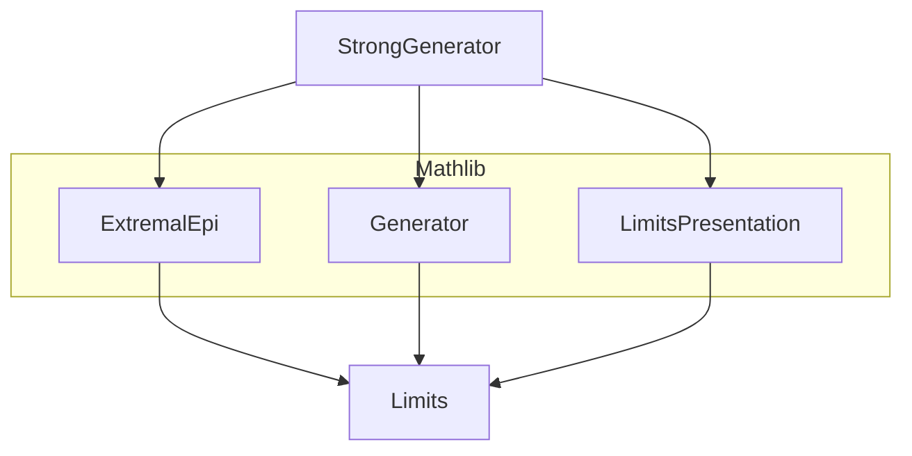
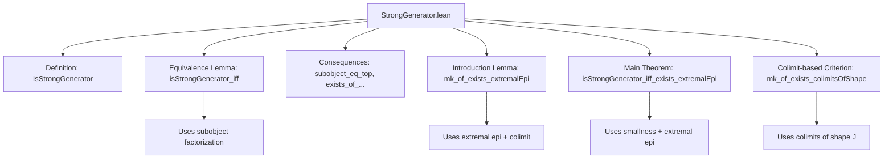
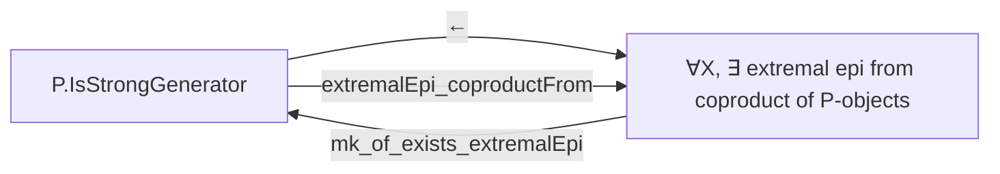

### Technical Brief: `StrongGenerator.lean`

---

#### **1. Key Definitions & Theorems**

| Name | Type / Signature | Purpose |
|------|------------------|---------|
| `IsStrongGenerator` | `P : ObjectProperty C → Prop` | Defines when a property `P` is a *strong generator*: it is separating, and for any proper subobject `A ⊂ X`, there exists a morphism from a `P`-object to `X` that does **not** factor through `A`. |
| `isStrongGenerator_iff` | `P.IsStrongGenerator ↔ P.IsSeparating ∧ ∀ ⦃X Y : C⦄ (i : X ⟶ Y) [Mono i], (∀ (G : C) (_ : P G), Function.Surjective (f ↦ f ≫ i)) → IsIso i` | Equivalent characterization: `P` is a strong generator iff every monomorphism through which all `P`-objects are surjective is an isomorphism. |
| `subobject_eq_top` | `∀ (G : C) (_ : P G) (f : G ⟶ X), Subobject.Factors A f → A = ⊤` | Consequence of `IsStrongGenerator`: if all `P`-objects factor through `A`, then `A` is top. |
| `exists_of_subobject_ne_top` | `A ≠ ⊤ → ∃ (G : C) (_ : P G) (f : G ⟶ X), ¬ Subobject.Factors A f` | Contrapositive of `subobject_eq_top`: if `A` is proper, some `P`-object maps to `X` without factoring through `A`. |
| `exists_of_mono_not_isIso` | `Mono i → ¬ IsIso i → ∃ (G : C) (_ : P G) (g : G ⟶ Y), ∀ f, f ≫ i ≠ g` | If a mono is not iso, some `P`-object maps to the codomain but not through `i`. |
| `mk_of_exists_extremalEpi` | `(∀ X, ∃ ι, s, ∀ i, P (s i), cofan, colimit, p : colim → X, ExtremalEpi p) → P.IsStrongGenerator` | Sufficient condition: if every object is a colimit of `P`-objects via an extremal epi, then `P` is a strong generator. |
| `extremalEpi_coproductFrom` | `P.IsStrongGenerator → ExtremalEpi (P.coproductFrom X)` | Under strong generator, the canonical map from coproduct of `P`-objects over `X` to `X` is extremal epi. |
| `isStrongGenerator_iff_exists_extremalEpi` | Under smallness assumptions (`w`-small `P`, locally `w`-small `C`, coproducts of size `w`), `P` is strong generator ⇔ every object is target of extremal epi from coproduct of `P`-objects. | Main equivalence theorem. |
| `IsStrongGenerator.mk_of_exists_colimitsOfShape` | `(∀ X, ∃ J, P.colimitsOfShape J X) → P.IsStrongGenerator` | If every object is a colimit of `P`-objects (not necessarily via extremal epi), then `P` is a strong generator. |

---

#### **2. Naming Conventions**

- **Prefixes**:
  - `isStrongGenerator_`: properties/lemmas about `IsStrongGenerator`.
  - `subobject_`, `exists_of_`, `isIso_of_`: derived consequences.
  - `mk_of_`: introduction lemmas (constructing `IsStrongGenerator` from a condition).
- **Suffixes**:
  - `_iff`: equivalence characterizations.
  - `_extremalEpi`, `_coproductFrom`: specific constructions involving extremal epis or coproducts.
- **General pattern**: `is<Property>_<consequence>` or `<consequence>_of_<assumption>`.

---

#### **3. Tactic Stack**

Frequently used tactics in proofs:
- `rw`: rewriting using equivalences and definitions.
- `refine`: constructing proofs with holes.
- `choose`: using choice to pick witnesses from existential statements.
- `simp`, `simp only`, `dsimp`: simplification, especially with colimits, coproducts, and factorization.
- `by_contra!`: contradiction proofs (especially in `exists_of_` lemmas).
- `exact`, `intro`, `intro h`, `intro f`: basic intro/exact steps.
- `cancel_mono`, `cancel_epi`: simplifying compositions with monos/epis.
- `Cofan.IsColimit.desc`, `Cofan.IsColimit.hom_ext`: colimit universal properties.

---

#### **4. Proof Logic**

- **Structure of proofs**:
  - Most proofs follow a *two-directional* pattern: prove both directions of an equivalence (`↔`).
  - For `IsStrongGenerator` introduction (`mk_of_`), the proof typically:
    1. Uses `isStrongGenerator_iff` to reduce to showing `IsSeparating` and that mono-surjectivity implies iso.
    2. Constructs required data (e.g., colimits, coproducts) using the hypothesis.
    3. Applies universal properties (e.g., `Cofan.IsColimit.desc`, `hom_ext`) to verify conditions.
  - For elimination (e.g., `isStrongGenerator_iff_exists_extremalEpi` → direction):
    - Uses `extremalEpi_coproductFrom` to produce the extremal epi from the strong generator assumption.
    - Uses smallness to shrink indexing types to `w`.
  - Contrapositive arguments (`exists_of_`) use `by_contra!` to reduce to the defining property of strong generators.

- **Common pattern**:
  ```text
  intro hP
  rw [isStrongGenerator_iff]
  refine ⟨IsSeparating.mk_of_..., fun X Y i _ hi ↦ ?_⟩
  · ... use hP to get factorization ...
  · apply hP.isIso_of_mono; intro G hG; ...
  ```

---

#### **5. Imports**

- `Mathlib.CategoryTheory.ExtremalEpi`: extremal epimorphisms.
- `Mathlib.CategoryTheory.Generator.Basic`: generators, separating families.
- `Mathlib.CategoryTheory.Limits.Presentation`: colimits, coproducts, cofans, colimit universal properties.

These imports define the categorical context: smallness, colimits, subobjects, and factorization systems.

---

#### **6. Mermaid Diagrams**

##### **Dependency Graph (Module-Level)**



##### **Overview of File Structure**



##### **Conceptual Flow of Main Theorem**



---

#### **7. Summary**

This file formalizes the theory of *strong generators* in category theory, extending the notion of separating families by requiring that proper subobjects can be detected by morphisms from `P`-objects. It establishes foundational equivalences between:
- the logical definition (`IsStrongGenerator`),
- detection of isomorphisms via monos,
- existence of extremal epimorphisms from coproducts of `P`-objects,
- and more generally, existence of colimits of `P`-objects.

The results are crucial for understanding representability, accessibility, and presentability in locally presentable categories (cf. Adámek–Rosický).
