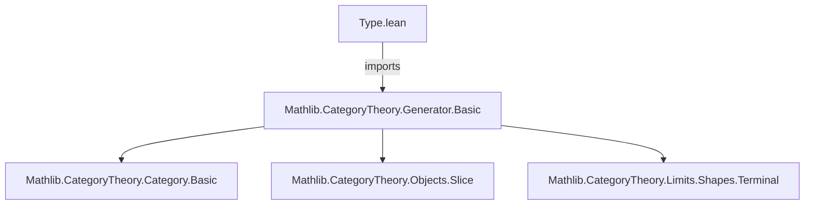
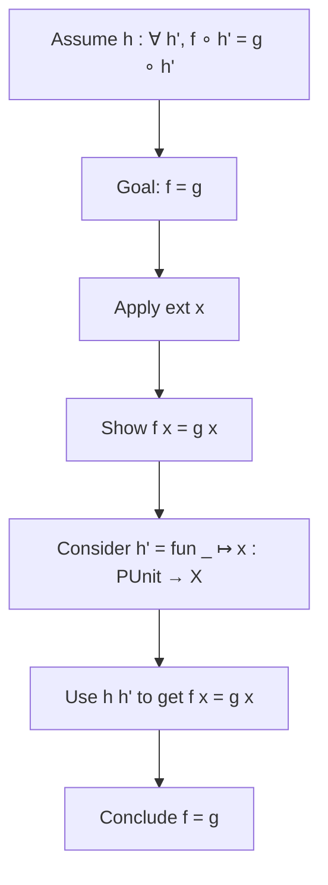

**Technical Brief: `Type.lean` — Generator of `Type`**

---

### 1. **Key Definitions & Theorems**

| Name | Type | Purpose |
|------|------|---------|
| `Types.isSeparator_punit` | `IsSeparator (PUnit.{u + 1})` | Proves that the singleton type `PUnit` (lifted to universe `u + 1`) is a *separator* (i.e., a *dense generator* or *test object*) in the category `Type u`. Concretely, it shows that morphisms out of `PUnit` detect equality of natural transformations: if two functions `f g : X ⟶ Y` agree post-composed with all maps `PUnit → X`, then `f = g`. |

- **`IsSeparator`** (from `Mathlib.CategoryTheory.Generator.Basic`):  
  For an object `G`, `IsSeparator G` means:  
  $$
  \forall X, Y, f, g : X \to Y,\quad (f \circ h = g \circ h\ \forall h : G \to X) \implies f = g
  $$

- **`PUnit.{u + 1}`**: The singleton type in universe `u + 1`, used to avoid universe mismatch when mapping into objects of `Type u`.

---

### 2. **Naming Conventions**

- **Prefixes**:  
  - `isSeparator_`: Indicates membership in the class `IsSeparator`.  
  - `Types.`: Module-level namespace prefix (implied by `module Types` and `public import`), used to group results about `Type`.

- **Suffixes**:  
  - `_punit`: Denotes the specific separator object `PUnit`.

- **Pattern**: `isSeparator_<object>` for separator lemmas.

---

### 3. **Tactic Stack**

| Tactic | Usage |
|--------|-------|
| `intro` | Introduces variables and hypotheses (`X Y f g h`). |
| `ext` | Extensionality: reduces equality of functions to pointwise equality (`x : X`). |
| `congr_fun` | Converts equality of functions into equality of their values at a point. |
| `h PUnit (by simp) (fun _ ↦ x)` | Applies the hypothesis `h` (which is a function of type `∀ {X Y : Type u}, (PUnit → X) → (X → Y) → (X → Y) → …`) with:  
  - test object `PUnit`,  
  - proof `by simp` that `PUnit` is nonempty (i.e., inhabited),  
  - constant function `fun _ ↦ x` from `PUnit` to `X`. |
| `.unit` | Uses the unique element of `PUnit` to conclude the pointwise equality. |

> **Note**: The proof is highly automated but relies on the internal structure of `IsSeparator` and the definitional uniqueness of maps into/from `PUnit`.

---

### 4. **Proof Logic**

The proof follows a standard *test-object* argument:

1. **Goal**: Show $f = g$ given $\forall h : PUnit \to X,\ f \circ h = g \circ h$.
2. **Extensionality**: Reduce to showing $f(x) = g(x)$ for arbitrary $x : X$.
3. **Use hypothesis**: Apply `h` to the unique map $!_x : PUnit \to X$ sending `•` to $x$.
4. **Evaluate at unit**: Use the fact that `PUnit` has a unique element (`PUnit.unit`) to extract $f(x) = g(x)$.

Formally:
$$
f = g \iff \forall x,\ f(x) = g(x) \iff \forall x,\ (f \circ !_{x})(\text{•}) = (g \circ !_{x})(\text{•}) \overset{h}{\implies} f = g
$$

---

### 5. **Imports**

| Import | Role |
|--------|------|
| `Mathlib.CategoryTheory.Generator.Basic` | Provides the definition of `IsSeparator`, and foundational generator theory in categories. |

> This file is self-contained and builds directly on the basic generator machinery.

---

### 6. **Mermaid Diagrams**

#### Dependency Graph (File-Level)



#### Overview of Theoretical Context

```mermaid
graph LR
  subgraph CategoryTheory
    G[Generator Theory] --> H[IsSeparator]
    H --> I[Type.lean]
    I --> J[PUnit is separator]
  end

  subgraph Type u
    K[Type u] --> L[Objects = Types]
    L --> M[Morphisms = Functions]
  end

  I -->|applies to| Type u
```

#### Proof Sketch Flow



---

### Summary

This file formalizes a foundational fact: in the category of types (`Type u`), the singleton type `PUnit` serves as a *separator*, meaning it can distinguish between distinct morphisms (functions). The proof is concise and leverages the uniqueness of maps into `PUnit`, demonstrating Lean’s strength in categorical reasoning with minimal axiomatic overhead.
