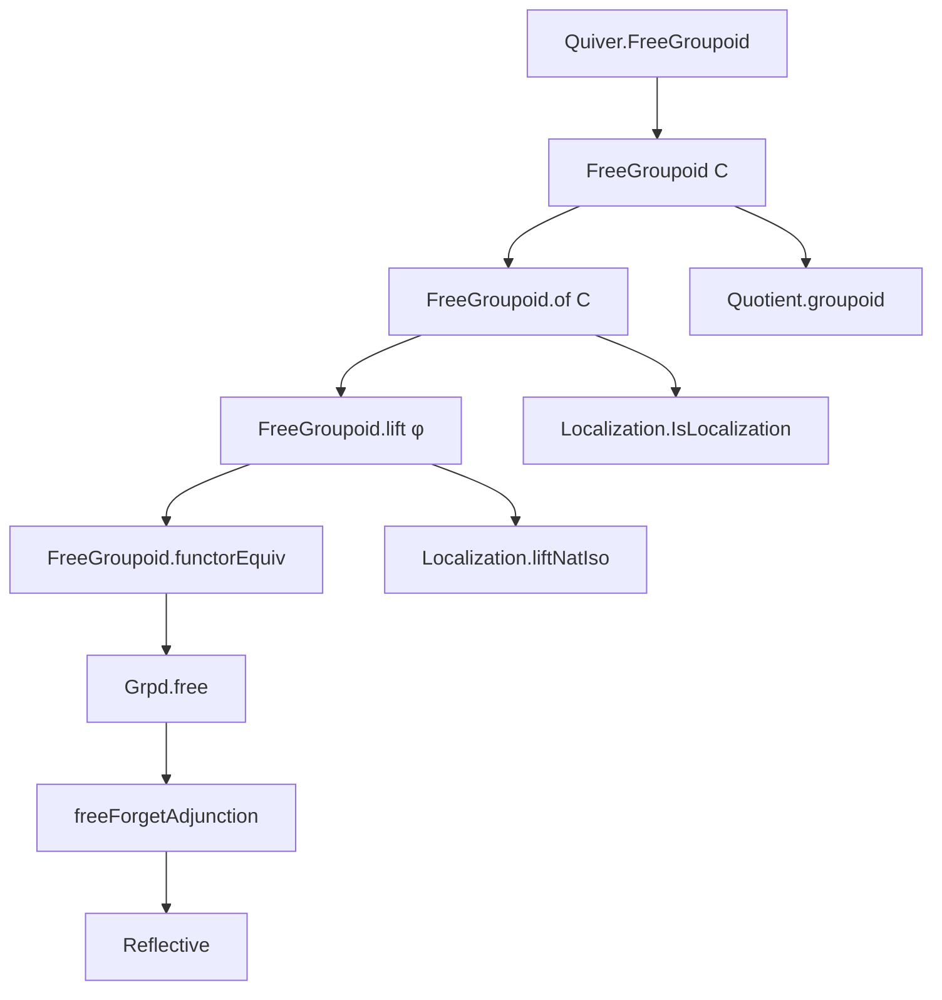
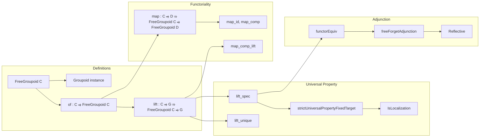

### Technical Brief: Free Groupoid on a Category (Lean 4)

---

#### **1. Key Definitions & Theorems**

| Name | Type / Signature | Purpose |
|------|------------------|---------|
| `FreeGroupoid C` | `Type u` | Underlying type of the free groupoid on a category `C`, defined as `Quotient (FreeGroupoid.homRel C)` |
| `FreeGroupoid.instGroupoid` | `Groupoid (FreeGroupoid C)` | Constructs a groupoid structure on `FreeGroupoid C` via quotienting |
| `FreeGroupoid.of C` | `C ⥤ FreeGroupoid C` | Localization functor embedding `C` into its free groupoid |
| `FreeGroupoid.mk X` | `mk X : FreeGroupoid C` | Constructor for objects: `mk X = (of C).obj X` |
| `FreeGroupoid.homMk f` | `homMk f : mk X ⟶ mk Y` | Constructor for morphisms: `homMk f = (of C).map f` |
| `FreeGroupoid.lift φ` | `C ⥤ G ⇒ FreeGroupoid C ⥤ G` | Universal lift of a functor from `C` to a groupoid `G` |
| `FreeGroupoid.lift_spec φ` | `of C ⋙ lift φ = φ` | Proof that `lift φ` extends `φ` along `of C` |
| `FreeGroupoid.lift_unique φ Φ hΦ` | `Φ = lift φ` | Uniqueness of lift: any extension of `φ` through `of C` equals `lift φ` |
| `FreeGroupoid.map F` | `FreeGroupoid C ⥤ FreeGroupoid D` | Functorial extension of `F : C ⥤ D` to free groupoids |
| `FreeGroupoid.functorEquiv D` | `(FreeGroupoid C ⥤ D) ≃ (C ⥤ D)` | Bijective correspondence between functors out of free groupoid and from base category |
| `Grpd.free` | `Cat ⥤ Grpd` | Free groupoid construction as a functor |
| `Grpd.freeForgetAdjunction` | `free ⊣ Grpd.forgetToCat` | Adjunction showing `free` is left adjoint to forgetful functor |
| `Grpd.instance Reflective` | `Reflective Grpd.forgetToCat` | Consequence of adjunction: groupoids are reflective subcategory of categories |

---

#### **2. Naming Conventions**

- **Prefixes**:
  - `FreeGroupoid.`: All core definitions and lemmas live in this namespace.
  - `map_`, `lift_`, `of_`: Functional operations (`map`, `lift`, `of`) followed by descriptive suffixes.
  - `homMk`, `mk`: Constructors for morphisms and objects.
- **Suffixes**:
  - `_spec`: Specifies correctness of a construction (e.g., `lift_spec`).
  - `_unique`: States uniqueness (e.g., `lift_unique`).
  - `_app`: Used in natural isomorphism component lemmas (e.g., `liftNatIso_hom_app`).
  - `_iso`: Natural isomorphisms (e.g., `mapId`, `mapComp`, `mapCompLift`).
- **`[simp]` lemmas**:
  - Most `lift`, `map`, and `homMk`/`mk` interactions are marked `[simp]` for automation.

---

#### **3. Tactic Stack**

Frequent tactics used in proofs:
- `simp`: Especially with `[simp]` lemmas and `lift_spec`, `lift_unique`.
- `rw`: Rewriting using `lift_spec`, `lift_unique`, `Functor.assoc`, `Functor.id_comp`.
- `induction`: On inductive relations like `FreeGroupoid.homRel`.
- `cat_disch`, `cat`: Category-theoretic simplification and solving.
- `apply`, `exact`, `reflexivity`: Basic proof scripting.
- `aesop`: Not explicitly used here, but could be for routine category-theoretic reasoning.
- `congr_arg`: For proving equality of functors/natural transformations.

---

#### **4. Proof Logic**

- **Construction**:
  - Define `FreeGroupoid C` as a quotient of the free groupoid on the underlying quiver of `C`, modulo relations enforcing preservation of identities and composition.
  - Use `Quotient.lift` to define `lift φ`, ensuring the relations are respected.
- **Uniqueness**:
  - Prove `lift_unique` by reducing to uniqueness of lift for free groupoids on quivers (`Quiver.FreeGroupoid.lift_unique`).
- **Functoriality**:
  - Define `map F := lift (F ⋙ of D)` and prove properties via `lift_unique`.
- **Adjunction & Reflectivity**:
  - Use `Localization.StrictUniversalPropertyFixedTarget` to show `of C` is a localization.
  - Define `freeForgetAdjunction` via `Adjunction.mkOfHomEquiv`, using `functorEquiv` and naturality lemmas.

---

#### **5. Imports**

| Module | Purpose |
|--------|---------|
| `Mathlib.CategoryTheory.Groupoid.FreeGroupoid` | Core theory of free groupoids on quivers |
| `Mathlib.CategoryTheory.Groupoid.Grpd.Basic` | Basic definitions about `Grpd`, including `forgetToCat` |
| `Mathlib.CategoryTheory.Adjunction.Reflective` | Tools for reflective subcategories and adjunctions |
| `Mathlib.CategoryTheory.Localization.Predicate` | Localization theory, including `IsLocalization`, `StrictUniversalPropertyFixedTarget` |

---

#### **6. Mermaid Diagrams**

##### **Dependency Graph (High-Level)**

##### **Overview of File Structure**

---

#### **7. Summary**

This file formalizes the *free groupoid on a category* as a universal construction: given a category `C`, it produces a groupoid `FreeGroupoid C` equipped with a functor `of : C ⥤ FreeGroupoid C` such that any functor from `C` to a groupoid factors uniquely through `of`. The construction is functorial, and the assignment `C ↦ FreeGroupoid C` extends to a left adjoint `free : Cat → Grpd` to the forgetful functor `Grpd → Cat`. This makes `Grpd` a *reflective subcategory* of `Cat`.

The implementation uses quotient types to enforce the categorical axioms (identity and composition preservation) on the free groupoid of the underlying quiver, and leverages localization theory to express the universal property cleanly.

--- 

Let me know if you'd like a formalized dependency graph in `leanpkg` format or a visualization of the `homRel` inductive definition.
