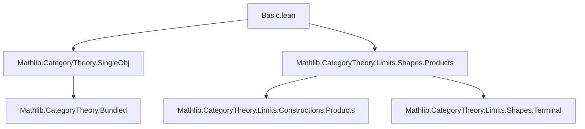
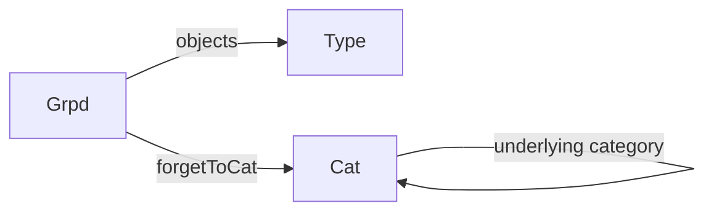

### Technical Brief: `Basic.lean` — Category of Groupoids (`Grpd`)

---

#### **1. Key Definitions & Theorems**

| Name | Type / Signature | Purpose |
|------|------------------|---------|
| `Grpd` | `def Grpd := Bundled Groupoid.{v, u}` | Bundled category of groupoids; objects are groupoids, morphisms are functors. |
| `of` | `def of (C : Type u) [Groupoid C] : Grpd` | Constructor to build a bundled groupoid from a type + groupoid instance. |
| `category` | `instance : LargeCategory Grpd` | Equips `Grpd` with a category structure: homs = functors, identity = identity functor, composition = horizontal composition `⋙`. |
| `objects` | `def objects : Grpd ⥤ Type u` | Forgetful functor sending a groupoid to its type of objects; *not* faithful. |
| `forgetToCat` | `def forgetToCat : Grpd ⥤ Cat` | Forgetful functor embedding `Grpd` into the category of (small) categories. |
| `piLimitFan` | `def piLimitFan (F : J → Grpd) : Fan F` | Constructs a cone over a family of groupoids using dependent product type `∀ j, F j`. |
| `piLimitFanIsLimit` | `def piLimitFanIsLimit (F : J → Grpd) : IsLimit (piLimitFan F)` | Proves the cone is a limit cone, i.e., products exist in `Grpd`. |
| `has_pi` | `instance : HasProducts Grpd` | Consequence of `piLimitFanIsLimit`: `Grpd` has all small products. |
| `piIsoPi` | `noncomputable def piIsoPi (J) (f) : of (∀ j, f j) ≅ ∏ᶜ f` | Explicit isomorphism between the bundled product groupoid and the categorical product. |
| `id_eq_id`, `comp_eq_comp` | `theorem id_eq_id : 𝟙 C = 𝟭 C`, `comp_eq_comp : f ≫ g = f ⋙ g` | Bridge between categorical notation (`𝟙`, `≫`) and functor-theoretic notation (`𝟭`, `⋙`). |
| `forgetToCat_full`, `forgetToCat_faithful` | `instance Full`, `instance Faithful` | `forgetToCat` is full and faithful (i.e., fully faithful embedding into `Cat`). |

---

#### **2. Naming Conventions**

- **Prefixes**:
  - `of_`: constructor for bundled objects (`of`, `of'` not present, but `of` used).
  - `pi_`: for product-related constructions (`piLimitFan`, `piIsoPi`, `piIsoPi_hom_π`).
  - `forgetTo_`: for forgetful functors (`forgetToCat`).
  - `hom_to_`, `id_to_`: deprecated aliases for bridging categorical and functor syntax.

- **Suffixes**:
  - `_IsLimit`: indicates a limit cone (e.g., `piLimitFanIsLimit`).
  - `_hom_π`: for projection component lemmas of cone morphisms.

- **General pattern**: `noun_verb` or `noun_noun` (e.g., `piLimitFan`, `forgetToCat`).

---

#### **3. Tactic Stack**

Frequent tactics used in proofs:

| Tactic | Usage |
|--------|-------|
| `rfl` | Proving definitional equalities (e.g., `id_comp`, `assoc`, `comp_eq_comp`). |
| `simp` / `simpa` | Simplifying using `@[simp]` lemmas (e.g., `piIsoPi_hom_π`, `coerce_of`). |
| `intro`, `apply`, `specialize` | Standard proof scripting in limit arguments. |
| `dsimp only [...]` | Local simplification with explicit rewrite rules. |
| `apply_funext`, `apply Functor.pi_ext` | Extensionality for functors (used in `piLimitFanIsLimit`). |
| `congrArg` | Proving equality of morphisms by equality of underlying functors (in `forgetToCat_faithful`). |
| `aesop` | Not used in this file (lean 4 style avoids heavy automation here). |

---

#### **4. Proof Logic**

- **Structure**: Mostly *constructive* and *definitional*.
- **Products**: Constructed explicitly via dependent function types (`∀ j, F j`), then verified as limits using:
  - `mkFanLimit` + `Functor.pi'` for the mediating morphism.
  - `Functor.pi_ext` for uniqueness.
- **Forgetful functors**: Verified for fullness/faithfulness by unfolding definitions and using `congrArg`.
- **Identities**: Proven by `rfl` due to definitional equality of categorical and functorial operations.

---

#### **5. Imports**

| Module | Purpose |
|--------|---------|
| `Mathlib.CategoryTheory.SingleObj` | Provides `SingleObj PUnit` for the initial object (inhabited instance). |
| `Mathlib.CategoryTheory.Limits.Shapes.Products` | Provides `Fan`, `IsLimit`, `HasProducts`, `∏ᶜ`, etc., for product limits. |

No other imports are used — the file is self-contained for defining `Grpd` and its product structure.

---

#### **6. Mermaid Diagrams**

##### **Dependency Graph (Module-Level)**



##### **Conceptual Overview of `Grpd` Theory**

```mermaid
graph LR
  subgraph Objects
    G1[Groupoid C] --> Grpd[Grpd]
    G2[Groupoid D] --> Grpd
    G3[Groupoid E] --> Grpd
  end

  subgraph Morphisms
    F1[C ⥤ D] --> Hom[Hom(C, D)]
    F2[D ⥤ E] --> Hom
  end

  Grpd -->|category| Hom
  Grpd -->|objects| Type
  Grpd -->|forgetToCat| Cat

  subgraph Limits
    Fan[piLimitFan F] --> IsLimit[piLimitFanIsLimit]
    IsLimit --> HasProducts[HasProducts Grpd]
  end

  HasProducts -->|constructs| Prod[∏ᶜ f]
  Prod <-->|piIsoPi| BundledProd[of (∀ j, f j)]
```

##### **Functor Diagrams**



```mermaid
graph LR
  Grpd -- π_j --> Grpd_j
  Grpd -- ∏ᶜ f --> Grpd
  of (∀ j, f j) -- iso --> ∏ᶜ f
```

---

#### **7. Summary**

This file defines the **category `Grpd` of (small) groupoids**, equipped with:
- A category structure via bundled functors.
- Explicit construction of all small products using dependent products.
- Two forgetful functors: one to `Type` (objects), one to `Cat`.
- Full faithfulness of `forgetToCat`, making `Grpd` a *full subcategory* of `Cat`.

It follows Lean’s *bundled object* pattern and emphasizes *definitional equality* for categorical operations, avoiding heavy automation in favor of explicit, verifiable constructions.

--- 

Let me know if you'd like a formalized summary in `lean` comment style or a theory graph for the broader `CategoryTheory` hierarchy.
