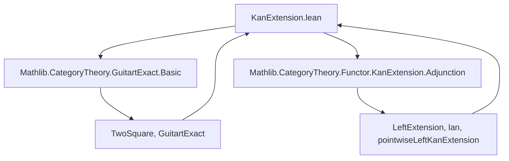
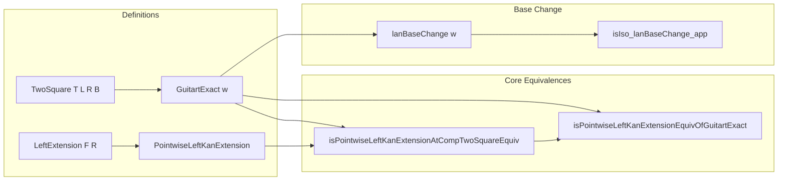

### Technical Brief: `KanExtension.lean`

---

#### **1. Key Definitions & Theorems**

| Name | Type / Signature | Purpose |
|------|------------------|---------|
| `TwoSquare T L R B` | `T ⋙ R ⇒ L ⋙ B` | A 2-cell (natural transformation) forming a square of functors. |
| `LeftExtension.mk F' α` | Constructs a left extension of `F : C₂ ⥤ D` along `R : C₂ ⥤ C₄`. | Encodes universal property of left Kan extension data. |
| `compTwoSquare w` | `L.LeftExtension (T ⋙ F)` from `E : R.LeftExtension F` | Precomposes with `B` and postcomposes with `w` to transfer extension data across square. |
| `isPointwiseLeftKanExtensionAtCompTwoSquareEquiv w X₃` | Equivalence of pointwise left Kan extension conditions at `X₃` and `B.obj X₃`. | Core equivalence for Guitart exact squares. |
| `isPointwiseLeftKanExtensionEquivOfGuitartExact w` | Equivalence of *global* pointwise left Kan extension properties under essential surjectivity of `B`. | Enables checking Kan extension via pullback square. |
| `lanBaseChange w` | Natural transformation `(T ⋙ L.lan) ⇒ (R.lan ⋙ B)` | Base change map for left Kan extensions induced by square `w`. |
| `isIso_lanBaseChange_app` | `IsIso (w.lanBaseChange.app F)` under Guitart exactness + pointwise left Kan extensions exist. | Shows base change is iso when extensions exist — key structural result. |

---

#### **2. Naming Conventions**

- **Prefixes**:
  - `isPointwiseLeftKanExtensionAt_`: predicates for pointwise left Kan extension at an object.
  - `hasPointwiseLeftKanExtensionAt_`: existence predicate for pointwise left Kan extension at an object.
  - `compTwoSquare`: construction using a 2-cell `w`.
  - `lanBaseChange`: base change map for left Kan extensions.

- **Suffixes**:
  - `_Equiv`: indicates an equivalence (not just equivalence of types, but logical equivalence).
  - `_iff`: logical equivalence (`↔`) statements.
  - `_app`: component at an object/functor in a natural transformation.

- **Other patterns**:
  - `objPreimage`, `objObjPreimageIso`: used when `B` is essentially surjective.
  - `costructuredArrowRightwards X₃`: construction of a cocone from square `w` at `X₃`.

---

#### **3. Tactic Stack**

Frequent tactics used in proofs:

- `rw`, `simp`, `dsimp`: rewriting and simplification using definitions/equivalences.
- `congr 1`, `ext`: extensionality for natural transformations / functors.
- `exact`, `refine`, `infer_instance`: constructing proofs/instances.
- `subsingleton`: for uniqueness of proofs in subsingleton types.
- `Adjunction.homEquiv_naturality_left_symm`, `homEquiv_naturality_right_symm`: manipulating hom-equivalences from adjunctions.
- `simp only [...]`: fine-grained simplification with explicit lemmas.

---

#### **4. Proof Logic**

- **Inductive structure**: proofs often proceed by:
  1. Reducing to pointwise conditions (`isPointwiseLeftKanExtensionAt`).
  2. Using the equivalence `isPointwiseLeftKanExtensionAtCompTwoSquareEquiv`, which relies on:
     - `Final.isColimitWhiskerEquiv`: colimit preservation under whiskering.
     - `Cocones.ext`: extensionality of cocones.
  3. Leveraging essential surjectivity of `B` to lift properties from `C₃` to `C₄`.
  4. Applying adjunction machinery (`lanAdjunction`) to construct and analyze `lanBaseChange`.

- **Key logical flow**:
  - Show equivalence of pointwise Kan extension conditions via colimit characterization.
  - Use Guitart exactness to ensure the costructured arrow category has a final object.
  - Prove base change is iso by showing its components are left Kan extension maps (hence iso by universal property).

---

#### **5. Imports**

- `Mathlib.CategoryTheory.GuitartExact.Basic`: foundational definitions of Guitart exact squares, costructured arrows, etc.
- `Mathlib.CategoryTheory.Functor.KanExtension.Adjunction`: adjunctions and basic properties of left Kan extensions (`lan`, `pointwiseLeftKanExtension`, etc.).

---

#### **6. Mermaid Diagrams**

##### **Dependency Graph (Module-Level)**



##### **Overview of Theoretical Flow**



##### **Square Diagram (Intuition)**

```
     T
  C₁ ⥤ C₂
L |     | R
  v     v
  C₃ ⥤ C₄
     B
```

- `w : T ⋙ R ⇒ L ⋙ B` is a 2-cell.
- Guitart exactness ⇒ the induced cocone at each `X₃ ∈ C₃` is final.
- Kan extension along `R` ↔ Kan extension along `L` after precomposing with `T`, up to `B`.

---

#### **7. Summary**

This file formalizes a fundamental result in enriched category theory: **Guitart exact squares preserve and reflect pointwise left Kan extensions**, and induce an isomorphism between the corresponding left Kan extension functors (`lan`). It bridges universal properties (Kan extensions) with 2-categorical exactness, and is foundational for derived base change and homotopy theory in categorical semantics.

The key insight is that *exactness* of the square ensures the costructured arrow category is final, enabling colimit-based characterizations of Kan extensions to transfer across the square. The `lanBaseChange` natural transformation is the categorical manifestation of this transfer, and its invertibility is the main structural theorem.
