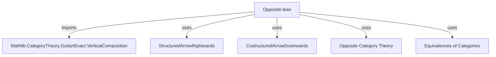

**Technical Brief: Opposite.lean — Guitart Exactness and Opposite Squares**

---

### 1. **Key Definitions & Theorems**

| Name | Type / Signature | Purpose |
|------|------------------|---------|
| `TwoSquare` | `Type u₁ → Type u₂ → Type u₃ → Type u₄ → CategoryTheory.TwoSquare` | Represents a 2-square in category theory: a commutative diagram of functors $T, L, R, B$ with a natural transformation $w : R \circ T \Rightarrow B \circ L$. |
| `w.op` | `w : TwoSquare T L R B ⟹ w.op : TwoSquare T.op L.op R.op B.op` | Opposite (i.e., transposed) 2-square, obtained by applying `op` to all categories and functors. |
| `StructuredArrowRightwards` | `(w : TwoSquare …) → (X₃ : C₃ᵒᵖ) → (X₂ : C₂ᵒᵖ) → (g : B.op.obj X₃ ⟶ R.op.obj X₂) → Category` | Category of structured arrows *rightwards* from $g$ in $w$. |
| `CostructuredArrowDownwards` | `(w : TwoSquare …) → (X₃ : C₃) → (X₂ : C₂) → (g : B.obj X₃ ⟶ R.obj X₂) → Category` | Category of costructured arrows *downwards* from $g$ in $w$. |
| `structuredArrowRightwardsOpEquivalence` | `(w.op.StructuredArrowRightwards g)ᵒᵖ ≌ w.CostructuredArrowDownwards g.unop` | Equivalence of categories between opposite structured arrows in $w^\mathrm{op}$ and costructured arrows in $w$. |
| `guitartExact_iff_isConnected_rightwards` | `w.GuitartExact ↔ ∀ X₃ X₂ g, IsConnected (w.StructuredArrowRightwards g)` | Characterization of Guitart exactness via connectedness of structured arrow categories. |
| `guitartExact_op_iff` | `w.op.GuitartExact ↔ w.GuitartExact` | Main theorem: a 2-square is Guitart exact iff its opposite is. |
| `guitartExact_id'` | `GuitartExact (TwoSquare.mk F (𝟭 C₁) (𝟭 C₂) F (𝟙 F))` | Identity square (with $T = B = F$, $L = R = \mathrm{id}$) is Guitart exact. |

---

### 2. **Naming Conventions**

- **Prefixes**:
  - `structuredArrow*`: for categories of structured arrows (rightwards/downwards).
  - `costructuredArrow*`: for costructured arrows (dual notion).
  - `op`: for opposite constructions (`w.op`, `g.unop`, `f.unop`, etc.).
  - `unop`: for unwrapping opposites (e.g., `g.unop : B.obj X₃ ⟶ R.obj X₂`).
- **Suffixes**:
  - `Equivalence`: for categorical equivalences (`structuredArrowRightwardsOpEquivalence`).
  - `mk`: for constructors of structured/costructured arrows.
  - `proj`, `w`, `hom`: for projection maps and witness morphisms in arrow categories.
- **`op`/`unop` duality**:
  - `Opposite.op`, `Opposite.unop` used to move between $C$ and $C^\mathrm{op}$.
  - `Quiver.Hom.op_inj`, `Quiver.Hom.unop_inj`: injectivity lemmas for opposite morphisms.

---

### 3. **Tactic Stack**

- `ext`: extensionality for morphisms in functor/arrow categories.
- `simpa using …`: simplifies goals using given equalities.
- `rw [← …, …]`: rewriting using equivalences and definitions (e.g., `isConnected_op_iff_isConnected`, `guitartExact_iff_isConnected_rightwards`).
- `infer_instance`: to discharge typeclass goals (e.g., `GuitartExact`).
- `cat_disch`: category-theoretic tactic to discharge diagrammatic equalities (likely custom or from `Mathlib.CategoryTheory`).
- `exact Quiver.Hom.op_inj …`: uses injectivity of opposite morphism mapping.

---

### 4. **Proof Logic**

- **Main proof strategy**:
  1. Use `guitartExact_iff_isConnected_rightwards` to reduce Guitart exactness to connectedness of structured arrow categories.
  2. Apply `isConnected_op_iff_isConnected` to relate connectedness in $w^\mathrm{op}$ to $w$.
  3. Use `isConnected_iff_of_equivalence` with `structuredArrowRightwardsOpEquivalence` to transfer connectedness across the equivalence.
  4. Conclude via `infer_instance`.

- **Equivalence construction**:
  - Construct functors `functor` and `inverse` explicitly on objects and morphisms.
  - Verify unit/counit are identities (`unitIso := Iso.refl _`, `counitIso := Iso.refl _`), yielding an equivalence.

- **Symmetry proof (`guitartExact_op_iff`)**:
  - One direction uses the above instance.
  - The reverse uses factorization of $w$ through double opposites:  
    $w = (1 \vartriangleright w^{\mathrm{op}\,\mathrm{op}}) \vartriangleright 1$,  
    where $1$ are identity squares (handled by `guitartExact_id'`).

---

### 5. **Imports**

- `Mathlib.CategoryTheory.GuitartExact.VerticalComposition`: provides definitions and lemmas about Guitart exact squares and their vertical composition.

---

### 6. **Mermaid Diagrams**

#### **Dependency Graph (Module-Level)**



#### **Overview of File Structure**

```mermaid
flowchart LR
  A[2-Square w] --> B[w.op]
  B --> C[StructuredArrowRightwards g in w.op]
  C --> D[(...)ᵒᵖ]
  A --> E[CostructuredArrowDownwards g.unop in w]
  D <-->|equivalence| E
  D -->|connectedness| F[GuitartExact w.op]
  E -->|connectedness| G[GuitartExact w]
  F <-->|guitartExact_op_iff| G
```

#### **Equivalence Construction (Object Level)**

```mermaid
flowchart LR
  f : (w.op.StructuredArrowRightwards g)ᵒᵖ
    -->|functor| f' : w.CostructuredArrowDownwards g.unop
  f' -->|inverse| f.op
  f -- unop/right/left operations --> f'
  f' -- op/right/left operations --> f
```

---

### 7. **Summary**

This file establishes that **Guitart exactness is preserved under taking opposites**, by constructing an explicit equivalence between structured arrow categories in $w^\mathrm{op}$ and costructured arrow categories in $w$. The proof leverages:
- Opposite-category machinery (`op`, `unop`, `op_inj`, `unop_inj`),
- Connectedness criteria for Guitart exactness,
- Categorical equivalence to transfer properties.

It is foundational for symmetry arguments in 2-categorical exactness, especially when working with dual notions (e.g., homotopy exact squares, derivators).
