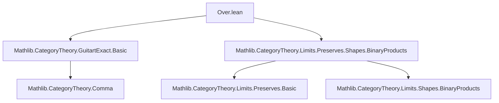
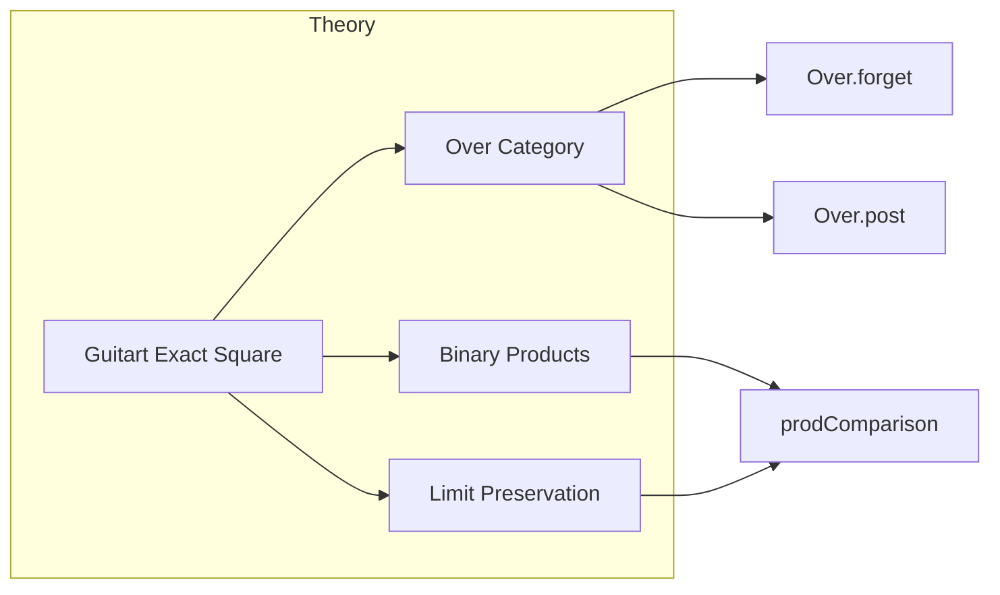

**Technical Brief: `Over.lean` — Guitart Exactness of the `Over`-Post Square**

---

### 1. **Key Definitions & Theorems**

| Name | Type / Signature | Purpose |
|------|------------------|---------|
| `TwoSquare.overPost` | `abbrev TwoSquare (Over.post F) (Over.forget X) (Over.forget (F.obj X)) F` | Constructs the commutative square of categories: <br> `Over X → Over (F X)` <br> `↓          ↓` <br> `C   →   D` <br> induced by `F : C ⥤ D` and `X : C`. |
| `TwoSquare.overPost.GuitartExact` | `instance [∀ Y, HasBinaryProduct X Y] [∀ Y, PreservesLimit (pair X Y) F] : (TwoSquare.overPost F X).GuitartExact` | Main theorem: the square is *Guitart exact* if `F` preserves binary products with `X`. |
| `prodComparison` | `prodComparison F X Z : F.obj (X ⨯ Z) ⟶ F.obj X ⨯ F.obj Z` | The canonical comparison map from preservation of products (used to relate `F(X ⨯ Z)` to `F X ⨯ F Z`). |
| `inv_prodComparison_map_fst`, `inv_prodComparison_map_snd` | `simp`-friendly lemmas | Show that the inverse of `prodComparison` projects correctly onto each factor. |

---

### 2. **Naming Conventions**

- **Prefixes**:
  - `overPost`: indicates construction over the `Over` category and post-composition with `F`.
  - `prodComparison`, `inv_prodComparison_*`: standard comparison maps for limit preservation.
- **Suffixes**:
  - `_map_fst`, `_map_snd`: denote behavior under projection maps.
  - `StructuredArrowRightwards`, `CostructuredArrow`: standard terminology for objects/morphisms in the comma category used in Guitart exactness.

---

### 3. **Tactic Stack**

| Tactic | Usage |
|--------|-------|
| `simp` | Simplifying hom-components, especially using `inv_prodComparison_map_fst/snd`. |
| `ext` | Extensionality for morphisms in `Over` categories (i.e., equality of underlying arrows in `C`). |
| `rw [← Functor.map_comp]` | Rewriting using functoriality of `F`. |
| `simpa` | Simplifying goals using hypotheses (e.g., `Over.w`, `CostructuredArrow.w`). |
| `cancel_mono` | Cancelling monomorphisms (used in uniqueness arguments). |
| `zigzag_isConnected` | Proves connectedness of the comma category of structured arrows (key for Guitart exactness). |
| `Nonempty.intro` | Introducing a witness to show non-emptiness of a type. |

---

### 4. **Proof Logic**

The proof proceeds as follows:

1. **Non-emptiness**: Construct a *canonical structured arrow* `P` in the rightwards comma category using:
   - The binary product `X ⨯ Z`,
   - The lift `prod.lift (W.hom) g : W.left ⟶ X ⨯ Z`,
   - The inverse of `prodComparison` to define the map `W.left ⟶ F X` and `W.left ⟶ F Z`.

2. **Connectedness**:
   - For any two structured arrows `Q₁`, `Q₂`, construct a zigzag connecting them via a *unique* morphism `φ Q : Q ⟶ P`.
   - Show `φ Q` is a morphism in the comma category using:
     - `Over.w` and `CostructuredArrow.w` to verify commutativity,
     - `cancel_mono (prodComparison F X _)` to ensure uniqueness.

3. **Conclusion**: Apply `zigzag_isConnected` to deduce the comma category is connected, hence the square is Guitart exact.

---

### 5. **Imports**

| Import | Role |
|--------|------|
| `Mathlib.CategoryTheory.GuitartExact.Basic` | Defines Guitart exact squares and related notions (`TwoSquare`, `StructuredArrowRightwards`, `GuitartExact`). |
| `Mathlib.CategoryTheory.Limits.Preserves.Shapes.BinaryProducts` | Provides `HasBinaryProduct`, `PreservesLimit (pair X Y)`, and `prodComparison`. |

---

### 6. **Mermaid Diagrams**

#### **Dependency Graph (Module Level)**



#### **Overview of the Theoretical Context**



#### **Commutative Square (Object-Level)**

```mermaid
graph LR
  OverX[Over X] -->|Over.post F| OverFX[Over (F X)]
  v[Over X] -->|Over.forget X| C
  OverFX -->|Over.forget (F X)| D
  C -->|F| D
```

---

### 7. **Summary**

This file formalizes a key example of a Guitart exact square involving over-categories. It shows that if a functor `F` preserves binary products with a fixed object `X`, then the natural square formed by `Over.forget` and `Over.post F` is Guitart exact. The proof leverages the universal property of binary products and the structure of comma categories, with heavy use of `simp`-friendly lemmas about `prodComparison`.
