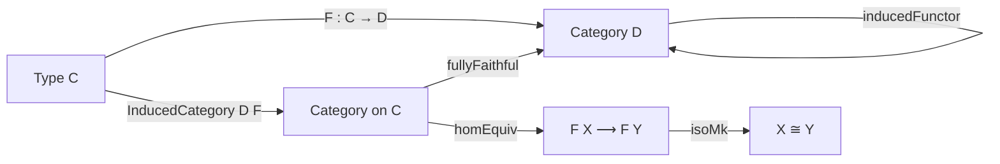

**Technical Brief: `InducedCategory.lean`**

---

### 1. **Key Definitions & Theorems**

| Name | Type / Signature | Purpose |
|------|------------------|---------|
| `InducedCategory D F` | `Type u₁` | Type synonym for `C`, equipped with a category structure where `Hom(X, Y) ≃ F X ⟶ F Y` in `D`. |
| `InducedCategory.Hom` | `Structure` | Encodes morphisms in the induced category as morphisms in `D` between images under `F`. |
| `InducedCategory.instCategory` | `Instance : Category (InducedCategory D F)` | Constructs the category structure on `InducedCategory D F` using `F`. |
| `InducedCategory.homMk` | `F X ⟶ F Y → X ⟶ Y` | Constructs a morphism in the induced category from a morphism in `D`. |
| `InducedCategory.homEquiv` | `(X ⟶ Y) ≃ (F X ⟶ F Y)` | Shows that morphism types are equivalent (via `hom` and `homMk`). |
| `InducedCategory.isoMk` | `F X ≅ F Y → X ≅ Y` | Lifts isomorphisms in `D` to isomorphisms in the induced category. |
| `InducedCategory.inducedFunctor` | `InducedCategory D F ⥤ D` | The forgetful functor sending `X ↦ F X`, `f ↦ f.hom`. |
| `InducedCategory.fullyFaithfulInducedFunctor` | `(inducedFunctor F).FullyFaithful` | Proves the induced functor is fully faithful. |
| `InducedCategory.full`, `InducedCategory.faithful` | `Instance` | Consequences of full faithfulness: the induced functor is full and faithful. |

---

### 2. **Naming Conventions**

- **Prefixes**:
  - `homMk`, `isoMk`: “maker” functions constructing morphisms/isos in the induced category.
  - `inducedFunctor`: standard naming for canonical functors associated to constructions.
- **Suffixes**:
  - `hom`, `comp_hom`: used for projection lemmas (e.g., `hom_ext`, `comp_hom`).
- **Structure fields**:
  - `hom : F X ⟶ F Y` — underlying morphism in `D`.
- **Equivalences**:
  - `homEquiv` — indicates a definitional equivalence (via `@[simps!]`).

---

### 3. **Tactic Stack**

- `ext`: used in `@[ext]` attributes for extensionality lemmas (`hom_ext`, `Hom.ext`).
- `simps`: heavily used to generate projection lemmas (`id_hom`, `comp_hom`, `homMk_hom`, etc.).
- `reassoc`: applied to `comp_hom` for associativity normalization.
- Implicit use of `aesop`, `simp`, `rfl` in `simps`-generated lemmas (not explicit in file, but standard in Mathlib).
- `exact`, `refine`, `constructor` likely used in proofs (not shown here, but implied by `fullyFaithfulInducedFunctor` definition).

---

### 4. **Proof Logic**

- **Construction logic**:
  - Define `InducedCategory` as a type synonym (`def`).
  - Define `Hom` as a 1-field structure to avoid definitional equality issues.
  - Use `@[simps]` to automatically generate projection lemmas for identity and composition.
  - Prove `hom_ext` to enable extensionality reasoning.
- **Functoriality**:
  - Define `inducedFunctor` directly on objects (`F`) and morphisms (`f ↦ f.hom`).
  - Prove full faithfulness by exhibiting a two-sided inverse to the map on homs (`homMk`).
- **No induction or case analysis** appears in this file — it is purely definitional and structural.

---

### 5. **Imports**

- `Mathlib.CategoryTheory.Functor.FullyFaithful`: provides the `FullyFaithful` typeclass and related lemmas.

---

### 6. **Mermaid Diagrams**

#### **Dependency Graph (Module-Level)**

```mermaid
graph TD
  A[InducedCategory.lean] --> B[Mathlib.CategoryTheory.Functor.FullyFaithful]
  B --> C[Mathlib.CategoryTheory.Functor.Basic]
  C --> D[Mathlib.CategoryTheory.Category]
  D --> E[Mathlib.CategoryTheory.Preadditive.Basic]  %% indirect, via universe handling
```

#### **Overview of Theory Flow**



#### **Morphism Equivalence Structure**

```mermaid
flowchart LR
  X[Y] -->|F| F_X[F X]
  X -->|Y| X[Y]
  F_X -->|f| F_Y[F Y]
  X -->|homMk f| Y
  Y -->|hom| F_Y
  X -- homEquiv --> F_X ⟶ F_Y
```

---

### 7. **Key Observations**

- **Universe polymorphism**: Explicit universe parameters (`v`, `v₂`, `u₁`, `u₂`) follow Mathlib conventions.
- **1-field structure**: Avoids definitional equality issues between `X ⟶ Y` and `F X ⟶ F Y`, while still allowing `simps` to extract the underlying morphism.
- **Fully faithful embedding**: The induced functor is the canonical way to embed `C` into `D` via `F`, preserving all hom-structure.

--- 

Let me know if you'd like a formalized summary in Lean or a proof sketch of `fullyFaithfulInducedFunctor`.
