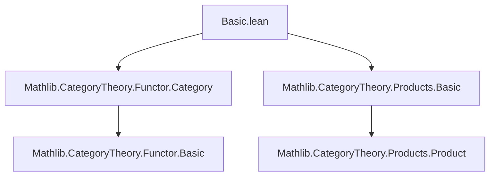

### Technical Brief: Joins of Categories (`Basic.lean`)

---

#### **1. Key Definitions & Theorems**

| Name | Type / Signature | Purpose |
|------|------------------|---------|
| `Join C D` | `Type (max u₁ u₂)` | Type of objects in the join: disjoint union of objects of `C` and `D`, encoded as `left c` or `right d`. |
| `Hom X Y` | `C ⋆ D → C ⋆ D → Type (max v₁ v₂)` | Morphism set: inherited from `C`/`D` via `ULift`, plus `PUnit` for `left → right`, `PEmpty` for `right → left`. |
| `edge c d` | `left c ⟶ right d` | The unique morphism from a left object to a right object. |
| `inclLeft : C ⥤ C ⋆ D` | Functor | Canonical inclusion of `C` into the join. Fully faithful. |
| `inclRight : D ⥤ C ⋆ D` | Functor | Canonical inclusion of `D` into the join. Fully faithful. |
| `homInduction` | `∀ {x y}, (x ⟶ y) → P f` | Induction principle for morphisms in `C ⋆ D`: any morphism is either from `inclLeft`, `inclRight`, or `edge`. |
| `mkFunctor F G α` | `C ⋆ D ⥤ E` | Universal constructor of functors out of a join: given `F: C→E`, `G: D→E`, and `α: F∘fst ⇒ G∘snd`, yields `C⋆D → E`. |
| `mkNatTrans αₗ αᵣ h` | `F ⟶ F'` | Constructor for natural transformations between functors out of a join, compatible on edges. |
| `mkNatIso eₗ eᵣ h` | `F ≅ G` | Constructor for natural isomorphisms between such functors. |
| `edgeTransform` | `Prod.fst ⋙ inclLeft ⟶ Prod.snd ⋙ inclRight` | Bundles all `edge c d` into a natural transformation. |
| `mapPair Fₗ Fᵣ` | `C ⋆ D ⥤ E ⋆ E'` | Induced functor from pair of functors `Fₗ: C→E`, `Fᵣ: D→E'`. |
| `mapWhiskerLeft`, `mapWhiskerRight` | `mapPair H Fᵣ ⟶ mapPair H Gᵣ`, etc. | Induced natural transformations from whiskering. |
| `mapPairEquiv e e'` | `C ⋆ D ≌ C' ⋆ D'` | Equivalence of joins induced by equivalences of components. |

---

#### **2. Naming Conventions**

- **Prefixes**:
  - `incl*`: inclusion functors (`inclLeft`, `inclRight`)
  - `edge*`: canonical morphisms/natural transformations involving `edge`
  - `mk*`: universal constructions (`mkFunctor`, `mkNatTrans`, `mkNatIso`)
  - `map*`: induced constructions from component functors (`mapPair`, `mapWhisker*`, `mapIso*`)
- **Suffixes**:
  - `Left`/`Right`: indicate which side of the join is involved.
  - `Comp`: composition-related isomorphisms (`mapPairComp`)
  - `Equiv`: equivalence-related constructions (`mapPairEquiv`)
- **Variables**:
  - `αₗ`, `αᵣ`: natural transformations on left/right components.
  - `eₗ`, `eᵣ`: isomorphisms on left/right components.

---

#### **3. Tactic Stack**

- **Core tactics**:
  - `cases`: heavily used on `Join` objects and morphisms (`cases a <;> ...`)
  - `simp only [...] <;> tauto`: simplification + tautology solving for category axioms.
  - `dsimp`, `simp`: for definitional reductions (e.g., `mkFunctor_obj_left`).
  - `ext`: extensionality for natural transformations.
  - `cat_disch`: category-theoretic discharge tactic (custom or imported).
  - `rw`, `apply`, `exact`, `congrArg`: standard proof scripting.
  - `iso_whisker_*`, `assoc`, `id_comp`, `comp_id`: used for coherence proofs.

---

#### **4. Proof Logic**

- **Inductive structure**: Proofs often proceed by:
  1. **Case analysis** on objects (`left`/`right`) and morphisms (via `homInduction`).
  2. **Simplification** using definitional equalities (e.g., `obj`, `map`, `comp`).
  3. **Verification of naturality/associativity/unitality** by reducing to component categories.
- **Key pattern**:
  - For `mkFunctor`, `map_comp` and `map_id` are proven by `homInduction`, reducing to:
    - `F.map_id`, `F.map_comp` (for left-left),
    - `G.map_id`, `G.map_comp` (for right-right),
    - naturality of `α` (for left-right compositions).
- **Uniqueness**: Natural transformations/isomorphisms are uniquely determined by their restrictions to `inclLeft` and `inclRight`, via `natTrans_ext`.

---

#### **5. Imports**

- `Mathlib.CategoryTheory.Functor.Category`: Provides basic functor category infrastructure.
- `Mathlib.CategoryTheory.Products.Basic`: Provides product category constructions (`Prod.fst`, `Prod.snd`, `Prod.sectL`, etc.).

---

#### **6. Mermaid Diagrams**

##### **Dependency Graph (Module-Level)**



##### **Overview of Join Construction**

```mermaid
graph TD
  C[Category C] -->|inclLeft| J[C ⋆ D]
  D[Category D] -->|inclRight| J
  J -->|edge c d| J
  J -->|mkFunctor F G α| E[Category E]
  J -->|mapPair Fₗ Fᵣ| E⋆E'[E ⋆ E']
  J -->|mapPairEquiv e e'| J'[C' ⋆ D']
  C <->|e| C'
  D <->|e'| D'
```

##### **Universal Property of Join**

```mermaid
graph LR
  C -->|F| E
  D -->|G| E
  C ⋆ D --∃! mkFunctor F G α--> E
  Prod C D -.->|α: F∘fst ⇒ G∘snd| E
```

---

This file formalizes the *join* of categories, a fundamental construction in higher category theory (e.g., in Kerodon), enabling the gluing of two categories along a “cone” of morphisms from one to the other. It provides a clean, inductive, and proof-relevant framework for reasoning about such glued categories and their universal properties.
