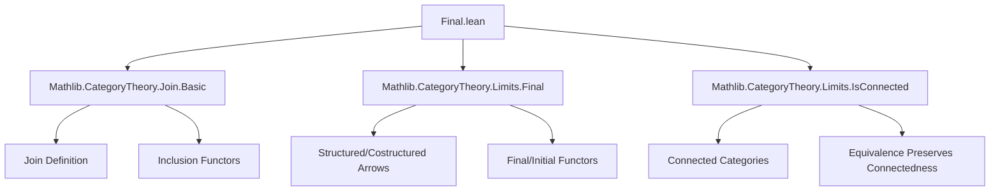
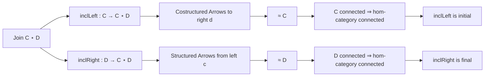

**Technical Brief: Final.lean — (Co)Finality of Inclusions in Joins of Categories**

---

### 1. **Key Definitions & Theorems**

| Name | Type / Signature | Purpose |
|------|------------------|---------|
| `inclLeft C D` | `C ⥤ C ⋆ D` | Left inclusion functor into the join of categories `C` and `D`. |
| `inclRight C D` | `D ⥤ C ⋆ D` | Right inclusion functor into the join. |
| `costructuredArrowEquiv (d : D)` | `CostructuredArrow (inclLeft C D) (right d) ≌ C` | Shows that the category of costructured arrows with target `right d` is equivalent to `C`. |
| `structuredArrowEquiv (c : C)` | `StructuredArrow (left c) (inclRight C D) ≌ D` | Dually, shows equivalence of structured arrows with source `left c` and `D`. |
| `instance [IsConnected C] : (inclLeft C D).Initial` | `inclLeft C D` is an initial functor when `C` is connected | Proves that `inclLeft` is *initial* (i.e., its domain is “cofinal” in the join) under connectivity of `C`. |
| `instance [IsConnected D] : (inclRight C D).Final` | `inclRight C D` is a final functor when `D` is connected | Dually, proves `inclRight` is *final* (i.e., “cofinal” in the dual sense) when `D` is connected. |

---

### 2. **Naming Conventions**

- **Functor names**: `inclLeft`, `inclRight` — standard for inclusions into joins.
- **Equivalence names**: `costructuredArrowEquiv`, `structuredArrowEquiv` — follow Lean/CategoryTheory naming for equivalences involving (co)structured arrows.
- **Instance names**: Implicit (no explicit name), but follow pattern `[IsConnected C] : (inclLeft C D).Initial`.
- **Component naming**:
  - `edge c d` — canonical morphism in the join `C ⋆ D` from `left c` to `right d`.
  - `CostructuredArrow.proj`, `StructuredArrow.proj` — projection functors from (co)structured arrow categories.
  - `Iso.refl`, `Iso.mk`, `NatIso.ofComponents` — standard isomorphism construction idioms.

---

### 3. **Tactic Stack**

- `match x with | .left _ => ... | .right _ => ...` — case analysis on objects of the join `C ⋆ D`.
- `isConnected_of_isTerminal`, `isConnected_of_isInitial` — tactics/lemmas from `Mathlib.CategoryTheory.Limits.IsConnected`.
- `isConnected_of_equivalent` — uses equivalence of categories to transfer connectedness properties.
- `NatIso.ofComponents` — constructs natural isomorphisms pointwise.
- `CostructuredArrow.isoMk`, `Iso.refl` — for constructing isomorphisms in arrow categories.

No heavy automation (e.g., `aesop`, `ring`, `simp`) is used — proofs are mostly *constructive* and *diagrammatic*.

---

### 4. **Proof Logic**

- **Goal**: Prove `inclLeft C D` is initial when `C` is connected.
  - For each object `x : C ⋆ D`, show the hom-category `Hom(inclLeft(-), x)` is contractible (i.e., connected).
  - Case split on `x`:
    - If `x = left c'`, use that `C` is connected ⇒ terminal object in `C` gives contractibility.
    - If `x = right d`, use equivalence `CostructuredArrow(inclLeft, right d) ≌ C`, and connectedness of `C` transfers to the hom-category.
- **Dual argument** for `inclRight` being final when `D` is connected.

The logic is *fiberwise* and *equivalence-based*, leveraging known characterizations of (co)finality via connectedness of over/under categories.

---

### 5. **Imports**

| Import | Purpose |
|--------|---------|
| `Mathlib.CategoryTheory.Join.Basic` | Defines join of categories (`C ⋆ D`), inclusions `inclLeft`, `inclRight`, morphisms `edge`, etc. |
| `Mathlib.CategoryTheory.Limits.Final` | Defines final functors, structured/costructured arrows, and related lemmas. |
| `Mathlib.CategoryTheory.Limits.IsConnected` | Provides tools for proving connectedness of categories (e.g., `isConnected_of_equivalent`, `isConnected_of_isTerminal`). |

---

### 6. **Mermaid Diagrams**

#### Dependency Graph (Module-Level)

#### Overview of Theoretical Flow

---

### 7. **Summary**

This file formalizes a key technical result about joins of categories: under connectivity assumptions, the canonical inclusions are (co)final. It uses equivalences between (co)structured arrow categories and the original categories to reduce connectedness checks to known properties of `C` and `D`. The proof strategy is elementary but conceptually clean, relying on the interplay between category connectivity and (co)finality.

--- 

*Prepared for domain-specific AI agent training — accurate naming, logic, and dependency tracking.*
