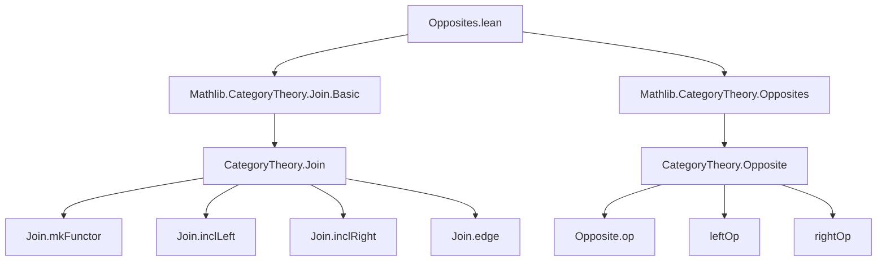
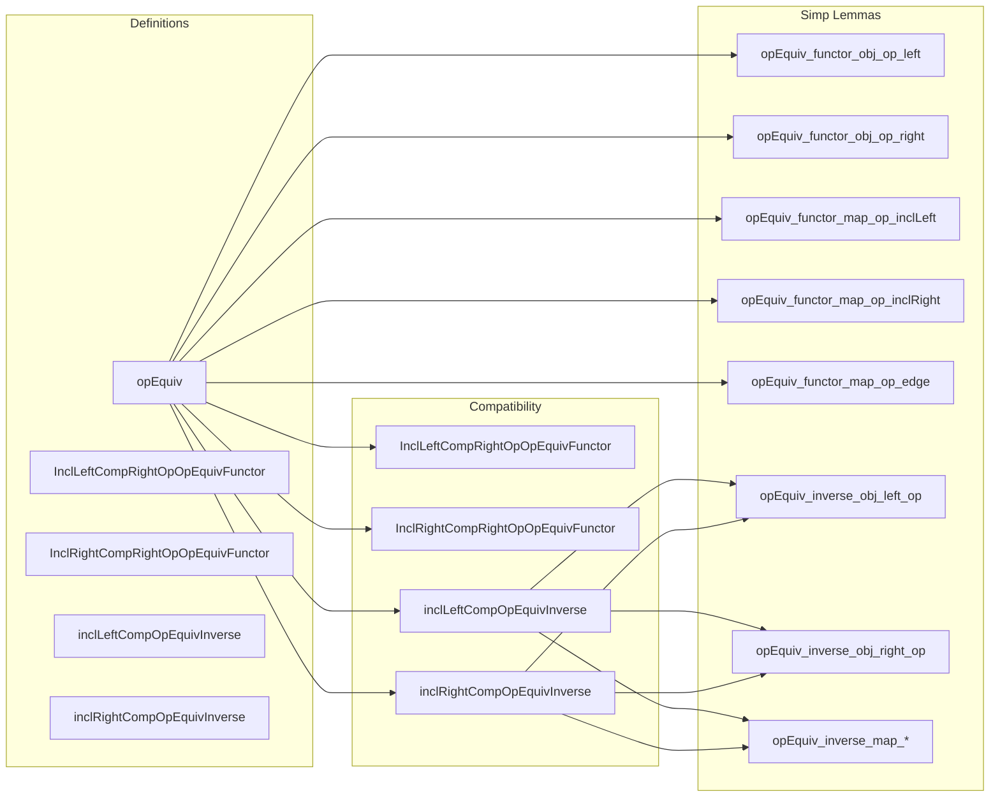

### Technical Brief: `Opposites.lean` — Opposites of Joins of Categories

---

#### **1. Key Definitions & Theorems**

| Name | Type | Purpose |
|------|------|---------|
| `opEquiv` | `(C ⋆ D)ᵒᵖ ≌ Dᵒᵖ ⋆ Cᵒᵖ` | Canonical equivalence of categories induced by reversing the join order and taking opposites. |
| `opEquiv.functor` | `(C ⋆ D)ᵒᵖ ⥤ Dᵒᵖ ⋆ Cᵒᵖ` | The forward direction of the equivalence; constructed via `leftOp` and `Join.mkFunctor`. |
| `opEquiv.inverse` | `Dᵒᵖ ⋆ Cᵒᵖ ⥤ (C ⋆ D)ᵒᵖ` | The inverse functor; symmetric construction using `op` on inclusions and edges. |
| `opEquiv.unitIso` | `1 ≅ opEquiv.functor ⋙ opEquiv.inverse` | Natural isomorphism witnessing unit law (trivial on objects, identity morphisms). |
| `opEquiv.counitIso` | `opEquiv.inverse ⋙ opEquiv.functor ≅ 1` | Natural isomorphism witnessing counit law (also trivial). |
| `opEquiv_functor_obj_op_left` | `(opEquiv C D).functor.obj (op (left c)) = right (op c)` | Action of the functor on objects from `C`. |
| `opEquiv_functor_obj_op_right` | `(opEquiv C D).functor.obj (op (right d)) = left (op d)` | Action of the functor on objects from `D`. |
| `opEquiv_functor_map_op_inclLeft` | Maps `op (inclLeft f)` to `inclRight (op f)` | Behavior on morphisms from `C`. |
| `opEquiv_functor_map_op_inclRight` | Maps `op (inclRight f)` to `inclLeft (op f)` | Behavior on morphisms from `D`. |
| `opEquiv_functor_map_op_edge` | `op (edge c d) ↦ edge (op d) (op c)` | Swaps and opposites the edge morphism. |
| `InclLeftCompRightOpOpEquivFunctor` | `inclLeft ⋙ opEquiv.functor.rightOp ≅ inclRight.rightOp` | Compatibility of left inclusion with the functor under `rightOp`. |
| `InclRightCompRightOpOpEquivFunctor` | `inclRight ⋙ opEquiv.functor.rightOp ≅ inclLeft.rightOp` | Compatibility of right inclusion with the functor under `rightOp`. |
| `inclLeftCompOpEquivInverse`, `inclRightCompOpEquivInverse` | `inclLeft ⋙ opEquiv.inverse ≅ inclRight.op`, etc. | Analogous compatibility lemmas for the inverse functor. |
| `opEquiv_inverse_obj_left_op`, `opEquiv_inverse_obj_right_op` | Descriptions of inverse on objects. | Symmetric to forward direction. |
| `opEquiv_inverse_map_*` lemmas | Descriptions of inverse on morphisms. | Symmetric to forward direction. |

---

#### **2. Naming Conventions**

- **Prefixes**:
  - `opEquiv_*`: Relating to the main equivalence.
  - `incl*Comp*`: Compatibility of inclusions with functors.
  - `op_*`: Operations involving opposites (e.g., `op_left`, `op_edge`).
- **Suffixes**:
  - `_obj_*`: On objects.
  - `_map_*`: On morphisms.
  - `_hom_app_*`, `_inv_app_*`: Component-wise behavior of natural isomorphisms.
- **Pattern**:
  - `opEquiv_functor_obj_op_left` = `opEquiv` + `functor` + `obj` + `op` + `left`
  - `inclLeftCompOpEquivInverse_hom_app_op` = `inclLeft` + `Comp` + `OpEquivInverse` + `hom` + `app` + `op`

---

#### **3. Tactic Stack**

- **`by cat_disch`**: Used repeatedly to discharge category-theoretic diagrammatic obligations (likely a custom tactic for category theory in this codebase).
- **`rfl`**: Used in `@[simp]` lemmas to assert definitional equality (e.g., on objects and morphisms).
- **`isoWhiskerLeft`**, **`≪≫`**, **`mkFunctorLeft`**, **`mkFunctorRight`**: Used in constructing natural isomorphisms between composite functors.
- **`NatIso.ofComponents`**: Constructs natural isomorphisms from componentwise isomorphisms.

---

#### **4. Proof Logic**

- **Structure**: The equivalence is *defined* (not proven to exist), with explicit functors and natural isomorphisms.
- **Main proof strategy**:
  1. Define `functor` and `inverse` using `Join.mkFunctor`, `inclLeft`, `inclRight`, and `edge`.
  2. Construct `unitIso` and `counitIso` using `NatIso.ofComponents`, with identity components (since objects map *definitively* and morphisms are determined by universal property of join).
  3. Verify triangle identities (`functor_unitIso_comp`) by case analysis on objects (`op (left _)`, `op (right _)`) and using `cat_disch`.
- **Key insight**: Opposites reverse the direction of morphisms *and* swap the roles of `C` and `D` in the join, so the equivalence is essentially “reversing the orientation” of the join diagram.

---

#### **5. Imports**

- `Mathlib.CategoryTheory.Join.Basic`: Provides the join construction `C ⋆ D`, inclusions `inclLeft`, `inclRight`, and edge morphisms.
- `Mathlib.CategoryTheory.Opposites`: Provides `Opposite`, `op`, `leftOp`, `rightOp`, and related machinery.

---

#### **6. Mermaid Diagrams**

##### **Dependency Graph**

##### **Overview of File Structure**

---

#### **7. Summary**

This file formalizes the canonical equivalence between the opposite of a join of categories and the join of the opposites in reversed order:  
$$
(C \mathbin{\star} D)^\mathrm{op} \cong D^\mathrm{op} \mathbin{\star} C^\mathrm{op}
$$

It is fully explicit: all components of the equivalence are defined constructively, and all key properties are verified via definitional equalities (`rfl`) and category-theoretic reasoning (`cat_disch`). The naming and structure follow Lean/Category Theory conventions, with heavy use of `@[simp]` lemmas for automation and `simps!` for automatic projection of morphism components.

This result is foundational for reasoning about dualities in categorical constructions involving joins, such as cones, cocones, or diagram extensions.
