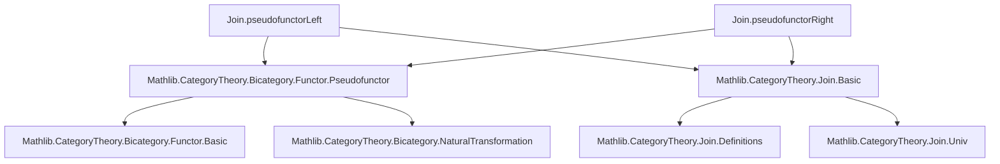
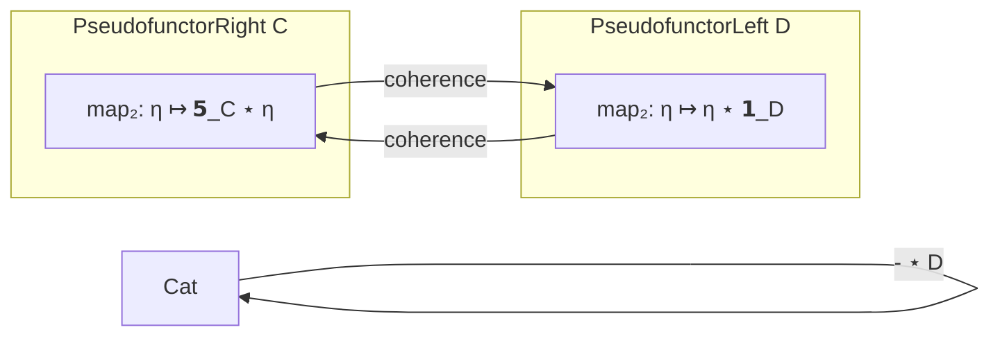

### Technical Brief: `Pseudofunctor.lean`

---

#### **1. Key Definitions & Theorems**

| Name | Type / Purpose |
|------|----------------|
| `mapCompRight A F G` | Structural isomorphism for composition in `pseudofunctorRight`:   `mapPair (𝟭 A) (F ⋙ G) ≅ mapPair (𝟭 A) F ⋙ mapPair (𝟭 A) G` |
| `mapCompLeft D F G` | Structural isomorphism for composition in `pseudofunctorLeft`:   `mapPair (F ⋙ G) (𝟭 D) ≅ mapPair F (𝟭 D) ⋙ mapPair G (𝟭 D)` |
| `mapWhiskerLeft_whiskerLeft A F η` | Compatibility of `mapWhiskerLeft` with left whiskering of natural transformations. |
| `mapWhiskerRight_whiskerLeft D F η` | Compatibility of `mapWhiskerRight` with left whiskering (in first argument). |
| `mapWhiskerLeft_whiskerRight A F G η` | Compatibility of `mapWhiskerLeft` with right whiskering. |
| `mapWhiskerRight_whiskerRight D F G η` | Compatibility of `mapWhiskerRight` with right whiskering. |
| `mapWhiskerLeft_associator_hom A F G H` | Compatibility of `mapWhiskerLeft` with associators. |
| `mapWhiskerRight_associator_hom D F G H` | Compatibility of `mapWhiskerRight` with associators. |
| `mapWhiskerLeft_leftUnitor_hom A F` | Compatibility of `mapWhiskerLeft` with left unitors. |
| `mapWhiskerRight_leftUnitor_hom C F` | Compatibility of `mapWhiskerRight` with left unitors. |
| `mapWhiskerLeft_rightUnitor_hom A F` | Compatibility of `mapWhiskerLeft` with right unitors. |
| `mapWhiskerRight_rightUnitor_hom C F` | Compatibility of `mapWhiskerRight` with right unitors. |
| `pseudofunctorRight C` | Pseudofunctor `Cat ⥤ Cat` sending `D ↦ C ⋆ D`, `F ↦ 𝟭_C ⋆ F`. |
| `pseudofunctorLeft D` | Pseudofunctor `Cat ⥤ Cat` sending `C ↦ C ⋆ D`, `F ↦ F ⋆ 𝟭_D`. |

---

#### **2. Naming Conventions**

- **Prefixes**:
  - `mapComp*`: structural isomorphisms for composition in pseudofunctors.
  - `mapWhisker*`: structural coherence laws for whiskering.
- **Suffixes**:
  - `*_hom`: refer to the hom-component of natural transformations (often used in associator/unit laws).
  - `*_left`, `*_right`: indicate which argument is being varied (left or right variable of `Join`).
- **`mapPair`**: core operation — the join of two functors.
- **`mapIsoWhisker*`**: derived isomorphisms using whiskering and unitors.

---

#### **3. Tactic Stack**

- `simp [name]`: heavily used to simplify using definitions and lemmas.
- `apply natTrans_ext <;> ext`: standard for proving equality of natural transformations.
- `congr`: used to lift lemmas to `Cat.Hom.isoMk` in pseudofunctor fields.
- `rw`, `refl`, `exact`: implicit in `simp` and `ext`.
- `aesop`: not used here — proof is mostly manual and structured.

---

#### **4. Proof Logic**

- **Structure**: Proofs are broken into small lemmas, each verifying one pseudofunctor axiom.
- **Strategy**:
  1. Define structural isomorphisms (`mapCompRight`, `mapCompLeft`) using whiskering and unitors.
  2. Prove coherence lemmas for whiskering, associators, and unitors.
  3. Assemble pseudofunctors using `@[simps!]` and `congr` to lift lemmas to the required `Pseudofunctor` structure.
- **Induction**: Not used — all proofs are direct diagrammatic reasoning in bicategories.
- **Reassoc**: All whiskering lemmas are tagged `@[reassoc]`, indicating they help reassociate whiskered composites.

---

#### **5. Imports**

- `Mathlib.CategoryTheory.Join.Basic`: defines the join of categories and functors.
- `Mathlib.CategoryTheory.Bicategory.Functor.Pseudofunctor`: defines `Pseudofunctor` and its axioms.

---

#### **6. Theory Overview & Dependency Diagram**

##### **Module Scope**
- Promotes the binary operation `⋆` (categorical join) to a *pseudofunctor* in each argument.
- Establishes that `C ↦ C ⋆ D` and `D ↦ C ⋆ D` are pseudofunctors `Cat → Cat`.

##### **Dependency Graph (Mermaid)**

##### **Overview Diagram (Mermaid)**

---

#### **7. Summary**

This file formalizes the *pseudofunctoriality* of the categorical join operation in Lean 4. It constructs two pseudofunctors (`pseudofunctorLeft` and `pseudofunctorRight`) and verifies all pseudofunctor axioms (identity, composition, associator, unitors) using explicit coherence lemmas. The structure is modular, with each coherence law proven separately and then assembled into the pseudofunctor definition.

This is foundational for higher-categorical constructions involving joins, such as cones, colimits, or the theory of opfibrations over join-shaped diagrams.
