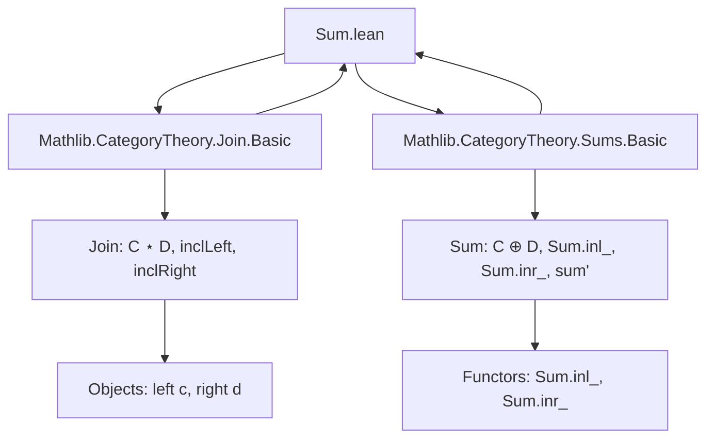
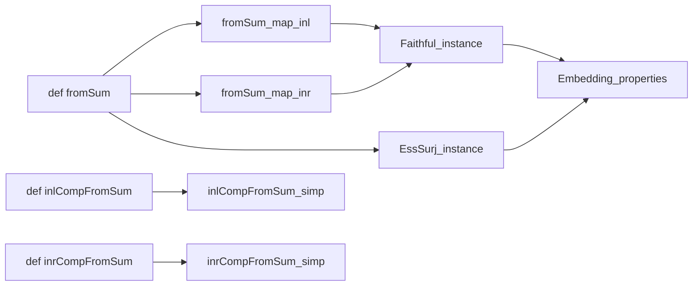
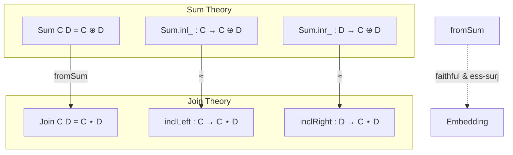

**Technical Brief: `Sum.lean` – Embedding of `C ⊕ D` into `C ⋆ D`**

---

### 1. **Key Definitions & Theorems**

| Name | Type | Purpose |
|------|------|---------|
| `fromSum` | `C ⊕ D ⥤ C ⋆ D` | Canonical functor embedding the *coproduct* (sum) of categories into their *join*; maps `inl c ↦ left c`, `inr d ↦ right d`. |
| `fromSum_map_inl` | `∀ f : c ⟶ c', (fromSum C D).map (Sum.inl_ C D.map f) = inclLeft C D.map f` | Characterizes action of `fromSum` on morphisms from the left summand. |
| `fromSum_map_inr` | `∀ f : d ⟶ d', (fromSum C D).map (Sum.inr_ C D.map f) = inclRight C D.map f` | Characterizes action of `fromSum` on morphisms from the right summand. |
| `inlCompFromSum` | `Sum.inl_ C D ⋙ fromSum C D ≅ inclLeft C D` | Shows that precomposing the left inclusion with `fromSum` yields an isomorphism to the left inclusion into the join. |
| `inrCompFromSum` | `Sum.inr_ C D ⋙ fromSum C D ≅ inclRight C D` | Analogous for the right inclusion. |
| `EssSurj` instance | `(fromSum C D).EssSurj` | Proves `fromSum` is essentially surjective: every object in `C ⋆ D` (i.e., `left c` or `right d`) lies in the essential image. |
| `Faithful` instance | `(fromSum C D).Faithful` | Proves `fromSum` is faithful: injective on hom-sets. |

---

### 2. **Naming Conventions**

- **Prefixes**:
  - `fromSum`: indicates construction *from* a sum (`⊕`) to a join (`⋆`).
  - `inclLeft`, `inclRight`: canonical inclusions of `C`, `D` into the join.
  - `Sum.inl_`, `Sum.inr_`: sum-category inclusions (as functors).
- **Suffixes**:
  - `_map_inl`, `_map_inr`: specify behavior on morphisms from left/right summands.
  - `CompFromSum`: composition with `fromSum` (e.g., `F ⋙ fromSum`).
- **`@[simps!]`**: used to automatically generate simplification lemmas for object/morphism parts (especially for functors and natural isomorphisms).

---

### 3. **Tactic Stack**

- `rfl`: used directly for definitional equalities (e.g., `fromSum_map_inl`, `fromSum_map_inr`).
- `cases`: destructs sum morphism cases (`inl`, `inr`).
- `simp only [...] at heq`: simplifies using explicit definitions of `fromSum_obj`, `fromSum_map_*`, etc.
- `simp [...]`: final simplification using `Functor.map_injective`.
- `all_goals`: applies same tactic sequence to all subgoals.

No heavy automation (e.g., `aesop`, `ring`, `linarith`) is used—proofs are mostly definitional or rely on structural properties of sum/join.

---

### 4. **Proof Logic**

- **Definition**: `fromSum` is defined as the *sum of functors*: `(inclLeft C D).sum' (inclRight C D)`, leveraging `CategoryTheory.Sums.Basic`.
- **Morphism behavior**: Proven by `rfl`, since `sum'` is defined to act as the two component functors on respective summands.
- **Isomorphisms `inlCompFromSum`, `inrCompFromSum`**: Use existing lemmas `Functor.inlCompSum'`, `Functor.inrCompSum'` from `CategoryTheory.Sums.Basic`.
- **Essential surjectivity**: Directly from `obj_mem_essImage`, using the fact that objects of `C ⋆ D` are exactly `left c` or `right d`.
- **Faithfulness**: 
  - Cases on morphisms in `C ⊕ D` (only `inl` or `inr` morphisms exist).
  - Simplify using `fromSum_map_inl`/`fromSum_map_inr`.
  - Apply `Functor.map_injective` to deduce equality of morphisms from equality of their images.

---

### 5. **Imports**

- `Mathlib.CategoryTheory.Join.Basic`: defines the *join* of categories (`C ⋆ D`), inclusions `inclLeft`, `inclRight`, and objects `left`, `right`.
- `Mathlib.CategoryTheory.Sums.Basic`: defines the *coproduct* (`C ⊕ D`), inclusions `Sum.inl_`, `Sum.inr_`, and the `sum'` construction of functors out of a sum.

These imports define the *ambient categorical context* for the embedding.

---

### 6. **Mermaid Diagrams**

#### Dependency Graph (Module-Level)

#### Conceptual Flow (Theorem Dependencies)

#### Overview of Theory Context

---

### 7. **Summary**

This file formalizes the *canonical embedding* of the coproduct of two categories into their join. It establishes that this embedding is:
- **Essentially surjective** (covers all objects of the join),
- **Faithful** (reflects equality of morphisms),
- And commutes (up to isomorphism) with the canonical inclusions.

The proofs are largely definitional, leveraging the universal properties of sums and joins, and rely on standard library lemmas (`sum'`, `inlCompSum'`, etc.). The `@[simps!]` annotations ensure that the functor’s action is automatically simplifiable in terms of the inclusions, supporting downstream reasoning.
