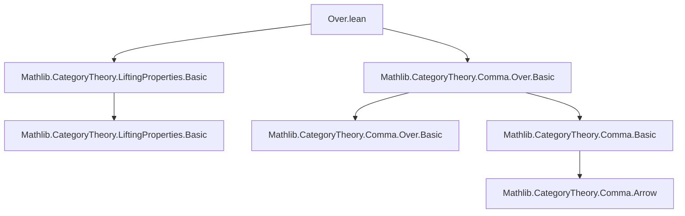

**Technical Brief: `Over.lean` — Lifting Properties in Over Categories**

---

### 1. **Key Definitions & Theorems**

| Name | Type / Signature | Purpose |
|------|------------------|---------|
| `CommSq.HasLift.over` | `∀ {X₁ X₂ X₃ X₄ : Over S} {t l r b sq}, [CommSq.HasLift (sq.map (Over.forget _))] → sq.HasLift` | Shows that a lift in the underlying category `C` for the image of a commutative square `sq` under `Over.forget S` yields a lift in `Over S`. |
| `HasLiftingProperty.over` | `∀ {A B X Y : Over S} (i : A ⟶ B) (p : X ⟶ Y), [HasLiftingProperty i.left p.left] → HasLiftingProperty i p` | Proves that if the left morphism `i.left` has the left lifting property (LLP) w.r.t. `p.left` in `C`, then `i` has LLP w.r.t. `p` in `Over S`. |

- **`CommSq.HasLift`**: A predicate asserting existence of a diagonal filler for a commutative square.
- **`HasLiftingProperty i p`**: Predicate meaning `i` has the left lifting property w.r.t. `p`.
- **`Over.forget S`**: The forgetful functor `Over S ⥤ C`, sending an object `X : Over S` (i.e., `X.left : X.left ⟶ S`) to its domain `X.left`, and a morphism to its underlying arrow.
- **`Over.homMk`**: Constructor for morphisms in `Over S`, requiring compatibility with the structure map to `S`.

---

### 2. **Naming Conventions**

- **Prefixes**:
  - `over`: Indicates constructions or lemmas relating objects/morphisms/squares in `Over S` to those in `C`.
  - `CommSq.HasLift`, `HasLiftingProperty`: Standard naming for lifting-related predicates (consistent with `Mathlib.CategoryTheory.LiftingProperties.Basic`).
- **Suffixes**:
  - `.left`: Refers to the underlying morphism/object in `C` (e.g., `i.left`, `sq.map (Over.forget _).lift`).
- **Structure**:
  - Lemmas are named after the main construction (`over`) and placed under the relevant namespace (`CommSq.HasLift`, `HasLiftingProperty`).

---

### 3. **Tactic Stack**

- **Core tactics used**:
  - `intro`, `exact`, `let`, `dsimp`, `rw`, `assumption`
  - `Over.homMk` (used as a constructor, not a tactic)
- **Rewriting tools**:
  - `rw [← Over.w b, ← sq'.fac_right_assoc, Over.w r]`: Uses definitional equalities and universal properties of comma objects (`Over S`).
- **No heavy automation** (e.g., no `aesop`, `ring`, `simp_rw`), indicating a lightweight, structural proof style.

---

### 4. **Proof Logic**

- **Strategy**:
  1. Map the square `sq` in `Over S` to a square `sq'` in `C` via `Over.forget S`.
  2. Use the assumed lift in `C` (`sq'.lift`) to define a candidate lift in `Over S`.
  3. Construct the lift morphism using `Over.homMk`, verifying the required commutativity with the structure maps to `S` using:
     - `Over.w` (the defining commutativity of morphisms in `Over S`)
     - `sq'.fac_right_assoc` (factorization property of the lift in `C`).
- **For `HasLiftingProperty.over`**:
  - Given a square in `Over S`, apply the previous lemma (`over`) to the lift guaranteed by `HasLiftingProperty i.left p.left`.
  - Construct the lift functionally: `⟨fun _ ↦ .over⟩`.

- **Induction / Cases**: Not used — proofs are direct and definitional.

---

### 5. **Imports**

| Import | Role |
|--------|------|
| `Mathlib.CategoryTheory.LiftingProperties.Basic` | Provides `HasLiftingProperty`, `CommSq.HasLift`, and basic lifting theory. |
| `Mathlib.CategoryTheory.Comma.Over.Basic` | Defines `Over S`, `Over.forget`, `Over.homMk`, `Over.w`, and basic properties of over-categories. |

These imports fix the ambient context: a locally small category `C`, objects over a fixed `S : C`, and standard lifting theory.

---

### 6. **Mermaid Diagrams**

#### **Dependency Graph (Module-Level)**



#### **Conceptual Overview of the File**

```mermaid
flowchart LR
  subgraph "Over S"
    O1[Object X₁: X₁.left → S]
    O2[Object X₂: X₂.left → S]
    O3[Object X₃: X₃.left → S]
    O4[Object X₄: X₄.left → S]
    i[i : X₁ → X₂]
    p[p : X₃ → X₄]
    sq[Comm. square: i; p = X₁; X₃ → X₂; X₄]
  end

  subgraph "C (via Over.forget)"
    C1[X₁.left]
    C2[X₂.left]
    C3[X₃.left]
    C4[X₄.left]
    iL[i.left]
    pL[p.left]
    sqL[sq.map (Over.forget _)]
  end

  O1 -->|Over.forget| C1
  O2 -->|Over.forget| C2
  O3 -->|Over.forget| C3
  O4 -->|Over.forget| C4
  i -->|Over.forget| iL
  p -->|Over.forget| pL
  sq -->|map| sqL

  sqL -.->|lift exists| C5[diag: X₂.left → X₃.left]
  sq -->|lift constructed| O5[diag: X₂ → X₃ in Over S]

  style sqL fill:#f9f,stroke:#333
  style sq fill:#9ff,stroke:#333
```

#### **Theoretical Flow**

- **Goal**: Transfer lifting properties from `C` to `Over S`.
- **Key Insight**: `Over S` is a comma category `(↓ S)`, and lifting problems in `Over S` correspond exactly to lifting problems in `C` over the fixed object `S`.
- **Result**: `HasLiftingProperty i.left p.left ⇒ HasLiftingProperty i p`.

---

### 7. **Summary**

This file formalizes a foundational observation: lifting properties in over-categories reduce to lifting properties in the base category. It is a *definitional* transfer — no additional coherence or higher-categorical data is needed — and is implemented via explicit construction of lifts using `Over.homMk`. The proofs are short, rely on the universal property of comma objects, and follow standard Lean category-theory patterns.

--- 

*End of Technical Brief.*
