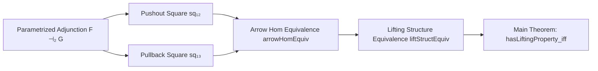

### Technical Brief: `ParametrizedAdjunction.lean`

---

#### **1. Key Definitions & Theorems**

| Name | Type / Signature | Purpose |
|------|------------------|---------|
| `arrowHomEquiv` | `(Arrow.mk sq₁₂.ι ⟶ Arrow.mk f₃) ≃ (Arrow.mk f₂ ⟶ Arrow.mk sq₁₃.π)` | Constructs a bijection between commutative squares involving pushout and pullback structures under a parametrized adjunction. |
| `liftStructEquiv` | `Arrow.LiftStruct α ≃ Arrow.LiftStruct (adj₂.arrowHomEquiv sq₁₂ sq₁₃ α)` | Shows equivalence of lifting data for corresponding squares via `arrowHomEquiv`. |
| `hasLiftingProperty_iff` | `HasLiftingProperty sq₁₂.ι f₃ ↔ HasLiftingProperty f₂ sq₁₃.π` | Main theorem: lifting property transfers across parametrized adjunctions. |
| `arrowHomEquiv_apply_right_fst`, `arrowHomEquiv_apply_right_snd`, `inl_arrowHomEquiv_symm_apply_left`, `inr_arrowHomEquiv_symm_apply_left` | Lemmas about projections of `arrowHomEquiv` and its inverse | Simplify reasoning about components of the equivalence; used in proofs involving `liftStructEquiv`. |

---

#### **2. Naming Conventions**

- **Prefixes**:
  - `arrowHomEquiv`: indicates an equivalence of arrow-hom-sets.
  - `liftStructEquiv`: equivalence of lifting structures.
  - `hasLiftingProperty_iff`: iff-characterization of lifting properties.
- **Suffixes**:
  - `_apply_right_*`, `_symm_apply_left_*`: describe how components behave under application or inverse application.
  - `_assoc`, `_naturality_*`: refer to associativity or naturality conditions used in simplifications.

---

#### **3. Tactic Stack**

Frequent tactics used in proofs:
- `simp` / `simp only`: heavily used for rewriting using `simps!`, lemmas like `arrowHomEquiv_apply_right_fst`, etc.
- `aesop`: used in `left_inv` and `right_inv` for automated simplification.
- `ext`: extensionality for arrows and homs.
- `apply ... hom_ext`: used to prove equality of morphisms in pushouts/pullbacks.
- `dsimp`, `rw`, `have := ...`: for intermediate reasoning and hypothesis extraction.

---

#### **4. Proof Logic**

The logical flow follows a standard pattern for adjunction-based equivalences:

1. **Construct `arrowHomEquiv`**:
   - Define forward and backward maps using universal properties of pushout and pullback.
   - Use `adj₂.homEquiv` to translate between hom-sets.
   - Verify commutativity and uniqueness via `hom_ext` and simplifications.

2. **Define `liftStructEquiv`**:
   - Given a lifting for one square, transport it via `arrowHomEquiv` and `adj₂.homEquiv`.
   - Check factorization conditions using naturality and universal property equations.

3. **Prove `hasLiftingProperty_iff`**:
   - Use `Arrow.hasLiftingProperty_iff` to reduce to existence of liftings.
   - Surjectivity of `arrowHomEquiv` ensures every square on one side corresponds to one on the other.
   - `liftStructEquiv` ensures liftings correspond bijectively.

Induction is not used; the proof is purely categorical, relying on universal properties and adjunction data.

---

#### **5. Imports**

| Import | Role |
|--------|------|
| `Mathlib.CategoryTheory.LiftingProperties.Basic` | Defines `HasLiftingProperty`, `Arrow.LiftStruct`, etc. |
| `Mathlib.CategoryTheory.Adjunction.Parametrized` | Provides `⊣₂`, `homEquiv`, naturality lemmas, etc. |
| `Mathlib.CategoryTheory.Limits.Shapes.Pullback.PullbackObjObj` | Provides `PullbackObjObj`, `isPullback.lift`, etc. |

These imports define the foundational categorical structures used: parametrized adjunctions, pushouts, pullbacks, and lifting properties.

---

#### **6. Mermaid Diagrams**

##### **Dependency Graph (Module-Level)**


##### **Overview of Theoretical Flow**



##### **Categorical Intuition Diagram**

```
        sq₁₂:          sq₁₃:
      X₂ → Y₂        X₃ → Y₃
      ↓    ↓         ↓    ↓
     X₁ → Y₁        X₁ → Y₁

Under F ⊣₂ G:
  sq₁₂.ι : X₂ → Pushout has LLP w.r.t. f₃  ⇔
  f₂ : X₂ → Y₂ has LLP w.r.t. sq₁₃.π : Pullback → Y₃
```

---

#### **7. Summary**

This file formalizes a key categorical insight: under a parametrized adjunction, lifting properties can be transferred between pushout and pullback constructions. It leverages the interplay between universal properties (pushout/pullback) and adjunction data (`homEquiv`, naturality) to construct explicit equivalences of lifting data. The formalization is clean, modular, and heavily uses `simp`-based automation, consistent with modern Lean mathlib style.
