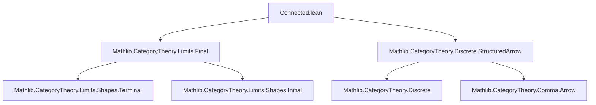
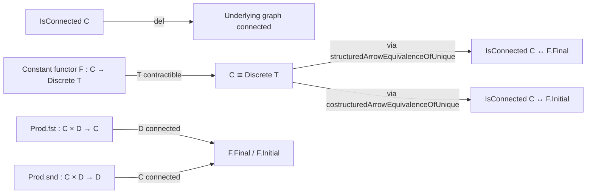

**Technical Brief: Connected.lean**

---

### 1. **Key Definitions & Theorems**

| Name | Type | Purpose |
|------|------|---------|
| `IsConnected C` | `Prop` | Predicate stating that category `C` is connected (i.e., its underlying graph is connected). |
| `F.Final` / `F.Initial` | `Prop` | Functor `F : C ⥤ D` is final (resp. initial) if for all `d : D`, the comma category `d/F` (resp. `F/d`) is contractible. |
| `Discrete T` | `Type u → Category u` | Discrete category on type `T`: objects = elements of `T`, only identity morphisms. |
| `structuredArrowEquivalenceOfUnique` | `F : C ⥤ Discrete T → [Unique T] → C ≌ Discrete T` | Equivalence between `C` and `Discrete T` when `F` is constant to the unique object and `T` is contractible. |
| `costructuredArrowEquivalenceOfUnique` | Same as above, but for costructured arrows (dual). |
| `isConnected_iff_final_of_unique` | `IsConnected C ↔ F.Final` | Characterization: `C` is connected iff the unique functor `C → Discrete T` (with `T` contractible) is final. |
| `isConnected_iff_initial_of_unique` | `IsConnected C ↔ F.Initial` | Dual characterization: `C` is connected iff the constant functor is initial. |
| `final_fst`, `initial_fst`, `final_snd`, `initial_snd` | Instances | Projections from product category `C × D` are final/initial when the other factor is connected. |

---

### 2. **Naming Conventions**

- **Prefixes**:
  - `isConnected_`: predicates about connectedness.
  - `final_`, `initial_`: properties of functors.
  - `structuredArrow_`, `costructuredArrow_`: constructions related to comma categories.
- **Suffixes**:
  - `_of_unique`: when `T` has a `Unique` instance.
  - `_fst`, `_snd`: projections from product categories.
- **Pattern**: `X_iff_Y_of_Z` for biconditional lemmas with auxiliary assumptions.

---

### 3. **Tactic Stack**

- `rw [...]`: rewriting using equivalences and lemmas.
- `refine ⟨?_, ?_⟩`: constructing pairs/proofs via `⟨⟩`.
- `intro / rintro`: introduction of hypotheses.
- `obtain rfl := Subsingleton.elim ...`: using subsingleton elimination to force equality.
- `infer_instance` / `inferInstanceAs`: auto-inference of typeclass instances.
- `rwa [...]`: `rw` followed by `assumption` (used implicitly via `rwa` in older versions or via `rwa` tactic in newer ones).
- `exact ?_` (implicit via `infer_instance`).

No heavy automation like `simp`, `linarith`, or `interval_cases` — proof is mostly structural and typeclass-driven.

---

### 4. **Proof Logic**

- **Core idea**: Use equivalence `C ≌ Discrete T` (when `T` is contractible) to reduce connectedness of `C` to contractibility of `C`, which is equivalent to the constant functor being final/initial.
- **Proof pattern**:
  1. Rewrite `IsConnected C` using `isConnected_iff_of_equivalence` with the structured/costructured arrow equivalence.
  2. Reduce to showing `Subsingleton (d / F)` or `F \ d`, which holds because `T` is contractible ⇒ comma category has a terminal/initial object ⇒ contractible.
  3. Use `Subsingleton.elim` to collapse objects to `default`.
  4. Conclude via `infer_instance` (since `Subsingleton (d / F)` implies `Nonempty (d / F)` and `Subsingleton (d / F)` ⇒ contractible).
- **Product projections**: Use functoriality of product, unitors, and braiding to reduce to constant functor case.

---

### 5. **Imports**

| Import | Purpose |
|--------|---------|
| `Mathlib.CategoryTheory.Limits.Final` | Defines final/initial functors, comma categories, and basic properties. |
| `Mathlib.CategoryTheory.Discrete.StructuredArrow` | Provides equivalences like `structuredArrowEquivalenceOfUnique`, which relate structured arrows over discrete categories with unique object to subterminal objects. |

---

### 6. **Mermaid Diagrams**

#### **Dependency Graph (Module-Level)**

#### **Overview of Theoretical Flow**

---

### 7. **Summary**

This module establishes a clean categorical characterization of connected categories: a category is connected iff the unique functor to any contractible discrete category is both final and initial. It then applies this to show that projections from a product with a connected factor are final/initial — a key tool for preserving connectedness under limits or colimits (e.g., in homotopy theory or shape theory). The proofs are elegant and rely heavily on typeclass inference and structural equivalences in `Mathlib`.
