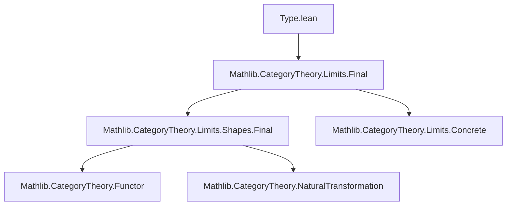
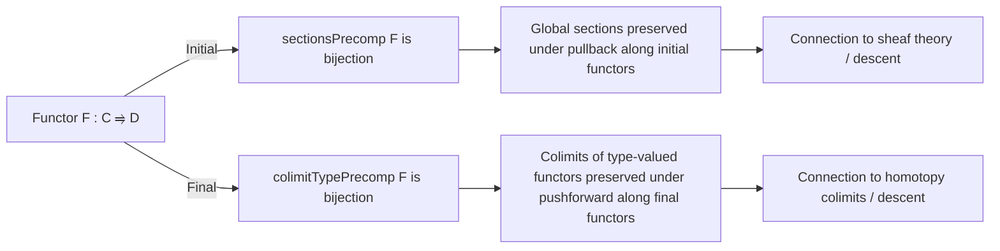

Here is the structured technical brief extracted from `Type.lean`:

---

### **1. Key Definitions & Theorems**

| Name | Type | Purpose |
|------|------|---------|
| `sectionsPrecomp` | `∀ {F : C ⥤ D} {P : D ⥤ Type w}, P.sections → (F ⋙ P).sections` | Precomposition of global sections along a functor `F`. |
| `colimitTypePrecomp` | `∀ {F : C ⥤ D} {P : D ⥤ Type w}, (F ⋙ P).ColimitType → P.ColimitType` | Precomposition of colimit elements (i.e., type-valued colimit cocones) along `F`. |
| `bijective_sectionsPrecomp` | `∀ {F : C ⥤ D} {P : D ⥤ Type w}, F.Initial → Function.Bijective (sectionsPrecomp F P)` | Shows `sectionsPrecomp F` is a bijection when `F` is initial. |
| `bijective_colimitTypePrecomp` | `∀ {F : C ⥤ D} {P : D ⥤ Type w}, F.Final → Function.Bijective (colimitTypePrecomp F P)` | Shows `colimitTypePrecomp F` is a bijection when `F` is final. |
| `colimitTypePrecomp_ιColimitType` | `∀ {F : C ⥤ D} {P : D ⥤ Type w} i x, colimitTypePrecomp F P ((F ⋙ P).ιColimitType i x) = P.ιColimitType (F.obj i) x` | Describes action of `colimitTypePrecomp` on canonical colimit injections. |

---

### **2. Naming Conventions**

- **Prefixes**:
  - `sectionsPrecomp`: `sections_` + `Precomp` — precomposition on sections.
  - `colimitTypePrecomp`: `colimitType_` + `Precomp` — precomposition on colimit types.
- **Suffixes**:
  - `Precomp`: indicates precomposition with a functor.
  - `sections`, `ColimitType`: refer to categorical constructions (`sections` = global sections = limits over discrete diagrams; `ColimitType` = colimit of type-valued functors).
- **Variable naming**:
  - `F`, `P`: standard for functors.
  - `x`, `t`, `s₁`, `s₂`: elements of sections or colimits.
  - `X`, `Y`, `Z`: objects in `C` or `D`.
  - `i`, `j`: indices in `C`.

---

### **3. Tactic Stack**

- `refine ⟨fun s₁ s₂ h ↦ ?_, fun t ↦ ?_⟩`: used to prove bijectivity by constructing inverse.
- `ext`: extensionality for functions/subtypes.
- `congr_fun`, `congr_arg`: to reason about equality of functions/proofs.
- `dsimp`: simplification of definitional equalities.
- `rw [← h₁, this, h₂]`: rewriting using hypotheses.
- `choose val hval using h`: using choice to pick witnesses from dependent hypotheses.
- `simp [← hval Y₁ X, …]`: simplification using lemmas about chosen functions.
- `obtain ⟨X, x, rfl⟩ := …`: destructuring existential statements (e.g., joint surjectivity of colimit injections).
- `have h := …`: constructing intermediate lemmas.
- `rw [← FunctorToTypes.map_comp_apply, …]`: rewriting using functoriality of `P` as a functor to `Type`.

---

### **4. Proof Logic**

- **For `bijective_sectionsPrecomp` (initial case)**:
  1. Prove injectivity: use existence of a *costructured arrow* `X : CostructuredArrow F Y` (guaranteed by initiality), and evaluate sections at `X.left` to distinguish them.
  2. Prove surjectivity: construct a section of `F ⋙ P` from a section `t` of `P` by defining its value at `Y` using constancy over the connected category of costructured arrows (via `constant_of_preserves_morphisms'`), then verify naturality.

- **For `bijective_colimitTypePrecomp` (final case)**:
  1. Prove injectivity: use joint surjectivity of colimit injections and constancy over structured arrows.
  2. Prove surjectivity: construct a cocone for `P` from the colimit of `F ⋙ P`, then use the universal property of colimits to get a map back.

- **Common pattern**:
  - Use *structured/costructured arrows* to reduce to a connected indexing category.
  - Leverage initial/finality to ensure existence/uniqueness of mediating morphisms.
  - Use `Classical.arbitrary _` to pick witnesses in connected components.

---

### **5. Imports**

- `Mathlib.CategoryTheory.Limits.Final`: provides definitions and lemmas about *final* and *initial* functors, structured/costructured arrows, and their properties (e.g., existence of costructured arrows for initial functors).

---

### **6. Mermaid Diagrams**

#### **Dependency Graph (Module-Level)**

#### **Overview of Theoretical Flow**

#### **Categorical Context**

- `sectionsPrecomp` corresponds to pullback of sections along `F`.
- `colimitTypePrecomp` corresponds to pushforward of colimit elements.
- Initial functors preserve limits (hence sections), final functors preserve colimits (hence colimits of types).
- This formalizes a *descent* principle: sections/colimits over `D` are equivalent to those over `C` when `F` is initial/final.

---

Let me know if you'd like a formalization of the dual statement for *co*sections or *limits* of type-valued functors.
