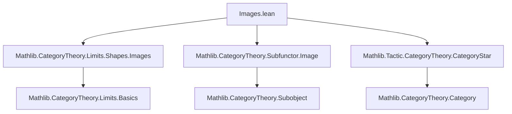
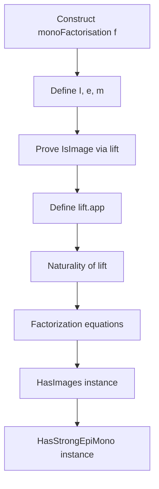

**Technical Brief: `Images.lean` — Image Factorization in `C ⥤ Type*`**

---

### 1. Key Definitions & Theorems

| Name | Type | Purpose |
|------|------|---------|
| `monoFactorisation` | `∀ {F G : C ⥤ Type u}, (f : F ⟶ G) → MonoFactorisation f` | Constructs a mono-factorization of a natural transformation `f` via the subfunctor `range f`. |
| `monoFactorisationIsImage` | `∀ {F G}, f : F ⟶ G → IsImage (monoFactorisation f)` | Proves that the constructed mono-factorization satisfies the universal property of an image. |
| `instance HasImages` | `HasImages (C ⥤ Type u)` | Establishes that the functor category `C ⥤ Type u` has all images (i.e., every morphism has an image factorization). |
| `instance HasStrongEpiMonoFactorisations` | `HasStrongEpiMonoFactorisations (C ⥤ Type u)` | Shows existence of strong epi-mono factorizations (via `image`, `image.ι`, `factorThruImage`). |

---

### 2. Naming Conventions

- **Prefixes**:
  - `monoFactorisation`: standard naming for factorization objects.
  - `isImage`: predicate-style naming for universal properties (`IsImage`).
- **Suffixes**:
  - `ι` for the monic part of a factorization (standard in `Limits`).
  - `toRange`, `toFunctor`: used for subfunctor constructions.
- **Subfunctor-related**:
  - `Subfunctor.range f`, `Subfunctor.ι f`, `Subfunctor.toRange f`: standard subfunctor image construction.

---

### 3. Tactic Stack

- `simp`: heavily used, especially with `FunctorToTypes.naturality`.
- `grind`: used for automated simplification of dependent equalities and subtype structure.
- `ext`: extensionality for natural transformations and functions.
- `apply injective_of_mono`: leverages that monos in `Type*` are injective.
- `choose`: used implicitly via `⟨x, hx⟩` destructuring in `lift.app`.

---

### 4. Proof Logic

- **Construction**:
  1. Define the intermediate object `I := Subfunctor.range f` (a subfunctor of `G`).
  2. Factor `f` as `e : F ⇒ I` (co-restriction to range) followed by `m : I ⇒ G` (inclusion).
- **Verification**:
  - **Universal property**: For any factorization `f = H.m ∘ H.e` with `H.m` mono, define `lift.app X` by sending `⟨x, hx⟩ ∈ I X` to `H.e.app X hx.choose`.
  - **Naturality of lift**: Proven by applying `injective_of_mono (H.m.app Y)` and simplifying using naturality of `H.e`, `H.m`.
  - **Factorization**: `lift_fac` shows `H.e = lift ∘ e` and `H.m = m ∘ lift`, via `ext` and `simp`.

- **Instances**:
  - `HasImages`: follows directly from `monoFactorisationIsImage`.
  - `HasStrongEpiMonoFactorisations`: uses `image`, `image.ι`, and `factorThruImage` (from `Limits`), which are definitionally equal to the above.

---

### 5. Imports

| Import | Role |
|--------|------|
| `Mathlib.CategoryTheory.Limits.Shapes.Images` | Provides `MonoFactorisation`, `IsImage`, `image`, `ι`, `factorThruImage`, etc. |
| `Mathlib.CategoryTheory.Subfunctor.Image` | Supplies `Subfunctor.range`, `ι`, `toRange`, and related lemmas. |
| `Mathlib.Tactic.CategoryTheory.CategoryStar` | Enables `Category*` syntax and tactics like `grind`. |

---

### 6. Mermaid Diagrams

#### Dependency Graph (Module-Level)



#### Overview of Construction

```mermaid
flowchart LR
  A[f : F ⟶ G] --> B[Subfunctor.range f]
  B --> C[I := (range f).toFunctor]
  B --> D[m := (range f).ι : I ⟶ G]
  A --> E[e := Subfunctor.toRange f : F ⟶ I]
  C -->|e| A
  C -->|m| G
  A -.->|factorization| C
  C -->|universal| H[∀ H.e, H.m, f = H.m ∘ H.e]
  H -->|lift| C
```

#### Proof Structure (High-Level)



---

### 7. Summary

This file establishes that the functor category `C ⥤ Type*` (for any `Category* C`) has images, by explicitly constructing them using subfunctor ranges. The construction is canonical and leverages the internal set-theoretic nature of `Type*` to define the image as a subfunctor. The proof uses standard category-theoretic techniques (extensionality, mono-injectivity, subtype elimination), and is fully formalized in Lean 4 using `grind` and `simp`-based automation.
