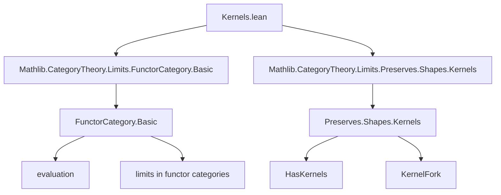

**Technical Brief: Kernels.lean (Category Theory — Kernels in Functor Categories)**

---

### 1. **Key Definitions & Theorems**

| Name | Type / Signature | Purpose |
|------|------------------|---------|
| `kerIsKernel` | `[HasKernels C] → IsLimit (KernelFork.ofι (ker.ι C) (ker.condition C))` | Shows that the kernel inclusion in `C` induces a limit cone (kernel fork) in the functor category `[C, D]` (via evaluation), i.e., kernels are preserved under functor categories. |
| `cokerIsCokernel` | `[HasCokernels C] → IsColimit (CokernelCofork.ofπ (coker.π C) (coker.condition C))` | Dually, shows that cokernel projections in `C` induce colimit cocones (cokernel coforks) in functor categories. |

Both theorems establish that *kernels* and *cokernels* in a category `C` lift to kernels and cokernels in any functor category `[C, D]`, assuming `C` has the respective limits/colimits.

---

### 2. **Naming Conventions**

- **Prefixes**:
  - `ker_`: for kernel-related constructions (`ker.ι`, `ker.condition`)
  - `coker_`: for cokernel-related constructions (`coker.π`, `coker.condition`)
  - `isLimit`, `isColimit`: standard Lean/CategoryTheory predicates for (co)limits.
  - `IsLimit`, `IsColimit`: typeclass-like propositions (propositions as types).
- **Suffixes**:
  - `IsKernel`, `IsCokernel`: used in `kernelIsKernel`, `cokernelIsCokernel` (likely imported lemmas).
  - `ofι`, `ofπ`: constructors for kernel forks / cokernel coforks.
- **Pattern**: `XIsY` where `X` is a construction and `Y` is a universal property (`IsKernel`, `IsCokernel`, `IsLimit`, `IsColimit`).

---

### 3. **Tactic Stack**

- `aesop`: used implicitly (via `rfl`, `.refl _`, etc.) — likely for trivial equality reasoning.
- `simp_rw`: not explicit, but `Fork.ext`, `Cofork.ext`, and `.refl _` suggest use of extensionality lemmas.
- `exact`, `apply`, `rw`: used in proof composition (e.g., `ofIsoLimit`, `ofIsoColimit`).
- `evaluationJointlyReflectsLimits`, `evaluationJointlyReflectsColimits`: key lemmas invoked — these are likely proven using `limit_cone`, `colimit_cocone` machinery.
- `fun f ↦ ...`: lambda abstraction over natural transformations/functors.

---

### 4. **Proof Logic**

- **Strategy**: *Evaluation reflects (co)limits* → reduce to known (co)limit property in base category `C`.
- **For `kerIsKernel`**:
  1. Use `evaluationJointlyReflectsLimits` to reduce proving a limit in `[C, D]` to checking it after evaluation at each object `f : C`.
  2. Apply `KernelFork.isLimitMapConeEquiv` to convert the fork into a limit cone.
  3. Use `kernelIsKernel f.hom` (imported lemma) to get that `ker.ι` is a kernel in `C`.
  4. Transport via `ofIsoLimit` and verify equality of cones using `Fork.ext (by refl)`.

- **For `cokerIsCokernel`**:
  - Dual argument using `evaluationJointlyReflectsColimits`, `CokernelCofork.isColimitMapCoconeEquiv`, `cokernelIsCokernel`, and `Cofork.ext`.

- **Core logical flow**:  
  `HasKernels C` ⇒ `ker.ι` is a kernel in `C` ⇒ evaluation of the induced fork is a kernel ⇒ fork is a kernel in functor category.

---

### 5. **Imports**

| Import | Purpose |
|--------|---------|
| `Mathlib.CategoryTheory.Limits.FunctorCategory.Basic` | Provides basic facts about functor categories (e.g., `evaluation`, `evaluationJointlyReflectsLimits`, etc.) |
| `Mathlib.CategoryTheory.Limits.Preserves.Shapes.Kernels` | Provides `kernelIsKernel`, `cokernelIsCokernel`, and related infrastructure for kernels/cokernels as (co)limits |

> **Note**: No explicit `HasZeroMorphisms` import needed — assumed via `[Category.{u} C] [HasZeroMorphisms C]`.

---

### 6. **Mermaid Diagrams**

#### **Dependency Graph (Module-Level)**



#### **Overview of Theoretical Flow**

```mermaid
flowchart LR
  subgraph BaseCategory[C]
    K[Kernel ι: ker ⟶ X] -->|kernelIsKernel| L[IsLimit KernelFork]
  end

  subgraph FunctorCategory[D^C]
    FK[KernelFork.ofι (ker.ι C) ...] -->|kerIsKernel| FL[IsLimit FK]
  end

  C -->|evaluationJointlyReflectsLimits| D^C
  L -->|pullback along eval_f| FL
```

#### **Proof Structure (High-Level)**

```mermaid
flowchart TD
  Start[Assume HasKernels C] --> EvalReflect[evaluationJointlyReflectsLimits]
  EvalReflect --> Reduce[Reduce to all eval_f : [C, D] → D]
  Reduce --> UseBase[Use kernelIsKernel f.hom]
  UseBase --> IsoLimit[Transport via ofIsoLimit]
  IsoLimit --> Ext[Fork.ext rfl]
  Ext --> End[IsLimit kerIsKernel]
```

---

### 7. **Domain-Specific AI Agent Notes**

- **Target Domain**: Homological algebra, categorical limits/colimits, functor categories.
- **Key Abstractions**: Kernel/cokernel as (co)limits, evaluation functor, joint reflection of limits.
- **Common Proof Patterns**:
  - Use of *evaluation reflects limits* to lift constructions.
  - Transport of (co)limit structures via isomorphisms (`ofIsoLimit`, `ofIsoColimit`).
  - Extensionality via `Fork.ext` / `Cofork.ext`.
- **Suggested AI Capabilities**:
  - Recognize when a limit in a functor category can be reduced to base category.
  - Suggest `evaluationJointlyReflectsLimits` when proving limits in `[C, D]`.
  - Auto-apply `Fork.ext rfl` when verifying cone morphisms.

--- 

Let me know if you'd like a formalization checklist or a template for similar proofs in functor categories.
