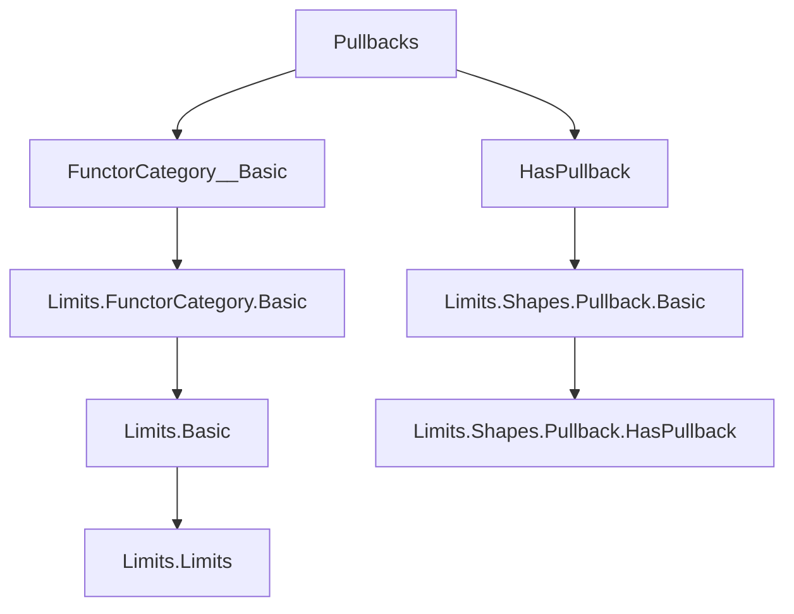

**Technical Brief: Pullbacks in Functor Categories (Lean 4 Formalization)**  
*Source: `Pullbacks.lean` (Mathlib)*  
*Author: Markus Himmel (2025)*  
*License: Apache 2.0*

---

### 1. KEY DEFINITIONS & THEOREMS

| Name | Type / Signature | Purpose |
|------|------------------|---------|
| `PullbackCone.combine` | `(f : F ⟶ H) → (g : G ⟶ H) → (∀ X, PullbackCone (f.app X) (g.app X)) → (∀ X, IsLimit (c X)) → PullbackCone f g` | Constructs a natural pullback cone over `f, g` in the functor category `[D, C]` from pointwise limiting pullback cones. |
| `PullbackCone.combineIsLimit` | `(f : F ⟶ H) → (g : G ⟶ H) → (∀ X, PullbackCone (f.app X) (g.app X)) → (∀ X, IsLimit (c X)) → IsLimit (combine f g c hc)` | Proves the constructed cone is limiting (i.e., a pullback) in `[D, C]`. |
| `pullbackObjIso` | `(f : F ⟶ H) → (g : G ⟶ H) → (d : D) → (pullback f g).obj d ≅ pullback (f.app d) (g.app d)` | Shows evaluation at `d` of the pullback functor is isomorphic to the pullback of evaluations. |
| `pullbackObjIso_hom_comp_fst`, `pullbackObjIso_hom_comp_snd`, `pullbackObjIso_inv_comp_fst`, `pullbackObjIso_inv_comp_snd` | `≈`-lemmas with `reassoc (attr := simp)` | Simplify compositions with projections (`fst`, `snd`) under the isomorphism; used for rewriting in proofs. |
| `pushoutObjIso` | `(f : F ⟶ G) → (g : F ⟶ H) → (d : D) → (pushout f g).obj d ≅ pushout (f.app d) (g.app d)` | Dual to `pullbackObjIso`; shows evaluation of pushout is pushout of evaluations. |
| `inl_comp_pushoutObjIso_hom`, `inr_comp_pushoutObjIso_hom`, `inl_comp_pushoutObjIso_inv`, `inr_comp_pushoutObjIso_inv` | `≈`-lemmas with `reassoc (attr := simp)` | Simplify compositions with coprojections (`inl`, `inr`) under pushout evaluation isomorphism. |

---

### 2. NAMING CONVENTIONS

- **`combine` / `combineIsLimit`**: Constructing a global (co)limit from pointwise ones.
- **`ObjIso` suffix**: Denotes an isomorphism between an (co)limit object in the functor category evaluated at `d`, and the (co)limit of the evaluated diagram at `d`.  
  - `pullbackObjIso`, `pushoutObjIso`
- **`hom_comp_` / `inv_comp_` prefix**: Lemmas about how the (iso) morphism interacts with universal arrows (`fst`, `snd`, `inl`, `inr`).
- **`reassoc (attr := simp)`**: Indicates lemmas are added to the `simp` set for automatic rewriting of associativity-like compositions.

---

### 3. TACTIC STACK

| Tactic | Usage Frequency | Purpose |
|--------|-----------------|---------|
| `simp` | Very High | Simplify using `@[simps!]`, `@[reassoc]`, and definitional equalities. |
| `intro` / `rintro` | High | Introduce hypotheses and destruct dependent pairs/sums. |
| `ext` | Medium | Extensionality for natural transformations/cones. |
| `all_goals` + `cat_disch` | Medium | Category-theoretic proof automation (e.g., `cat_disch` discharges morphism equalities via category axioms). |
| `hom_ext` | Medium | Prove equality of natural transformations by extensionality (pointwise equality). |
| `exact`, `refine`, `apply` | Medium | Direct proof steps, especially for constructing morphisms. |
| `≈≫` (iso composition) | High | Composing isomorphisms (e.g., `limitObjIsoLimitCompEvaluation ≪≫ HasLimit.isoOfNatIso`). |

---

### 4. PROOF LOGIC

- **Structure of `combineIsLimit` proof**:
  1. Reduce to pointwise limits via `evaluationJointlyReflectsLimits`.
  2. Show naturality of the cone isomorphism using `IsLimit.equivOfNatIsoOfIso`.
  3. Use `Cones.ext` to reduce to checking components (cases on cone morphism structure).
  4. Apply `hom_ext` and `simp` to verify component-wise equalities.

- **Structure of `pullbackObjIso` proof**:
  1. Use `limitObjIsoLimitCompEvaluation` to relate limit of diagram in `[D, C]` to limit after evaluation.
  2. Compose with `HasLimit.isoOfNatIso (diagramIsoCospan _)` to identify the diagram in `C` with the cospan `f.app d, g.app d`.

- **Dual logic applies to pushout case** using colimits.

---

### 5. IMPORTS & DEPENDENCIES

| Module | Role |
|--------|------|
| `Mathlib.CategoryTheory.Limits.FunctorCategory.Basic` | Provides basic theory of functor categories (`[D, C]`), including evaluation functors, natural transformations, and limits/colimits in functor categories. |
| `Mathlib.CategoryTheory.Limits.Shapes.Pullback.HasPullback` | Provides existence of pullbacks in `C`, and the `pullback` constructor, projections, and universal property. |
| Implicit: `Mathlib.CategoryTheory.Limits.Limit`, `Mathlib.CategoryTheory.Limits.Colimit`, `Mathlib.CategoryTheory.Limits.Preserves`, `Mathlib.CategoryTheory.NaturalIsomorphism` | Used for general limit/colimit machinery, evaluation reflection, and isomorphism reasoning. |

---

### 6. DIAGRAMS

#### Dependency Graph (Module Level)



#### Conceptual Flow (Proof Structure)

```mermaid
flowchart LR
  A[Pointwise pullback cones c X] -->|IsLimit| B[Pointwise limits]
  B -->|combine| C[Global pullback cone over f,g]
  C -->|combineIsLimit| D[Global pullback in [D,C]]
  D -->|evaluation at d| E[(pullback f g).obj d]
  B -->|evaluation| F[pullback (f.app d) (g.app d)]
  E -- iso --> F
```

#### Diagram Isomorphism Chain (for `pullbackObjIso`)

```mermaid
flowchart LR
  (pullback f g).obj d
    -->[limitObjIsoLimitCompEvaluation]
    limit (cospan f g) eval_d
    -->[HasLimit.isoOfNatIso (diagramIsoCospan _)]
    pullback (f.app d) (g.app d)
```

---

### 7. SUMMARY

This file formalizes the key fact that **pullbacks (and dually pushouts) in functor categories are computed pointwise**. It constructs the pullback cone in `[D, C]` from pointwise pullbacks, proves it is limiting, and derives an explicit isomorphism between the evaluation of the pullback functor and the pullback in the target category `C`. The proofs rely heavily on the fact that evaluation functors jointly reflect limits, and on the universal property of limits in functor categories. The `simp`-friendly lemmas (`@[reassoc]`) make the isomorphisms highly usable in downstream developments.

--- 

*End of Technical Brief*
