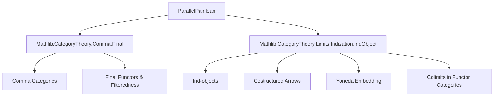

### Technical Brief: `ParallelPair.lean`

---

#### **1. Key Definitions & Theorems**

| Name | Type / Structure | Purpose |
|------|------------------|---------|
| `IndParallelPairPresentation {f g : A ⟶ B}` | `Structure` | Encodes a *common presentation* of two parallel natural transformations $f, g : A \to B$ between ind-objects $A, B$ via a filtered diagram $I \rightrightarrows C$. |
| `K` | `Abbrev` | The comma category indexing the common presentation: `Comma ((P₁.toCostructuredArrow ⋙ CostructuredArrow.map f) × (P₁.toCostructuredArrow ⋙ CostructuredArrow.map g), P₂.toCostructuredArrow × P₂.toCostructuredArrow)` |
| `F₁`, `F₂` | `Abbrev` | Diagrams $I \to C$ presenting $A$ and $B$ respectively, built from `K`. |
| `ι₁`, `ι₂` | `Abbrev` | Colimit cocones for $A$ and $B$ induced from the presentations $P_1, P_2$. |
| `isColimit₁`, `isColimit₂` | `Abbrev` | Proof that `ι₁`, `ι₂` are colimit cocones (via `Functor.Final.isColimitWhiskerEquiv`). |
| `ϕ`, `ψ` | `Def` | Natural transformations $F_1 \Rightarrow F_2$ presenting $f$ and $g$; components extract left projections of morphisms in comma category. |
| `hf`, `hg` | `Theorem` | Show $f$ and $g$ are indeed induced by $\varphi$ and $\psi$ via colimit mapping property. |
| `presentation` | `Def` | Constructs an instance of `IndParallelPairPresentation` from presentations of $A$ and $B$. |
| `nonempty_indParallelPairPresentation` | `Theorem` | Main result: for any ind-objects $A, B$ and $f,g : A \to B$, there *exists* a common presentation. |
| `parallelPairIsoParallelPairCompYoneda` | `Def` | Shows that the parallel pair $(f,g)$ is the colimit of $(\varphi,\psi)$ composed with Yoneda embedding and colimit functor. |

---

#### **2. Naming Conventions**

- **Prefixes**:
  - `ind_`, `Ind_`: Relating to ind-objects (e.g., `IndParallelPairPresentation`, `IsIndObject`).
  - `Nonempty_`: Existence lemmas (e.g., `nonempty_indParallelPairPresentation`).
  - `isColimit_`, `ι_`: Colimit-related data.
  - `ϕ`, `ψ`, `φ`, `ψ`: Greek letters for natural transformations between diagrams.
- **Suffixes**:
  - `_presentation`: Data exhibiting a presentation (e.g., `IndParallelPairPresentation`).
  - `_obj`, `_map`: Component-wise definitions in functor categories.
  - `_assoc`: Used in proofs involving associativity of composition.

---

#### **3. Tactic Stack**

Frequent tactics used:
- `simp` with extensive `only [...]` to simplify using many lemmas about `prod'`, `CostructuredArrow`, `IndObjectPresentation`, etc.
- `rw [IsColimit.ι_map]`, `rw [IsColimit.map]`: Rewriting colimit universal properties.
- `exact`, `refine`, `apply`: For constructing morphisms and proofs.
- `simp only [...] at this`: Local simplification in hypotheses.
- `funext`, `hom_ext`, `ext`: Extensionality for natural transformations / morphisms.
- `have := h.w; simp at this`: Extracting component-wise equations from naturality squares.
- `symm`: To reverse equations (e.g., `i.hom.1.w.symm`).
- `noncomputable def`: For constructions requiring choice (e.g., colimit uniqueness up to iso).

---

#### **4. Proof Logic**

The proof proceeds in three main stages:

1. **Construction of indexing category `K`**:
   - Given presentations $P_1$ of $A$ and $P_2$ of $B$, define `K` as a comma category encoding pairs of morphisms over $f$ and $g$.
   - Use `Comma.isFiltered_of_final` to show `K` is filtered.

2. **Diagram and cocone definitions**:
   - Define $F_1, F_2 : K \to C$ as composites with $P_1.F$, $P_2.F$.
   - Build cocones $\iota_1, \iota_2$ using whiskering.
   - Prove they are colimits via `Functor.Final.isColimitWhiskerEquiv`.

3. **Natural transformations and verification**:
   - Define $\varphi, \psi$ component-wise (extracting left/right projections).
   - Prove naturality via `simp` and `CostructuredArrow` lemmas.
   - Show $f = \mathrm{colim}(\varphi)$ and $g = \mathrm{colim}(\psi)$ using `IsColimit.hom_ext`.
   - Assemble into `IndParallelPairPresentation`.
   - Conclude existence via `⟨...⟩`.

The final `parallelPairIsoParallelPairCompYoneda` uses universal properties of colimits to show that $(f,g)$ is the colimit of $(\varphi,\psi)$ after Yoneda embedding.

---

#### **5. Imports**

- `Mathlib.CategoryTheory.Comma.Final`: For filteredness of comma categories.
- `Mathlib.CategoryTheory.Limits.Indization.IndObject`: For `IsIndObject`, `IndObjectPresentation`, costructured arrows, Yoneda embedding.

---

#### **6. Mermaid Diagrams**

##### **Dependency Graph (Module-Level)**



##### **Overview of Core Construction**

```mermaid
graph LR
  A[Presentations P₁ of A] -->|K := Comma(...)| D[K indexing category]
  B[Presentations P₂ of B] --> D
  D --> E[F₁ = fst ⋙ P₁.F]
  D --> F[F₂ = snd ⋙ P₂.F]
  E --> G[ι₁ : F₁ ⋙ yoneda ⇒ const A]
  F --> H[ι₂ : F₂ ⋙ yoneda ⇒ const B]
  G --> I[isColimit₁]
  H --> J[isColimit₂]
  D --> K[φ, ψ : F₁ ⇒ F₂]
  I --> L[f = colim(φ)]
  J --> M[g = colim(ψ)]
  L & M --> N[IndParallelPairPresentation f g]
```

##### **Theoretical Flow (Main Theorem)**

```mermaid
graph LR
  A[IsIndObject A] -->|presentations| P₁
  B[IsIndObject B] -->|presentations| P₂
  P₁ & P₂ & f & g -->|construction| K
  K -->|filtered| I
  I --> F₁ & F₂
  F₁ & F₂ --> φ & ψ
  φ & ψ -->|colimit| f & g
  I -->|main thm| Nonempty(IndParallelPairPresentation f g)
```

---

#### **7. Summary**

This file formalizes a key structural property of ind-objects: any pair of parallel natural transformations between ind-objects can be *simultaneously presented* by a filtered diagram in the base category. This is foundational for working with ind-objects in sheaf theory and homological algebra, and is used implicitly in many constructions involving limits/colimits in ind-categories.

The proof is constructive and explicit, leveraging comma categories and finality to build a common indexing category. It exemplifies Lean’s strength in handling high-categorical data with careful use of `simp`, universal properties, and filtered colimits.
