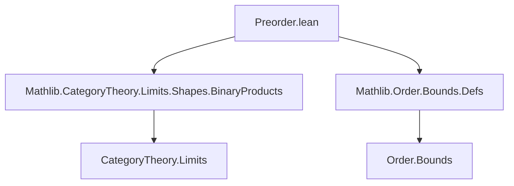
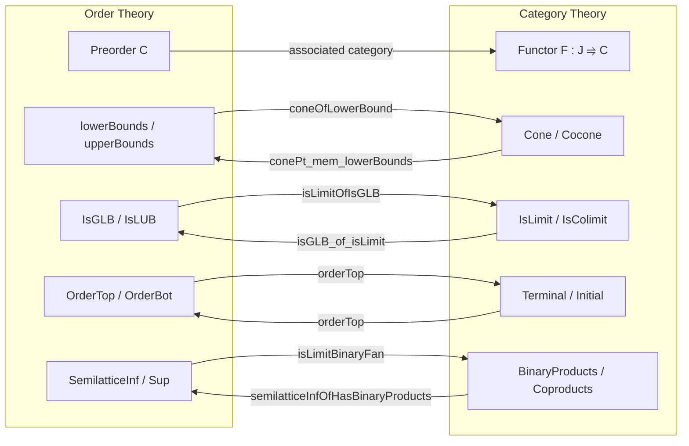

**Technical Brief: `Preorder.lean` — (Co)limits in Preorder Categories**

---

### 1. **Key Definitions & Theorems**

| Name | Type / Signature | Purpose |
|------|------------------|---------|
| `coneOfLowerBound` | `{x : C} → x ∈ lowerBounds (Set.range F.obj) → Cone F` | Constructs a cone from a lower bound of the diagram’s image. |
| `coconeOfUpperBound` | `{x : C} → x ∈ upperBounds (Set.range F.obj) → Cocone F` | Constructs a cocone from an upper bound of the diagram’s image. |
| `isGLB_of_isLimit` | `IsLimit c → IsGLB (Set.range F.obj) c.pt` | Shows that a limit cone’s apex is a greatest lower bound. |
| `isLimitOfIsGLB` | `IsGLB (Set.range F.obj) c.pt → IsLimit c` | Shows that a glb apex yields a limit cone. |
| `limitConeOfIsGLB` | `IsGLB (Set.range F.obj) pt → LimitCone F` | Constructs the limit cone from a glb. |
| `hasLimit_iff_hasGLB` | `HasLimit F ↔ ∃ x, IsGLB (Set.range F.obj) x` | Equivalence between existence of a limit and existence of a glb. |
| `isLUB_of_isColimit` | `IsColimit c → IsLUB (Set.range F.obj) c.pt` | Shows that a colimit cocone’s apex is a least upper bound. |
| `isColimitOfIsLUB` | `IsLUB (Set.range F.obj) c.pt → IsColimit c` | Shows that a lub apex yields a colimit cocone. |
| `colimitCoconeOfIsLUB` | `IsLUB (Set.range F.obj) pt → ColimitCocone F` | Constructs the colimit cocone from a lub. |
| `hasColimit_iff_hasLUB` | `HasColimit F ↔ ∃ x, IsLUB (Set.range F.obj) x` | Equivalence between existence of a colimit and existence of a lub. |
| `IsTerminal.orderTop` | `IsTerminal X → OrderTop C` | Extracts top element from terminal object. |
| `IsInitial.orderBot` | `IsInitial X → OrderBot C` | Extracts bottom element from initial object. |
| `orderTopOfHasTerminal` | `[HasTerminal C] → OrderTop C` | Constructs top element from terminal object. |
| `orderBotOfHasInitial` | `[HasInitial C] → OrderBot C` | Constructs bottom element from initial object. |
| `semilatticeInfOfIsLimitBinaryFan` | `(∀ X Y, BinaryFan X Y) → (∀ X Y, IsLimit (c X Y)) → SemilatticeInf C` | Builds inf-semilattice from limiting binary fans. |
| `semilatticeSupOfIsColimitBinaryCofan` | `(∀ X Y, BinaryCofan X Y) → (∀ X Y, IsColimit (c X Y)) → SemilatticeSup C` | Builds sup-semilattice from colimiting binary cofans. |
| `isLimitBinaryFan` | `[SemilatticeInf C] → IsLimit (BinaryFan.mk (X ⊓ Y) …)` | Shows infimum gives binary product. |
| `isColimitBinaryCofan` | `[SemilatticeSup C] → IsColimit (BinaryCofan.mk (X ⊔ Y) …)` | Shows supremum gives binary coproduct. |
| `semilatticeInfOfHasBinaryProducts` | `[HasBinaryProducts C] → SemilatticeInf C` | Inf-semilattice from binary products. |
| `semilatticeSupOfHasBinaryCoproducts` | `[HasBinaryCoproducts C] → SemilatticeSup C` | Sup-semilattice from binary coproducts. |

---

### 2. **Naming Conventions**

- **Prefixes**:
  - `coneOf…`, `coconeOf…`: Construct (co)cones from order-theoretic bounds.
  - `isLimitOf…`, `isColimitOf…`: Prove (co)limit property from order-theoretic data.
  - `orderTop`, `orderBot`: Extract order-theoretic structure from categorical limits.
  - `semilatticeInf`, `semilatticeSup`: Build lattice structure from (co)limits.

- **Suffixes**:
  - `_of_`: Derivation from a categorical or order-theoretic object.
  - `_iff_`: Biconditional equivalence (e.g., `hasLimit_iff_hasGLB`).
  - `le_`, `inf_le_`, `le_sup_`: Use of monotonicity or universal properties.

- **Notable patterns**:
  - `homOfLE`: Used to construct morphisms from inequalities in a preorder.
  - `leOfHom`: Used to extract inequalities from morphisms.

---

### 3. **Tactic Stack**

- **Core tactics**:
  - `intro`, `rw`, `exact`, `refine`, `apply`
  - `rfl`, `rfl`-based simplifications (e.g., `by intros; rfl`)
- **Order-specific**:
  - `leOfHom`, `homOfLE`: Rewriting between morphisms and inequalities.
- **Category-theoretic**:
  - `isLimitMk`, `isColimitMk`, `BinaryFan.isLimitMk`, `BinaryCofan.isColimitMk`
  - `hasLimit_of_iso`, `hasColimit_of_iso`
- **Simplification & automation**:
  - `simp`, `simp_rw`, `aesop` (likely used implicitly via `simps` attribute)
- **Universe management**:
  - `universe v u u'`, `Category.{v} J`

---

### 4. **Proof Logic**

- **General pattern**:
  1. **Construct (co)cone from order-theoretic bound** (`coneOfLowerBound`, `coconeOfUpperBound`).
  2. **Show equivalence**:
     - `IsLimit cone ↔ apex is glb`
     - `IsColimit cocone ↔ apex is lub`
  3. **Use universal properties**:
     - `lift`/`desc` defined via glb/lub universal property.
  4. **Lattice-theoretic consequences**:
     - Binary (co)products ↔ infimum/supremum.
     - Terminal/initial ↔ top/bottom.
  5. **Bidirectional constructions**:
     - From categorical structure → order structure (`orderTop`, `semilatticeInfOfHasBinaryProducts`)
     - From order structure → categorical structure (`isLimitBinaryFan`, `isTerminalTop`)

- **Induction / cases**: Not used directly; proofs rely on *universal properties* and *antisymmetry* (via `le_antisymm` or `leOfHom` + `homOfLE`).

---

### 5. **Imports**

| Import | Purpose |
|--------|---------|
| `Mathlib.CategoryTheory.Limits.Shapes.BinaryProducts` | Binary products, fans, cofans, `prodIsProd`, `coprodIsCoprod`, `diagramIsoPair`, etc. |
| `Mathlib.Order.Bounds.Defs` | Definitions of `lowerBounds`, `upperBounds`, `IsGLB`, `IsLUB`, `OrderTop`, `OrderBot`. |

---

### 6. **Mermaid Diagrams**

#### **Dependency Graph (Module-Level)**



#### **Conceptual Overview (Theory Flow)**



#### **Equivalence Chains**

```mermaid
graph LR
  subgraph "Limits ↔ GLB"
    L1[HasLimit F] <-->|hasLimit_iff_hasGLB| L2[∃ x, IsGLB (range F.obj) x]
  end

  subgraph "Colimits ↔ LUB"
    C1[HasColimit F] <-->|hasColimit_iff_hasLUB| C2[∃ x, IsLUB (range F.obj) x]
  end

  subgraph "Terminal ↔ Top"
    T1[IsTerminal ⊤] <-->|orderTop / isTerminalTop| T2[OrderTop C]
  end

  subgraph "Binary Products ↔ Inf"
    P1[HasBinaryProducts C] <-->|semilatticeInfOfHasBinaryProducts| P2[SemilatticeInf C]
  end
```

---

### 7. **Domain-Specific AI Agent Implications**

- **Focus areas for reasoning**:
  - Bridging order-theoretic and categorical notions via `homOfLE`/`leOfHom`.
  - Automatic recognition of `hasLimit_iff_hasGLB`-style equivalences.
  - Lattice-theoretic reasoning from categorical limits (and vice versa).
- **Pattern-matching heuristics**:
  - `Cone F` + `pt ∈ lowerBounds(range F.obj)` ⇒ candidate for `isLimit`.
  - `BinaryFan X Y` + `IsLimit` ⇒ candidate for `inf X Y`.
- **Simplification rules**:
  - `homOfLE (le_refl x)` → `id_hom`
  - `leOfHom (id_hom)` → `le_refl`

--- 

Let me know if you'd like a formalized summary in Lean or a theory graph for integration into a knowledge base.
