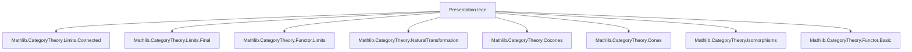
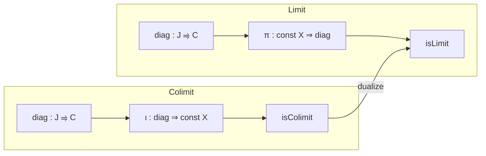

### Technical Brief: `Presentation.lean`

---

#### **1. Key Definitions & Theorems**

| Name | Type | Purpose |
|------|------|---------|
| `ColimitPresentation J X` | `Structure` | Encodes a diagram `diag : J ⥤ C`, a cocone `ι : diag ⟶ const X`, and a proof `isColimit` that this cocone is a colimit. |
| `LimitPresentation J X` | `Structure` | Dual to `ColimitPresentation`: encodes a diagram, a cone `π : const X ⟶ diag`, and a proof that it is a limit. |
| `ColimitPresentation.w` | `lemma` | Naturality of `ι`: for any `f : i ⟶ j`, `diag.map f ≫ ι.app j = ι.app i`. |
| `ColimitPresentation.cocone` | `abbrev` | Extracts the cocone underlying a colimit presentation. |
| `ColimitPresentation.hasColimit` | `lemma` | Extracts existence of colimit from a presentation. |
| `ColimitPresentation.self X` | `def` | Canonical colimit presentation of `X` over `PUnit`. |
| `ColimitPresentation.colimit F` | `def` | Colimit presentation of `colimit F` induced by the universal cocone. |
| `ColimitPresentation.map P F` | `def` | Maps a colimit presentation along a functor `F` that preserves `J`-colimits. |
| `ColimitPresentation.changeDiag P e` | `def` | Replaces the diagram in a presentation by an isomorphic one. |
| `ColimitPresentation.ofIso P e` | `def` | Pushes a presentation forward along an isomorphism of objects. |
| `ColimitPresentation.reindex P F` | `def` | Reindexes a colimit presentation along a final functor `F : J' ⥤ J`. |
| `LimitPresentation.w` | `lemma` | Dual naturality: `π.app i ≫ diag.map f = π.app j`. |
| `LimitPresentation.cone` | `abbrev` | Extracts the cone underlying a limit presentation. |
| `LimitPresentation.hasLimit` | `lemma` | Extracts existence of limit. |
| `LimitPresentation.self X` | `def` | Canonical limit presentation over `PUnit`. |
| `LimitPresentation.limit F` | `def` | Limit presentation of `limit F`. |
| `LimitPresentation.map P F` | `def` | Pushes a limit presentation forward along a limit-preserving functor. |
| `LimitPresentation.changeDiag P e` | `def` | Replace diagram by isomorphic one (dual to colimit case). |
| `LimitPresentation.ofIso P e` | `def` | Push forward along object isomorphism. |
| `LimitPresentation.reindex P F` | `def` | Reindex along an *initial* functor `F : J' ⥤ J`. |

---

#### **2. Naming Conventions**

- **Prefixes**:
  - `isColimit`, `isLimit`: Boolean-like predicates (though here stored as proofs).
  - `diag`: Diagram component.
  - `ι` (iota), `π` (pi): Canonical cocone/cone components.
  - `self`: Canonical presentation over terminal/initial index.
  - `colimit`, `limit`: Presentation induced by actual (co)limit.
  - `map`, `ofIso`, `changeDiag`, `reindex`: Structural operations.

- **Suffixes**:
  - `Presentation`: Denotes (co)limit presentation structures.
  - `whiskerLeft`, `whiskerRight`: Standard notation for pre/post-composition with functors.

- **Notation**:
  - `F ⋙ G`: Composition of functors (diagrammatic order).
  - `F.constComp _ _`: Natural isomorphism `F ∘ const X ≅ const (F X)`.
  - `whiskerLeft`, `whiskerRight`: For natural transformations.

---

#### **3. Tactic Stack**

Frequent tactics used in proofs and simplifications:

| Tactic | Usage |
|--------|-------|
| `simp` / `simp_rw` | Simplify using `initialize_simps_projections`, `@[simps]`, naturality lemmas. |
| `aesop` | Not explicitly used here, but `simp` + `rfl` suffices due to definitional structure. |
| `rw`, `apply`, `exact` | Manual proof steps in `w` lemmas and isomorphism transport. |
| `ext` | For extensionality in cocones/cones (e.g., `Cocones.ext`, `Cones.ext`). |
| `symm`, `trans` | For manipulating isomorphisms and equalities. |
| `simpa using` | In `w` lemmas: derive equality from naturality. |

---

#### **4. Proof Logic**

- **Structure**: Definitions are mostly *constructive* and *definitional*; proofs are often:
  - **Transport along isomorphisms**: Use universal properties (`IsColimit.precomposeHomEquiv`, `IsLimit.postcomposeHomEquiv`) to transfer proofs.
  - **Naturality**: `w` lemmas follow directly from naturality of `ι`/`π`.
  - **Universality**: `isColimit`/`isLimit` proofs use:
    - `isColimitOfPreserves`, `isLimitOfPreserves` for functoriality.
    - `ofIsoColimit`, `ofIsoLimit` for isomorphism transport.
    - `Final.isColimitWhiskerEquiv`, `Initial.isLimitWhiskerEquiv` for reindexing.

- **Induction**: Not used — no recursive structures or transfinite constructions here.

- **Flow**:
  1. Define data (`diag`, `ι`/`π`).
  2. Prove naturality (`w`).
  3. Show (co)limit existence (`hasColimit`/`hasLimit`).
  4. Define structural maps (`map`, `changeDiag`, `reindex`, `ofIso`) and verify (co)limit property via universal properties and isomorphism transport.

---

#### **5. Imports**

| Module | Purpose |
|--------|---------|
| `Mathlib.CategoryTheory.Limits.Connected` | Not directly used here, but likely for future work (e.g., connected diagrams). |
| `Mathlib.CategoryTheory.Limits.Final` | Provides `Final`, `Initial`, and universal properties for reindexing (e.g., `isColimitWhiskerEquiv`). |

> **Note**: The file is part of a larger theory on *presentable objects* and *presentations of (co)limits*, likely feeding into `Mathlib/CategoryTheory/Presentable/`.

---

#### **6. Mermaid Diagrams**

##### **Dependency Graph (Module-Level)**



##### **Conceptual Overview of `ColimitPresentation`**

```mermaid
graph LR
  J[Index Category J] --> D[Diagram diag : J ⥤ C]
  D --> I[Cocone ι : diag ⇒ const X]
  I --> IC[isColimit : Cocone.isColimit ι]
  IC --> CP[ColimitPresentation J X]
  
  CP -->|map| CP'[ColimitPresentation J (F X)]
  CP -->|reindex| CP''[ColimitPresentation J' X]
  CP -->|changeDiag| CP'''[ColimitPresentation J X]
  CP -->|ofIso| CP''''[ColimitPresentation J Y]
```

##### **Duality: Limit vs Colimit Presentations**



---

#### **7. TODOs & Future Work**

- Refactor `TransfiniteCompositionOfShape` to extend `ColimitPresentation`.
- Likely to be used in:
  - Presentable categories (`CategoryTheory/Presentable/`)
  - Accessible categories
  - Cellular objects / cell complexes (via transfinite composition)

---

#### **8. Summary**

This module formalizes *presentations of objects as (co)limits* over arbitrary index categories. It provides:
- A uniform data structure for (co)limits,
- Structural operations (functorial pushforward, reindexing, isomorphism transport),
- A foundation for constructing (co)limits from simpler building blocks.

The design is highly modular and leverages Lean’s typeclass inference and `@[simps]` for ergonomic manipulation of presentations.

--- 

Let me know if you'd like a formalized dependency graph (e.g., `.lean` file imports), or a comparison with `Mathlib/CategoryTheory/Presentable/`.
