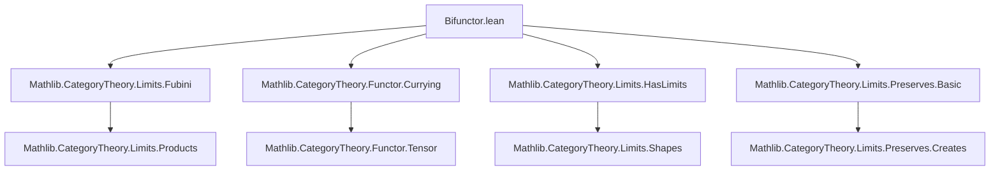
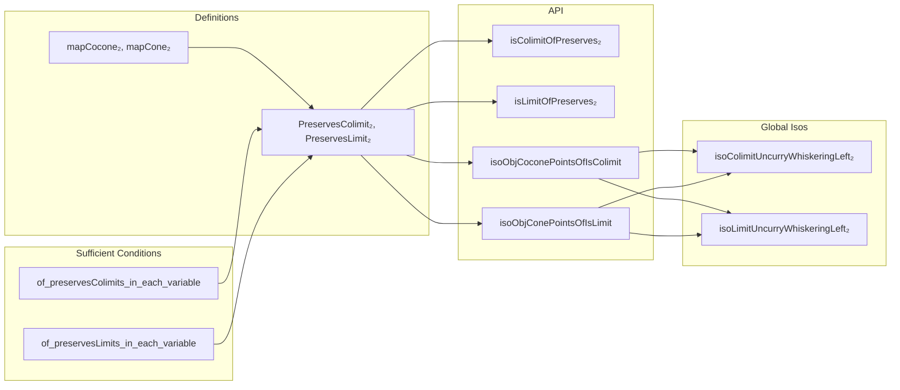

### Technical Brief: `Bifunctor.lean` — Preservation of Limits for Bifunctors

---

#### **1. Key Definitions & Theorems**

| Name | Type | Purpose |
|------|------|---------|
| `Functor.mapCocone₂` | `G : C₁ ⥤ C₂ ⥤ C → Cocone K₁ → Cocone K₂ → Cocone (uncurry (whiskeringLeft₂ G))` | Constructs a cocone over the product diagram from cocones in each variable. |
| `Functor.mapCone₂` | `G : C₁ ⥤ C₂ ⥤ C → Cone K₁ → Cone K₂ → Cone (uncurry (whiskeringLeft₂ G))` | Constructs a cone over the product diagram from cones in each variable. |
| `PreservesColimit₂ K₁ K₂ G` | `Prop` | Class asserting that `G` preserves colimits of the product diagram `K₁ × K₂`, i.e., `G.mapCocone₂ c₁ c₂` is a colimit when `c₁, c₂` are colimits. |
| `PreservesLimit₂ K₁ K₂ G` | `Prop` | Class asserting that `G` preserves limits of the product diagram `K₁ × K₂`, i.e., `G.mapCone₂ c₁ c₂` is a limit when `c₁, c₂` are limits. |
| `isColimitOfPreserves₂` | `[PreservesColimit₂ K₁ K₂ G] → IsColimit c₁ → IsColimit c₂ → IsColimit (G.mapCocone₂ c₁ c₂)` | Extracts the colimit structure from the class. |
| `isLimitOfPreserves₂` | `[PreservesLimit₂ K₁ K₂ G] → IsLimit c₁ → IsLimit c₂ → IsLimit (G.mapCone₂ c₁ c₂)` | Extracts the limit structure from the class. |
| `isoObjCoconePointsOfIsColimit` | `[PreservesColimit₂ K₁ K₂ G] → IsColimit c₁ → IsColimit c₂ → IsColimit c₃ → (G.obj c₁.pt).obj c₂.pt ≅ c₃.pt` | Gives the canonical isomorphism between the colimit of the composite diagram and the image of the colimits. |
| `isoObjConePointsOfIsLimit` | `[PreservesLimit₂ K₁ K₂ G] → IsLimit c₁ → IsLimit c₂ → IsLimit c₃ → (G.obj c₁.pt).obj c₂.pt ≅ c₃.pt` | Same as above, but for limits. |
| `isoColimitUncurryWhiskeringLeft₂` | `[HasColimit K₁] → [HasColimit K₂] → [PreservesColimit₂ K₁ K₂ G] → colim (uncurry (whiskeringLeft₂ G)) ≅ (G.obj (colim K₁)).obj (colim K₂)` | Global colimit isomorphism. |
| `isoLimitUncurryWhiskeringLeft₂` | `[HasLimit K₁] → [HasLimit K₂] → [PreservesLimit₂ K₁ K₂ G] → limit (uncurry (whiskeringLeft₂ G)) ≅ (G.obj (limit K₁)).obj (limit K₂)` | Global limit isomorphism. |
| `of_preservesColimits_in_each_variable` | `[∀ x, PreservesColimit K₁ (G.flip x)] → [∀ x, PreservesColimit K₂ (G.obj x)] → PreservesColimit₂ K₁ K₂ G` | Sufficient condition: separate preservation implies joint preservation for colimits. |
| `of_preservesLimits_in_each_variable` | `[∀ x, PreservesLimit K₁ (G.flip x)] → [∀ x, PreservesLimit K₂ (G.obj x)] → PreservesLimit₂ K₁ K₂ G` | Same for limits. |
| `of_preservesColimit₂_flip` / `of_preservesLimit₂_flip` | `PreservesColimit₂ K₂ K₁ G.flip` / `PreservesLimit₂ K₂ K₁ G.flip` | Symmetry: swapping arguments preserves the property. |

---

#### **2. Naming Conventions**

- **Prefixes**:
  - `mapCocone₂`, `mapCone₂`: mapping cocones/cones via bifunctor.
  - `isoObj*`: isomorphisms between object parts of (co)cones.
  - `iso*UncurryWhiskeringLeft₂`: global (co)limit isomorphisms involving uncurrying and whiskering.
- **Suffixes**:
  - `₂`: indicates bifunctorial (2-ary) behavior.
  - `flip`: indicates swapping arguments (e.g., `G.flip`).
- **Predicates**:
  - `PreservesColimit₂`, `PreservesLimit₂`: class names for joint preservation.
  - `of_preserves*`: construction lemmas (e.g., `of_preservesLimits_in_each_variable`).

---

#### **3. Tactic Stack**

- **Core tactics**:
  - `simp only [...]`: heavy use of `simp` with explicit lemmas (e.g., `Functor.map_comp`, `NatTrans.naturality`, `assoc`, `comp_id`).
  - `dsimp`: for definitional simplification (e.g., unfolding `mapCocone₂`, `uncurry`, `whiskeringLeft₂`).
  - `rw`, `apply`, `exact`: standard rewriting and application.
  - `cat_disch`: category-theoretic tactic for discharging diagrammatic commutativity.
  - `simp [E₀, E₁]`, `simp only [...] at this`: targeted simplification in hypotheses.
  - `let ... := ...`: local definitions for diagram constructions (e.g., `Q₀`, `P`, `E₀`, `E₁`).
  - `refine ... |>.toFun`: for constructing morphisms via universal properties.
  - `apply IsColimit.ofIsoColimit`, `IsLimit.postcomposeHomEquiv`, etc.: leveraging universal properties.

---

#### **4. Proof Logic**

- **Structure**:
  - **Definition phase**: introduce `mapCocone₂`, `mapCone₂`, and classes `PreservesColimit₂`, `PreservesLimit₂`.
  - **API extraction**: define `isColimitOfPreserves₂`, `isoObjCoconePointsOfIsColimit`, etc., using `some` from `Nonempty`.
  - **Instance constructions**:
    - Use `HasColimit`/`HasLimit` + `PreservesColimit₂`/`PreservesLimit₂` to derive existence of product diagram (co)limits.
  - **Characterization lemmas**:
    - Use `ι_comp_isoObjConePointsOfIsColimit_inv`, `map_ι_comp_isoObjConePointsOfIsColimit_hom`, etc., to describe universal morphisms.
  - **Main theorems**:
    - `of_preservesColimits_in_each_variable` and `of_preservesLimits_in_each_variable`:
      - Build a diagram of (co)cones `Q₀` indexed by `J₁`.
      - Show each `Q₀.obj j₁` is a (co)limit using `isLimitOfPreserves`/`isColimitOfPreserves`.
      - Use natural isomorphisms (`E₀`, `E₁`) to relate `Q₀` to the original diagram.
      - Apply `IsLimit.ofConeOfConeUncurry` / `IsColimit.ofCoconeUncurry` with universal property machinery.
    - `of_preservesColimit₂_flip` / `of_preservesLimit₂_flip`:
      - Use `uncurryObjFlip`, `Prod.braiding`, and `ofWhiskerEquivalence` to reduce to the original case.

- **Logical flow**:
  - **Induction-free**; relies on **universal properties** (colimit/limit uniqueness up to iso).
  - **Diagram chasing** via naturality and functoriality.
  - **Isomorphism-based reasoning**: many proofs reduce to showing two morphisms agree post- or pre-composed with universal arrows (`ι`, `π`), using `hom_ext`, `inv_comp_eq`, etc.

---

#### **5. Imports**

| Module | Purpose |
|--------|---------|
| `Mathlib.CategoryTheory.Limits.Fubini` | Fubini theorem for (co)limits, product diagrams. |
| `Mathlib.CategoryTheory.Functor.Currying` | Currying/uncurrying of functors, `uncurry`, `whiskeringLeft₂`. |
| `Mathlib.CategoryTheory.Limits.HasLimits` | Existence of (co)limits, `HasLimit`, `HasColimit`, `limit`, `colimit`. |
| `Mathlib.CategoryTheory.Limits.Preserves.Basic` | Basic preservation classes (`PreservesLimit`, `PreservesColimit`). |

---

#### **6. Mermaid Diagrams**

##### **Dependency Graph (Module-Level)**



##### **Conceptual Overview of Theory Flow**



##### **Proof Strategy for `of_preservesLimits_in_each_variable`**

```mermaid
graph TD
  A[Assume: G preserves K₁ limits in 1st var, K₂ limits in 2nd var] --> B[Define Q₀ : J₁ → Cones, Q₀ j₁ = G(K₁ j₁) ⊗ c₂]
  B --> C[Show: ∀ j₁, Q₀ j₁ is a limit cone (via hc₂)]
  C --> D[Define E₀ : conePoints Q₀ ≅ K₁ ⋙ G.flip c₂.pt]
  D --> E[Define E₁ : postcompose E₀ (coneOfConeUncurry P (G.mapCone₂ c₁ c₂)) ≅ (G.flip c₂.pt) ⊗ c₁]
  E --> F[Apply IsLimit.ofConeOfConeUncurry + IsLimit.postcomposeHomEquiv + IsLimit.ofIsoLimit]
  F --> G[Conclude: G.mapCone₂ c₁ c₂ is a limit]
```

---

#### **7. Mathematical Content Summary**

This file formalizes the **bifunctorial preservation of limits and colimits** in a 2-variable setting. It introduces a typeclass `PreservesLimit₂` (resp. `PreservesColimit₂`) that encodes the existence of canonical isomorphisms:

$$
\lim_{(j_1,j_2)} G(K_1(j_1), K_2(j_2)) \simeq G\left(\lim K_1, \lim K_2\right), \quad
\mathrm{colim}_{(j_1,j_2)} G(K_1(j_1), K_2(j_2)) \simeq G\left(\mathrm{colim} K_1, \mathrm{colim} K_2\right).
$$

It provides:
- A **constructive API** to extract these isomorphisms,
- **Instances** showing that separate preservation implies joint preservation,
- **Symmetry lemmas** (`flip`) and **characterizations** of the universal morphisms.

The development is fully internal to `CategoryTheory`, leveraging `uncurry`, `whiskeringLeft₂`, and the standard (co)limit machinery.

--- 

Let me know if you'd like a formalized summary in LaTeX or a dependency graph for the *proof terms* (e.g., `of_preservesLimits_in_each_variable` → `IsLimit.ofConeOfConeUncurry`).
