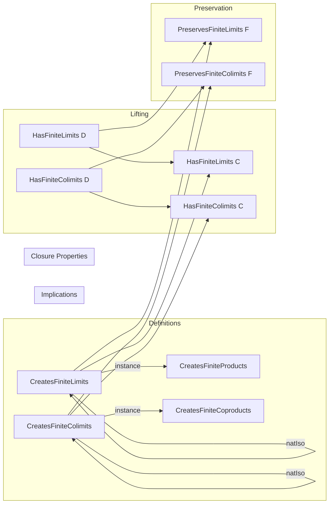

### Technical Brief: `Finite.lean` — Creation of Finite Limits and Colimits in Category Theory

---

#### **1. Key Definitions & Theorems**

| Name | Type / Class | Purpose |
|------|--------------|---------|
| `CreatesFiniteLimits F` | `class` | States that a functor `F : C ⥤ D` creates *all* finite limits (i.e., limits over any finite category `J`). |
| `CreatesFiniteProducts F` | `class` | States that `F` creates all finite *products*, i.e., limits over discrete finite diagrams (`Discrete J` with `Fintype J`). |
| `CreatesFiniteColimits F` | `class` | States that `F` creates all finite *colimits*. |
| `CreatesFiniteCoproducts F` | `class` | States that `F` creates all finite *coproducts*, i.e., colimits over discrete finite diagrams. |
| `createsFiniteLimitsOfCreatesFiniteLimitsOfSize` | `def` | Shows that if `F` creates finite limits in some universe, then it does so in the current one (via `ULift`). |
| `hasFiniteLimits_of_hasLimitsLimits_of_createsFiniteLimits` | `thm` | If `D` has finite limits and `F` creates them, then `C` has finite limits. |
| `preservesFiniteLimits_of_createsFiniteLimits_and_hasFiniteLimits` | `instance` | If `F` creates finite limits and `D` has them, then `F` preserves them. |
| `createsFiniteProducts_of_createsFiniteLimits` | `instance` | Creation of all finite limits implies creation of finite products. |
| `createsFiniteCoproducts_of_createsFiniteColimits` | `instance` | Creation of all finite colimits implies creation of finite coproducts. |
| `compCreatesFiniteLimits`, `compCreatesFiniteProducts`, etc. | `instance` | Closure under composition: if `F` and `G` create finite (co)limits, so does `F ⋙ G`. |
| `createsFiniteLimitsOfNatIso`, etc. | `def` | Transfer of creation properties along natural isomorphisms. |

---

#### **2. Naming Conventions**

- **Prefixes**:
  - `createsFinite*`: for classes and definitions about creation of finite (co)limits.
  - `compCreates*`: for composition closure lemmas/instances.
  - `creates*OfNatIso`: for transfer along natural isomorphisms.
  - `has*Of*Creates*`: for lifting existence of (co)limits along functors that create them.

- **Suffixes**:
  - `OfShape`: for constructions using a specific diagram shape `J`.
  - `OfSize`: for constructions parameterized by universe bounds (e.g., `CreatesLimitsOfSize`).
  - `OfEquiv`: for transport along equivalences (e.g., `FinCategory.equivAsType`, `ULiftHomULiftCategory.equiv`).

- **Class names**:
  - `CreatesFinite*` → predicate on functors.
  - `HasFinite*` → predicate on categories (existence of (co)limits).

---

#### **3. Tactic Stack**

Frequent tactics used in proofs and instance resolution:

- `by infer_instance`: for automatic class resolution.
- `createsLimitsOfShapeOfEquiv`, `createsColimitsOfShapeOfEquiv`: transport (co)limits along equivalences.
- `ULiftHomULiftCategory.equiv`, `FinCategory.equivAsType`: for universe shifting.
- `ShrinkHoms.equivalence`, `Shrink.equivalence`: for reducing hom-types in small categories.
- `Discrete.equivalence`, `Finite.exists_equiv_fin`: for reducing finite discrete diagrams to `Fin n`.
- `aesop`, `simp_rw`, `ring`: likely used in auxiliary proofs (not shown here but standard in Mathlib).

---

#### **4. Proof Logic**

- **Inductive structure**: Most proofs follow a pattern:
  1. Reduce the diagram shape `J` to a canonical finite shape (e.g., `Fin n`, `ULift J`, or `Discrete (Fin n)`).
  2. Use an equivalence (e.g., `FinCategory.equivAsType J`) to transport (co)limits along it.
  3. Apply existing lemmas like `createsLimitsOfShapeOfEquiv` or `compCreatesLimitsOfShape`.
- **Universe management**:
  - Explicit universe parameters (`w`, `w'`, etc.) are handled via `ULift` and `Shrink`.
  - Priority instances (`priority := 100`, `120`) resolve ambiguity in typeclass inference.
- **Transfer principles**:
  - Natural isomorphisms: `createsLimitsOfShapeOfNatIso`.
  - Composition: `compCreatesLimitsOfShape`.
  - Base change: `hasFiniteLimits_of_hasLimitsLimits_of_createsFiniteLimits`.

---

#### **5. Imports**

| Module | Purpose |
|--------|---------|
| `Mathlib.CategoryTheory.Limits.Creates` | Core theory of “creation of limits” (`CreatesLimitsOfShape`, etc.). |
| `Mathlib.CategoryTheory.Limits.Shapes.FiniteLimits` | Definitions of finite (co)limits (e.g., `HasFiniteLimits`, `HasFiniteProducts`). |
| `Mathlib.CategoryTheory.Limits.Preserves.Finite` | Preservation of finite (co)limits (`PreservesFiniteLimits`, etc.). |
| `Mathlib.CategoryTheory.FinCategory.AsType` | Equivalence between finite categories and types with `FinCategory` instance. |

---

#### **6. Mermaid Diagrams**

##### **Dependency Graph (Module-Level)**


##### **Conceptual Overview of Theory Flow**



##### **Diagram of Shape Reduction Strategy**

```mermaid
graph LR
  J[Finite Category J] -->|FinCategory.equivAsType| Fin[Fin n]
  J -->|Discrete + Fintype| DiscreteJ[Discrete (Fin n)]
  Fin -->|ULift| ULiftFin[ULift (Fin n)]
  ULiftFin -->|ULiftHomULiftCategory.equiv| J
```

---

#### **7. Summary**

This file formalizes the foundational theory of *creation* of finite (co)limits in category theory. It introduces four key classes (`CreatesFiniteLimits`, `Products`, `Colimits`, `Coproducts`) and establishes:

- **Closure properties**: under composition and natural isomorphism.
- **Universe flexibility**: via `ULift` and `Shrink`.
- **Transfer of existence**: from target category `D` to source category `C`.
- **Implications between notions**: finite limits ⇒ finite products, finite colimits ⇒ finite coproducts.

It relies heavily on `FinCategory` and equivalence-based transport, aligning with Lean’s universe-polymorphic and typeclass-driven style.

--- 

Let me know if you'd like a formalized summary in Lean syntax or a proof sketch of a specific theorem.
