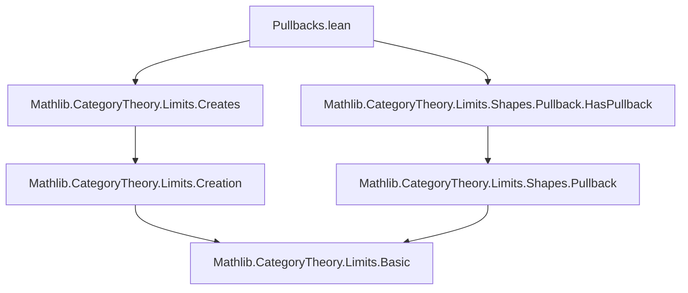
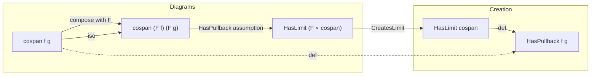

**Technical Brief: Pullbacks.lean**

---

### 1. KEY DEFINITIONS & THEOREMS

| Name | Type | Purpose |
|------|------|---------|
| `HasPullback.of_createsLimit` | `∀ {F : C ⥤ D} {X Y S : C} (f : X ⟶ S) (g : Y ⟶ S), [CreatesLimit (cospan f g) F] → [HasPullback (F.map f) (F.map g)] → HasPullback f g` | Shows that if a functor `F` creates limits of the cospan shape and the image cospan has a pullback in `D`, then the original cospan has a pullback in `C`. |
| `HasPushout.of_createsColimit` | `∀ {F : C ⥤ D} {X Y S : C} (f : S ⟶ X) (g : S ⟶ Y), [CreatesColimit (span f g) F] → [HasPushout (F.map f) (F.map g)] → HasPushout f g` | Dual statement: if `F` creates colimits of the span shape and the image span has a pushout in `D`, then the original span has a pushout in `C`. |

Both lemmas rely on the isomorphism between composition with `F` and the image diagram:
- `(cospan f g ⋙ F) ≅ cospan (F.map f) (F.map g)`
- `(span f g ⋙ F) ≅ span (F.map f) (F.map g)`

These are encoded via `cospanCompIso` and `spanCompIso`.

---

### 2. NAMING CONVENTIONS

- **Prefixes**:
  - `HasPullback`, `HasPushout`: Existence predicates for (co)limits of specific shapes.
  - `CreatesLimit`, `CreatesColimit`: Typeclass predicates for *creation* of (co)limits by a functor.
- **Suffixes**:
  - `of_...`: Indicates derivation from a more general property (e.g., `of_createsLimit`).
- **Morphism mapping**:
  - `F.map f`: Standard notation for functor action on morphisms.

---

### 3. TACTIC STACK

- `have : ... := ...` — to introduce intermediate facts.
- `symm` — used to reverse an isomorphism.
- Implicit use of typeclass resolution (`[...]`) for existence assumptions.
- No explicit tactic calls (e.g., `aesop`, `simp`, `ring`) appear in the proof terms — proofs are *definitionally* short and rely on library lemmas (`hasLimit_of_iso`, `hasLimit_of_created`, etc.).

---

### 4. PROOF LOGIC

- **Structure**: Short, high-level reasoning using existing categorical machinery.
- **For `HasPullback.of_createsLimit`**:
  1. Use `cospanCompIso F f g` to get an isomorphism between the diagram `cospan f g ⋙ F` and `cospan (F.map f) (F.map g)`.
  2. Apply `hasLimit_of_iso` to transfer existence of limit along the isomorphism.
  3. Use `hasLimit_of_created` (from `CreatesLimit`) to deduce `HasLimit (cospan f g)`, i.e., `HasPullback f g`.
- **For `HasPushout.of_createsColimit`**:
  - Dual: use `spanCompIso`, `hasColimit_of_iso`, and `hasColimit_of_created`.

Both proofs are *one-liner* in terms of tactic script, relying on pre-proved lemmas in `Mathlib.CategoryTheory.Limits.Creates`.

---

### 5. IMPORTS

| Module | Purpose |
|--------|---------|
| `Mathlib.CategoryTheory.Limits.Creates` | Defines `CreatesLimit`, `CreatesColimit`, and lemmas like `hasLimit_of_created`, `hasColimit_of_created`. |
| `Mathlib.CategoryTheory.Limits.Shapes.Pullback.HasPullback` | Defines `HasPullback`, `HasPushout`, and related constructions. |

These imports indicate the file sits in the *limit creation* layer of the categorical hierarchy, bridging abstract creation properties with concrete limit existence.

---

### 6. MERMAID DIAGRAMS

#### Dependency Graph (File-level)

#### Overview of Theoretical Flow

---

### 7. SUMMARY

This file formalizes a *reflection principle* for pullbacks and pushouts: if a functor creates the relevant (co)limit and the image diagram has the (co)limit, then the original diagram does too. It leverages the categorical principle that *creation of limits* + *existence in the codomain* ⇒ *existence in the domain*, via diagram isomorphism. The proofs are concise and rely on a well-structured hierarchy in `Mathlib`.
